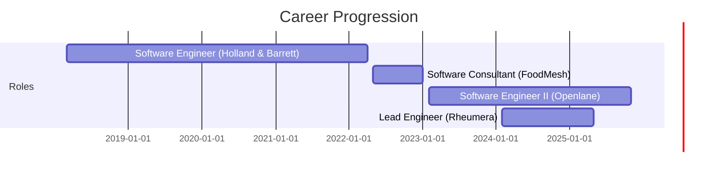

# Career Timeline

## 🚀 Professional Journey (2018 - Present)

### **2023 - Present: Software Engineer II @ Openlane Inc.**
*   **Focus:** Modernization, Microservices, AI Integration
*   **Key Milestone:** Migrated legacy Oracle systems to .NET microservices; integrated LLM-based moderation.
*   **Tech:** .NET, React, AWS Lambda, Azure, Honeycomb

### **2024 - 2025: Lead Software Engineer (Consultant) @ Rheumera**
*   **Focus:** Startup Leadership, Full-Stack Architecture
*   **Key Milestone:** Architected remote therapeutic monitoring platform; scaled to 60K+ patients.
*   **Tech:** Java Spring Boot, React, AWS, Docker

### **Part-Time: Software Consultant @ FoodMesh Inc.**
*   **Focus:** Social Impact, Geospatial Data
*   **Key Milestone:** Built food recovery marketplace diverting 35M kg of food waste.
*   **Tech:** Python Django, Flutter, Google Maps API

### **2018 - 2022: Software Engineer @ Holland & Barrett**
*   **Focus:** E-commerce Scale, Search, Data
*   **Key Milestone:** Led migration to AWS ElasticSearch; automated promo management with NLP.
*   **Tech:** .NET, AWS ElasticSearch, Kafka, React

---

## 📈 Growth Trajectory

