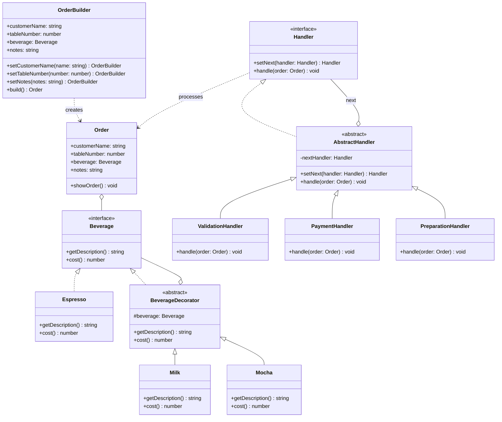

# Coffee Shop Class Diagram

This diagram illustrates three design patterns: **Decorator**, **Builder**, and **Chain of Responsibility**.

```mermaid
classDiagram
    %% Decorator Pattern
    class Beverage {
        <<interface>>
        +getDescription() string
        +cost() number
    }
    
    class Espresso {
        +getDescription() string
        +cost() number
    }
    
    class BeverageDecorator {
        <<abstract>>
        #beverage: Beverage
        +getDescription() string
        +cost() number
    }
    
    class Milk {
        +getDescription() string
        +cost() number
    }
    
    class Mocha {
        +getDescription() string
        +cost() number
    }
    
    Beverage <|.. Espresso
    Beverage <|.. BeverageDecorator
    BeverageDecorator <|-- Milk
    BeverageDecorator <|-- Mocha
    BeverageDecorator o-- Beverage
    
    %% Builder Pattern
    class Order {
        +customerName: string
        +tableNumber: number
        +beverage: Beverage
        +notes: string
        +showOrder() void
    }
    
    class OrderBuilder {
        +customerName: string
        +tableNumber: number
        +beverage: Beverage
        +notes: string
        +setCustomerName(name: string) OrderBuilder
        +setTableNumber(number: number) OrderBuilder
        +setNotes(notes: string) OrderBuilder
        +build() Order
    }
    
    OrderBuilder ..> Order : creates
    Order o-- Beverage
    
    %% Chain of Responsibility Pattern
    class Handler {
        <<interface>>
        +setNext(handler: Handler) Handler
        +handle(order: Order) void
    }
    
    class AbstractHandler {
        <<abstract>>
        -nextHandler: Handler
        +setNext(handler: Handler) Handler
        +handle(order: Order) void
    }
    
    class ValidationHandler {
        +handle(order: Order) void
    }
    
    class PaymentHandler {
        +handle(order: Order) void
    }
    
    class PreparationHandler {
        +handle(order: Order) void
    }
    
    Handler <|.. AbstractHandler
    AbstractHandler <|-- ValidationHandler
    AbstractHandler <|-- PaymentHandler
    AbstractHandler <|-- PreparationHandler
    AbstractHandler o-- Handler : next
    Handler ..> Order : processes
```
