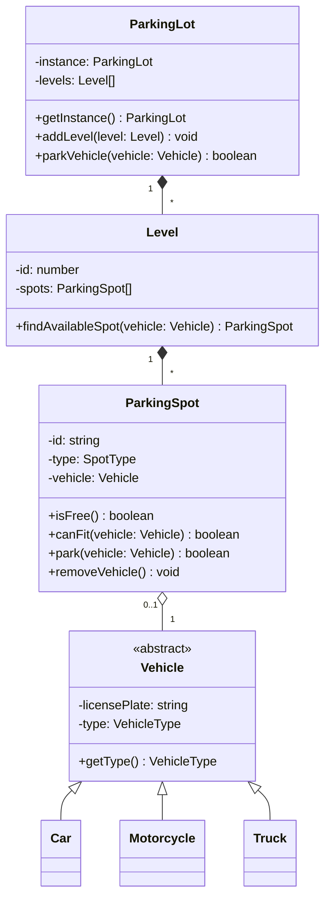

# Parking Lot Class Diagram

```mermaid
classDiagram
    class Vehicle {
        <<abstract>>
        -licensePlate: string
        -type: VehicleType
        +getType() VehicleType
    }
    class Car {
    }
    class Motorcycle {
    }
    class Truck {
    }
    Vehicle <|-- Car
    Vehicle <|-- Motorcycle
    Vehicle <|-- Truck

    class ParkingSpot {
        -id: string
        -type: SpotType
        -vehicle: Vehicle
        +isFree() boolean
        +canFit(vehicle: Vehicle) boolean
        +park(vehicle: Vehicle) boolean
        +removeVehicle() void
    }

    class Level {
        -id: number
        -spots: ParkingSpot[]
        +findAvailableSpot(vehicle: Vehicle) ParkingSpot
    }

    class ParkingLot {
        -instance: ParkingLot
        -levels: Level[]
        +getInstance() ParkingLot
        +addLevel(level: Level) void
        +parkVehicle(vehicle: Vehicle) boolean
    }

    ParkingLot "1" *-- "*" Level
    Level "1" *-- "*" ParkingSpot
    ParkingSpot "0..1" o-- "1" Vehicle
```
