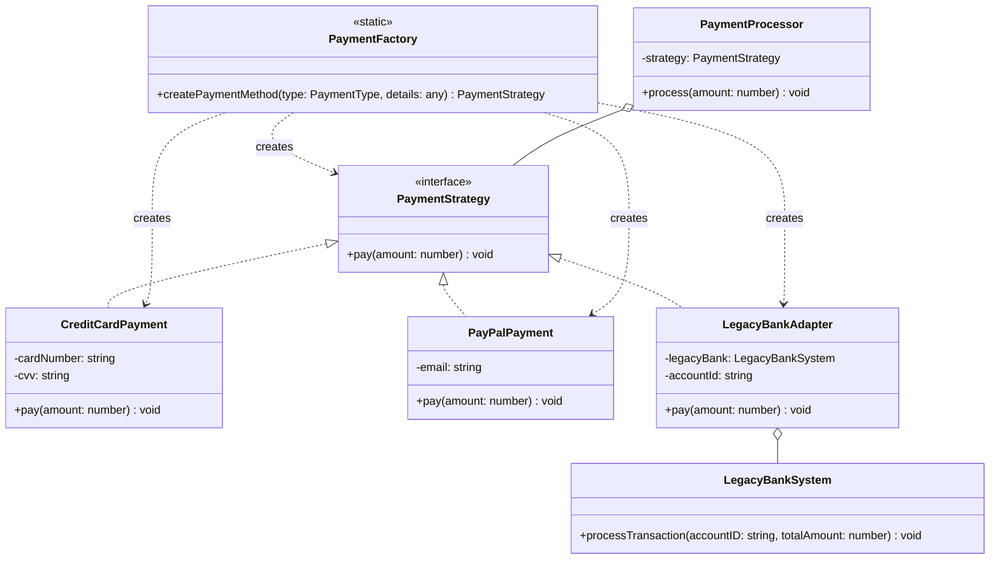

# Payment System Class Diagram

This diagram illustrates three design patterns: **Strategy**, **Factory**, and **Adapter**.

```mermaid
classDiagram
    %% Strategy Pattern
    class PaymentStrategy {
        <<interface>>
        +pay(amount: number) void
    }
    
    class CreditCardPayment {
        -cardNumber: string
        -cvv: string
        +pay(amount: number) void
    }
    
    class PayPalPayment {
        -email: string
        +pay(amount: number) void
    }
    
    PaymentStrategy <|.. CreditCardPayment
    PaymentStrategy <|.. PayPalPayment
    
    %% Adapter Pattern
    class LegacyBankSystem {
        +processTransaction(accountID: string, totalAmount: number) void
    }
    
    class LegacyBankAdapter {
        -legacyBank: LegacyBankSystem
        -accountId: string
        +pay(amount: number) void
    }
    
    PaymentStrategy <|.. LegacyBankAdapter
    LegacyBankAdapter o-- LegacyBankSystem
    
    %% Factory Pattern
    class PaymentFactory {
        <<static>>
        +createPaymentMethod(type: PaymentType, details: any) PaymentStrategy
    }
    
    PaymentFactory ..> PaymentStrategy : creates
    PaymentFactory ..> CreditCardPayment : creates
    PaymentFactory ..> PayPalPayment : creates
    PaymentFactory ..> LegacyBankAdapter : creates
    
    %% Context
    class PaymentProcessor {
        -strategy: PaymentStrategy
        +process(amount: number) void
    }
    
    PaymentProcessor o-- PaymentStrategy
```
