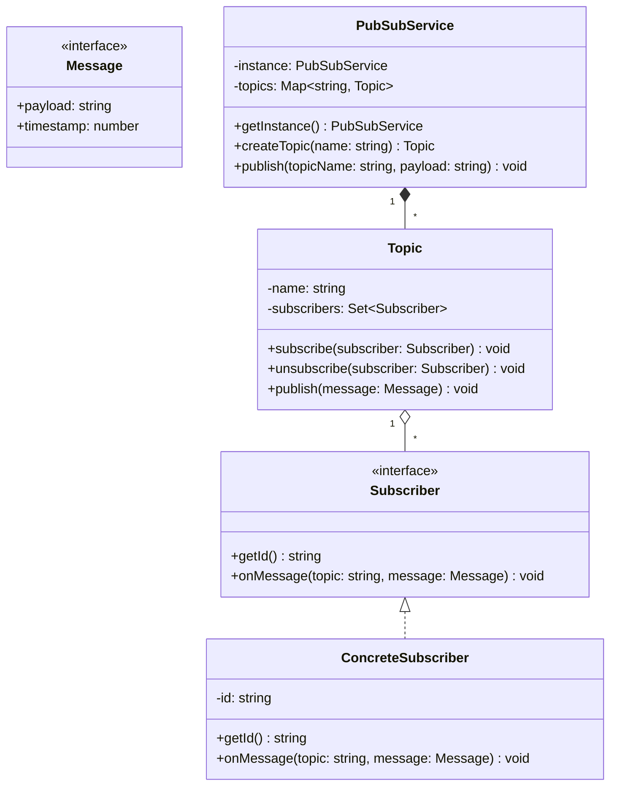

# Pub/Sub Class Diagram

```mermaid
classDiagram
    class Message {
        <<interface>>
        +payload: string
        +timestamp: number
    }

    class Subscriber {
        <<interface>>
        +getId() string
        +onMessage(topic: string, message: Message) void
    }

    class ConcreteSubscriber {
        -id: string
        +getId() string
        +onMessage(topic: string, message: Message) void
    }

    class Topic {
        -name: string
        -subscribers: Set~Subscriber~
        +subscribe(subscriber: Subscriber) void
        +unsubscribe(subscriber: Subscriber) void
        +publish(message: Message) void
    }

    class PubSubService {
        -instance: PubSubService
        -topics: Map~string, Topic~
        +getInstance() PubSubService
        +createTopic(name: string) Topic
        +publish(topicName: string, payload: string) void
    }

    Subscriber <|.. ConcreteSubscriber
    PubSubService "1" *-- "*" Topic
    Topic "1" o-- "*" Subscriber
```
