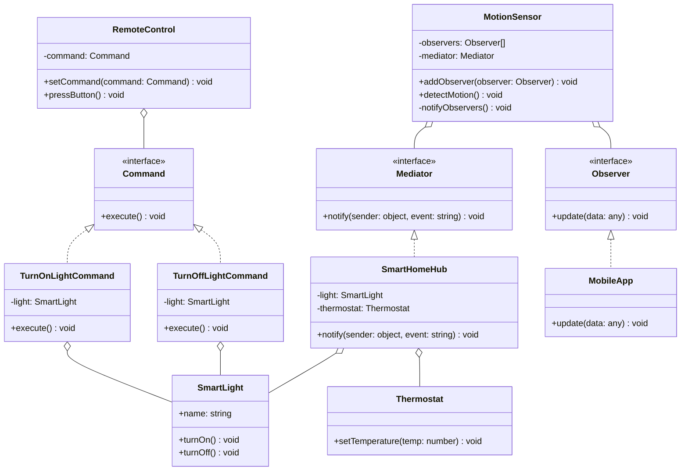

# Smart Home Class Diagram

This diagram illustrates three design patterns: **Command**, **Mediator**, and **Observer**.

```mermaid
classDiagram
    %% Command Pattern
    class Command {
        <<interface>>
        +execute() void
    }
    
    class TurnOnLightCommand {
        -light: SmartLight
        +execute() void
    }
    
    class TurnOffLightCommand {
        -light: SmartLight
        +execute() void
    }
    
    class SmartLight {
        +name: string
        +turnOn() void
        +turnOff() void
    }
    
    class RemoteControl {
        -command: Command
        +setCommand(command: Command) void
        +pressButton() void
    }
    
    Command <|.. TurnOnLightCommand
    Command <|.. TurnOffLightCommand
    TurnOnLightCommand o-- SmartLight
    TurnOffLightCommand o-- SmartLight
    RemoteControl o-- Command
    
    %% Mediator Pattern
    class Mediator {
        <<interface>>
        +notify(sender: object, event: string) void
    }
    
    class SmartHomeHub {
        -light: SmartLight
        -thermostat: Thermostat
        +notify(sender: object, event: string) void
    }
    
    class Thermostat {
        +setTemperature(temp: number) void
    }
    
    Mediator <|.. SmartHomeHub
    SmartHomeHub o-- SmartLight
    SmartHomeHub o-- Thermostat
    
    %% Observer Pattern
    class Observer {
        <<interface>>
        +update(data: any) void
    }
    
    class MotionSensor {
        -observers: Observer[]
        -mediator: Mediator
        +addObserver(observer: Observer) void
        +detectMotion() void
        -notifyObservers() void
    }
    
    class MobileApp {
        +update(data: any) void
    }
    
    Observer <|.. MobileApp
    MotionSensor o-- Observer
    MotionSensor o-- Mediator
```
