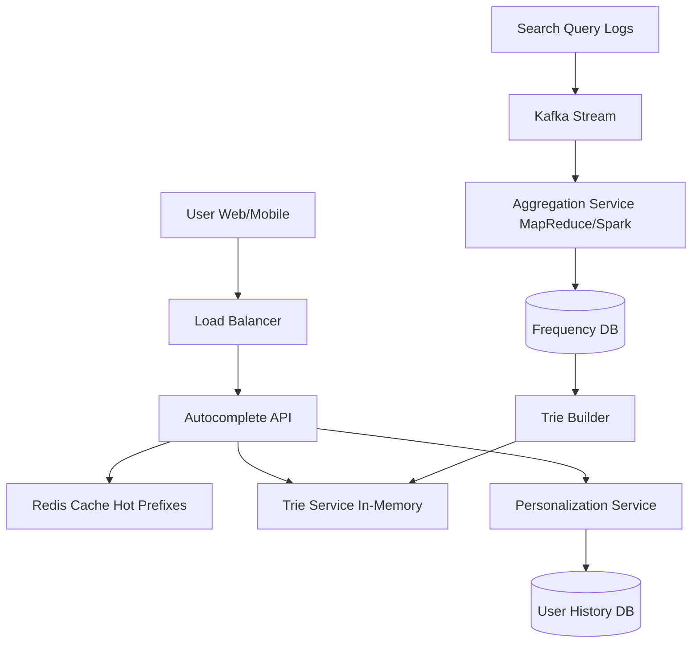

# Design Autocomplete (Typeahead)

## ⏱️ 1. The 2-Minute Version

**Goal**: Design a search autocomplete system that suggests top 5-10 completions as the user types, with extremely low latency (< 100ms) like Google Search or Amazon's search box.

**Key Components**:
1. **Trie (Prefix Tree)**: Fast prefix-based lookups (O(p) where p = prefix length).
2. **Ranking Service**: Scores suggestions based on popularity/personalization.
3. **Data Aggregation**: Batch process search logs to update suggestion rankings.
4. **Caching**: Redis cache for hot prefixes.

**Key Challenges**:
- **Latency**: Must respond in < 100ms (users typing).
- **Freshness**: Trending queries should surface quickly.
- **Scale**: Billions of queries, millions of unique terms.
- **Personalization**: Show relevant suggestions per user.

**Trade-offs**:
- **Real-time vs. Batch Updates**: Real-time (complex, expensive) vs. Hourly batch (simpler, slightly stale).
- **Global vs. Personalized**: Global (faster, cache friendly) vs. Personalized (better UX, harder to cache).
- **Prefix Length**: Support 1-char prefixes (huge trie) vs. 2+ chars (smaller, less responsive).

---

## 🏗️ 2. The 10-Minute Structured Version

### Requirements

#### Functional
- **Suggest**: As user types, show top K (e.g., 5) completions.
- **Ranking**: Rank by popularity (global frequency).
- **Update**: Incorporate new search trends (hourly/daily).
- **Personalization** (Optional): Adjust suggestions based on user history.

#### Non-Functional
- **Latency**: < 100ms per query.
- **Scale**:
  - 1B DAU.
  - 10 queries per user/day = 10B queries/day = 115k QPS.
  - 20% are unique searches = 2B unique terms.
- **Availability**: 99.9% uptime.
- **Freshness**: Update rankings daily (hourly for trends).

### Capacity Estimation

**Storage**:
- Unique terms: 2B terms * 20 bytes = 40 GB.
- Trie nodes: ~10x more = 400 GB (can fit in RAM with optimization).
- With frequency counts: 2B * 8 bytes = 16 GB.

**QPS**:
- 115k QPS normal.
- Peak (holiday shopping): 500k QPS.

### High-Level Architecture



### Data Flow

**Query Flow**:
1. User types "fa".
2. Request sent to Autocomplete API.
3. Check Redis cache: `autocomplete:fa`.
4. If  cache miss, query Trie Service.
5. Trie returns top 5: `["facebook", "fashion", "fast food", "farm", "faq"]`.
6. Cache result in Redis with TTL (10 mins).
7. Return to user.

**Data Pipeline Flow**:
1. Users perform searches, logs stored in Kafka.
2. Aggregation Service (Spark) runs every hour:
   - Count frequency of each search term.
   - Update Frequency DB.
3. Trie Builder reads updated frequencies, rebuilds trie.
4. Deploy new trie to Trie Service (rolling update).

---

## 🧠 3. Deep Dive & Technical Details

### 1. Trie Data Structure

**Why Trie?**
- **Fast prefix lookup**: O(p) where p = length of prefix.
- **Natural fit for autocomplete: All words with prefix "app" are in subtree under "app" node.

**Basic Trie Structure**:
```
Root
 ├─ a
 │  ├─ p
 │  │  ├─ p  (apple*)
 │  │  │  ├─ l
 │  │  │  │  ├─ e  (apple*)
 │  │  │  └─ s  (apps*)
 │  │  └─ i  (api*)
```

**Optimization - Store top K at each node**:
- Naive: Walk down to prefix node, traverse entire subtree, collect all completions, sort by frequency.
- **Optimized**: At each node, store top K completions that pass through this node.
- Example: At node "app", store `["apple": 1M, "apps":500k, "application": 300k]`.
- **Trade-off**: More memory, but O(1) to get top K instead of O(N log N).

**Implementation**:
```python
class TrieNode:
    def __init__(self):
        self.children = {}  # char -> TrieNode
        self.is_end_of_word = False
        self.top_suggestions = []  # [(term, frequency), ...] top K
        
class Trie:
    def __init__(self):
        self.root = TrieNode()
    
    def insert(self, word, frequency):
        node = self.root
        for char in word:
            if char not in node.children:
                node.children[char] = TrieNode()
            node = node.children[char]
            # Update top K at each node
            self.update_top_k(node, word, frequency)
        node.is_end_of_word = True
    
    def update_top_k(self, node, word, frequency):
        # Add/update and keep top K
        node.top_suggestions.append((word, frequency))
        node.top_suggestions.sort(key=lambda x: x[1], reverse=True)
        node.top_suggestions = node.top_suggestions[:5]
    
    def search(self, prefix):
        node = self.root
        for char in prefix:
            if char not in node.children:
                return []
            node = node.children[char]
        return [term for term, freq in node.top_suggestions]
```

**Memory Optimization**:
- **Compressed Trie (Radix Tree)**: Merge nodes with single child.
  - "apple" becomes single edge "apple" instead of 5 nodes.
- **Store only popular terms**: Filter out terms searched < 10 times.

---

### 2. Ranking Algorithm

**Factors** (in priority order):
1. **Global Popularity**: How often the term is searched globally.
2. **Recency/Trend**: "Taylor Swift concert" surges after ticket release.
3. **Personalization**: User's past searches and preferences.
4. **Context**: Location (mobile), language, device type.

**Score Formula**:
```
Score = W1 * Popularity 
      + W2 * Trend(time_decay)
      + W3 * PersonalScore
      + W4 * ContextScore
```

**Trending Queries**:
- Detect sudden spike in query frequency.
- Example: "earthquake" spikes 100x after event.
- Update trie hourly for trends (instead of daily).

---

### 3. Data Collection & Aggregation

**Logging**:
- Log every search query with metadata: `{query, user_id, timestamp, result_clicked, location}`.
- Store in Kafka (high-throughput, durable).

**Aggregation (MapReduce/Spark)**:
```python
# Pseudo code
search_logs = read_from_kafka(last_24_hours)

# Map phase
def map_fn(log):
    emit(log.query, 1)

# Reduce phase
def reduce_fn(query, counts):
    emit(query, sum(counts))

# Output: {query: total_count}
```

**Weekly vs. Hourly Updates**:
- **Daily batch**: Process last 24 hours, rebuild trie (for general terms).
- **Hourly batch**: Process last hour, update trending terms only (incremental update).

---

### 4. Personalization

**Approach**:
- Maintain user search history in Redis/Cassandra.
- Boost suggestions user has searched before.
- Use collaborative filtering: "Users like you searched X".

**Implementation**:
- **Fetch user history**: Top 10 recent searches.
- **Boost score**: If "apple" is in user history, boost "apple" completions.
- **Privacy**: Anonymous hashing, comply with GDPR.

---

### 5. Caching Strategy

**Why Cache?**
- Trie lookup is fast (O(p)), but Redis is faster (O(1)).
- 20% of prefixes account for 80% of queries ("a", "fa", "goo").

**What to Cache**:
- **Hot prefixes**: Cache top 10k most queried prefixes.
- **Key**: `autocomplete:{prefix}`.
- **Value**: `["suggestion1", "suggestion2", ...]`.
- **TTL**: 10 minutes (balance freshness vs. hit rate).

**Cache Hit Rate**:
- Target >90%.
- Monitor and adjust cache size/TTL.

**Cache Invalidation**:
- When trie is updated, invalidate affected prefixes.
- Or use short TTL and lazy refresh.

---

### 6. Distributed Trie Service

**Sharding by Prefix**:
- Example:
  - Server 1: Handles prefixes "a-m".
  - Server 2: Handles prefixes "n-z".
- **Load Balancer** routes request to appropriate server based on first char.

**Replication**:
- Each shard has 3 replicas (master + 2 slaves).
- Reads go to replicas, writes go to master (rebuilding trie).

**Deployment**:
- Build new trie offline.
- Deploy to replicas one by one (rolling update, zero downtime).

---

### 7. Latency Optimization

**Strategies**:
- **CDN/Edge Caching**: Deploy autocomplete service close to users (AWS CloudFront, Cloudflare Workers).
- **Async Prefetching**: After user types "a", prefetch results for "ap", "ar", "as".
- **Client-Side Caching**: Cache results in browser for 1 minute.
- **Debouncing**: Don't send request on every keystroke. Wait 200ms idle time.

---

### 8. Filtering & Safety

**Content Filtering**:
- Block offensive/inappropriate suggestions.
- Maintain blacklist of banned terms.
- Run ML model to detect toxic completions.

**Deduplication**:
- User types "apple", don't show "apple" and "apple inc" as separate suggestions.
- Normalize queries (lowercase, trim spaces).

---

### 9. Monitoring & Alerts

**Metrics**:
- **Latency**: p50, p95, p99. Target: p99 < 100ms.
- **Cache Hit Rate**: Target > 90%.
- **Zero Results Rate**: % of prefixes with no suggestions (should be low).
- **Suggestion Click-Through Rate**: % of times user clicks a suggestion vs. typing full query.

**Alerts**:
- Latency p99 > 200ms.
- Cache hit rate < 80%.
- Trie rebuild failure.

---

### 10. Edge Cases

**Problem**: User types gibberish "asdfgh".
- **Solution**: Return top global suggestions (fallback) or "No suggestions".

**Problem**: New trending topic emerges (breaking news).
- **Solution**: Hourly update pipeline for trends, manual override for urgent updates.

**Problem**: Malicious user floods system with fake queries to manipulate rankings.
- **Solution**: Rate limiting, anomaly detection, weight queries by user reputation.

**Problem**: Multilingual support.
- **Solution**: Separate tries per language, detect user language, route to appropriate trie.

---

## 📊 Diagram References

Related architecture diagrams:
- [Autocomplete System Architecture Diagram](file:///Users/dj/Documents/Programming/techLead/tech-lead-repo/docs/system_design/diagrams/design_autocomplete_1.mmd)
