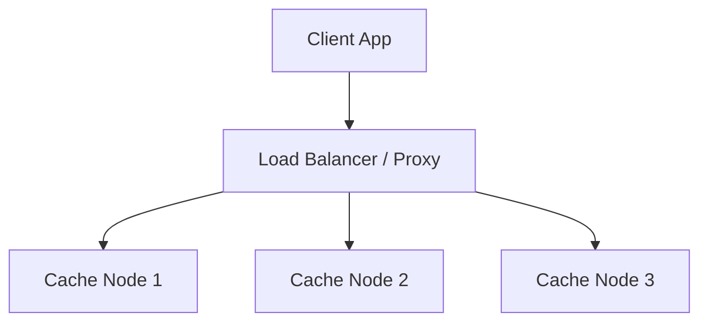

# Design a Distributed Cache (e.g., Redis, Memcached)

## ⏱️ 1. The 2-Minute Version

**Goal**: Design a fast, in-memory key-value store that can scale across multiple machines.

**Key Components**:
1.  **Client**: Has the logic to find which cache server to hit (Hashing).
2.  **Cache Server**: Stores data in RAM. Evicts old data when full.
3.  **Consistent Hashing**: Algorithm to distribute keys evenly and handle server additions/removals with minimal data movement.

**Trade-offs**:
- **LRU vs. LFU**: LRU is simpler and good for recency. LFU is better for frequency but harder to implement.
- **Write-Through vs. Write-Back**: Consistency vs. Performance.

---

## 🏗️ 2. The 10-Minute Structured Version

### Requirements
- **Functional**:
    - `put(key, value)`
    - `get(key)`
    - `delete(key)`
- **Non-Functional**:
    - High Performance (sub-millisecond latency).
    - High Availability.
    - Scalability (add nodes easily).

### High-Level Design

### Consistent Hashing (The Core)
- **Problem**: With `Mod(N)` hashing, adding a server changes `N` to `N+1`, remapping almost ALL keys. Cache stampede ensues.
- **Solution**: Map servers and keys to a **Ring** (0 to $2^{32}-1$).
    - A key is stored in the first server found moving clockwise on the ring.
    - **Virtual Nodes**: To avoid data hotspots, each physical server appears at multiple points on the ring.

---

## 🧠 3. Deep Dive & Technical Details

### Eviction Policies
- **LRU (Least Recently Used)**: Linked List + HashMap.
    - Move accessed item to head.
    - Evict tail when full.
    - **O(1)** operations.
- **LFU (Least Frequently Used)**: Min-Heap or multiple lists.
    - Good for "sticky" content.

### Availability & Replication
- **Master-Slave**: Writes to Master, Reads from Slaves.
- **Gossip Protocol**: Nodes talk to each other to detect failures (like Cassandra/Dynamo).

### Concurrency
- **Thread Safety**:
    - **Coarse-grained lock**: Lock the whole map (slow).
    - **Fine-grained lock**: Lock only the bucket/segment (ConcurrentHashMap).
    - **Redis approach**: Single-threaded event loop. No locks needed! Fast because RAM is fast and no context switching.

### Data Persistence (Optional)
- **RDB (Snapshot)**: Save RAM to disk every X minutes.
- **AOF (Append Only File)**: Log every write command. Slower but safer.
