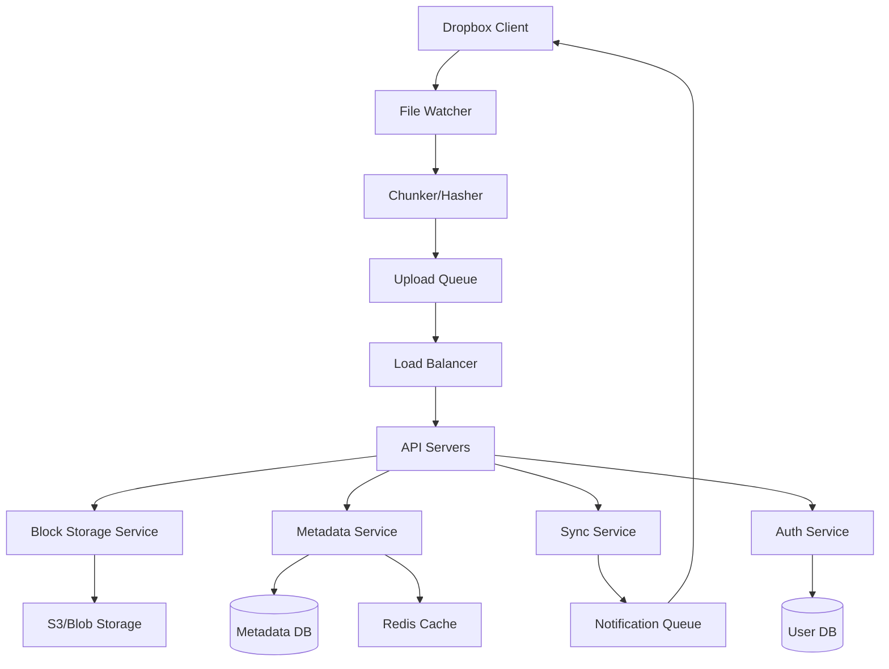

# Design Dropbox / Google Drive

## ⏱️ 1. The 2-Minute Version

**Goal**: Design a cloud file storage and synchronization service like Dropbox that allows users to store files, access them from multiple devices, share with others, and automatically sync changes across all devices.

**Key Components**:
1. **Block Server**: Stores file chunks in object storage (S3).
2. **Metadata Server**: Tracks file structure, versions, permissions, chunk mappings.
3. **Sync Service**: Coordinates file sync across devices using long polling or WebSockets.
4. **Client**: Monitors file system, chunks files, computes hashes, syncs with cloud.

**Key Challenges**:
- **Bandwidth Optimization**: Don't re-upload entire file if only 1 byte changed (delta sync).
- **Deduplication**: Multiple users uploading same file wastes storage.
- **Conflict Resolution**: Two devices edit same file offline, sync later.
- **Scalability**: Petabytes of data, billions of files.

**Trade-offs**:
- **Strong vs. Eventual Consistency**: Strong (all devices see same version immediately) vs. Eventual (propagation delay, better performance).
- **Chunk Size**: Large (fewer chunks, less metadata) vs. Small (better dedup, finer delta sync).
- **Conflict Resolution**: Last Write Wins (simple, data loss) vs. Versioning (complex, preserves all data).

---

## 🏗️ 2. The 10-Minute Structured Version

### Requirements

#### Functional
- **Upload/Download**: Files and folders.
- **Sync**: Automatic synchronization across all user devices.
- **Versioning**: Restore previous versions (at least 30 days).
- **Sharing**: Share files/folders with other users (read/write permissions).
- **Offline Mode**: Access files offline, sync when back online.
- **Notifications**: Notify user when file is updated by collaborator.
- **Cross-Platform**: Windows, Mac, Linux, iOS, Android, Web.

#### Non-Functional
- **Reliability**: 99.99% uptime, no data loss (11 nines durability).
- **Latency**: Sync propagation < 10 seconds.
- **Bandwidth**: Optimize to minimize network usage (delta sync).
- **Scale**:
  - 500M users.
  - Average 10 GB per user = 5 EB total storage.
  - 100M active syncs/day.
- **Security**: End-to-end encryption (optional), access control.

### Capacity Estimation

**Assumptions**:
- 500M users, 100M daily active.
- Average file size: 1 MB.
- Each user uploads 10 files/month = 5B files/month.

**Storage**:
- 5B files/month * 1 MB = 5 PB/month.
- With deduplication (50% reduction): 2.5 PB/month.

**Metadata**:
- Per file: 500 bytes (filename, size, hash, timestamps, permissions).
- 5B files * 500 bytes = 2.5 TB/month.

**Bandwidth**:
- 100M users syncing 100 MB/day = 10 PB/day inbound.

### High-Level Architecture



### Data Flow: File Upload & Sync

**Upload Flow**:
1. **User saves file** `presentation.pptx` on Device A.
2. **File Watcher** detects change (inotify on Linux, FSEvents on Mac).
3. **Chunker** splits file into fixed-size chunks (4 MB each).
4. **Hasher** computes SHA-256 hash for each chunk.
5. **Dedup Check**: For each chunk, ask server "Do you have chunk with hash X?".
6. **Upload**: Only upload chunks server doesn't have.
7. **Metadata Update**: Server updates file metadata (chunk IDs, version, timestamp).
8. **Notification**: Server notifies Device B (same user) via WebSocket.
9. **Device B** downloads missing chunks, reassembles file.

**Conflict Resolution (Two devices edit offline)**:
1. Device A and Device B both edit `document.txt` offline.
2. Device A comes online, uploads version A.
3. Device B comes online, uploads version B.
4. Server detects conflict (both have same parent version).
5. Server keeps both versions:
   - `document.txt` (Device A's version, based on timestamp).
   - `document (Device B's conflicted copy).txt`.
6. Users manually merge.

---

## 🧠 3. Deep Dive & Technical Details

### 1. File Chunking

**Why Chunk?**
- **Delta Sync**: If a 1 GB video file's metadata changes (1 KB), only re-upload changed chunk, not entire file.
- **Parallel Upload**: Upload multiple chunks concurrently.
- **Deduplication**: Multiple users upload same file (e.g., popular movie), only store chunks once.

**Fixed-Size Chunking**:
- Split file into 4 MB chunks.
- **Problem**: If user inserts 1 byte at the beginning, all chunk boundaries shift. All chunks are "new".

**✅ Content-Defined Chunking (CDC)** (Dropbox uses this):
- Use **Rabin fingerprint** (rolling hash) to determine chunk boundaries based on content.
- Boundary when `hash(window) & mask == 0`.
- **Benefit**: Inserting bytes in the middle doesn't shift all subsequent boundaries.
- **Trade-off**: Variable chunk sizes (avg 4 MB, range 1-8 MB).

**Implementation**:
```python
def chunk_file(file_path):
    chunks = []
    window = RollingHash()
    chunk_start = 0
    
    with open(file_path, 'rb') as f:
        for i, byte in enumerate(f):
            window.update(byte)
            # Check if boundary (hash & 0xFFF == 0 => avg 4KB chunks)
            if (window.hash() & 0xFFF) == 0 or (i - chunk_start) >= MAX_CHUNK_SIZE:
                chunk_data = read_bytes(chunk_start, i)
                chunk_hash = sha256(chunk_data)
                chunks.append({
                    'hash': chunk_hash,
                    'data': chunk_data,
                    'offset': chunk_start,
                    'size': i - chunk_start
                })
                chunk_start = i
    return chunks
```

---

### 2. Deduplication

**Global Deduplication**:
- User A uploads `movie.mp4`.
- Server stores chunks with hashes `[hash1, hash2, ..., hash_N]`.
- User B uploads the same `movie.mp4`.
- Client computes chunk hashes, asks server: "Do you have hash1, hash2, ...?".
- Server responds: "Yes, all chunks exist".
- Client doesn't upload any data. Server just creates metadata entry for User B pointing to same chunks.

**Savings**:
- Popular files (OS installers, videos) uploaded once, referenced by millions.

**Storage Schema**:
```sql
-- Chunks (deduplicated)
CREATE TABLE chunks (
  chunk_hash CHAR(64) PRIMARY KEY, -- SHA-256
  s3_path VARCHAR(500),
  size INT,
  ref_count INT -- How many files reference this chunk
);

-- File Metadata
CREATE TABLE files (
  file_id BIGINT PRIMARY KEY,
  user_id BIGINT,
  path VARCHAR(1000),
  version INT,
  size BIGINT,
  created_at TIMESTAMP,
  modified_at TIMESTAMP
);

-- File-Chunk Mapping
CREATE TABLE file_chunks (
  file_id BIGINT,
  chunk_hash CHAR(64),
  chunk_order INT, -- Sequence number
  PRIMARY KEY (file_id, chunk_order),
  FOREIGN KEY (chunk_hash) REFERENCES chunks(chunk_hash)
);
```

**Garbage Collection**:
- When file is deleted, decrement `ref_count` for its chunks.
- Background job deletes chunks with `ref_count = 0` after 30 days (for version history).

---

### 3. Metadata Management

**What Metadata?**
- File path, size, hash, timestamps.
- Folder structure.
- Versions.
- Permissions (shared files).
- Device sync state.

**Database Choice**:
- **PostgreSQL / MySQL**: Strong consistency, ACID.
- **Sharding**: Shard by `user_id` (all user's files on one shard).

**Schema**:
```sql
CREATE TABLE user_files (
  file_id BIGINT PRIMARY KEY,
  user_id BIGINT,
  parent_folder_id BIGINT, -- NULL for root
  name VARCHAR(255),
  is_directory BOOLEAN,
  size BIGINT,
  version INT,
  modified_at TIMESTAMP,
  deleted_at TIMESTAMP, -- Soft delete
  INDEX idx_user_parent (user_id, parent_folder_id)
);

CREATE TABLE file_versions (
  version_id BIGINT PRIMARY KEY,
  file_id BIGINT,
  version_number INT,
  chunk_hashes JSON, -- Array of chunk hashes
  size BIGINT,
  created_at TIMESTAMP
);
```

**Optimization - Caching**:
- Cache user's file tree in **Redis**.
- Key: `file_tree:{user_id}`.
- Invalidate on updates.

---

### 4. Synchronization Protocol

**Challenge**: Device B needs to know when Device A uploads a file.

**Approach 1: Short Polling** (Bad)
- Device B asks server every 10 seconds: "Anything new?".
- **Cons**: Wasteful (99% of polls return "No change"), high latency (up to 10 sec delay).

**Approach 2: Long Polling** (Better)
- Device B sends request:

 "Tell me when something changes".
- Server holds connection open until change occurs or timeout (60 sec).
- **Pros**: Low latency, less network overhead than short polling.
- **Cons**: Server must maintain many open connections.

**Approach 3: WebSocket** ✅ (Best)
- Persistent bidirectional connection.
- Server pushes notifications instantly.
- **Dropbox uses**: Hybrid of long polling (fallback) + WebSocket.

**Sync Flow**:
1. Device A uploads file, server updates metadata.
2. Server publishes event to **Notification Service** (Redis Pub/Sub or Kafka).
3. **Sync Service** listens to events, pushes to connected devices via WebSocket.
4. Device B receives notification: `{ file_id: 123, action: 'update', version: 5 }`.
5. Device B fetches metadata, downloads missing chunks.

---

### 5. Conflict Resolution

**Scenario**:
- File `document.txt` is version 3.
- User edits on Device A offline (creates version 4A).
- User edits on Device B offline (creates version 4B).
- Both devices come online.

**Detection**:
- Server sees two uploads with same parent version (3).

**Resolution Strategies**:

**1. Last Write Wins (LWW)**:
- Keep version with latest timestamp.
- **Cons**: Data loss (one user's edits discarded).

**2. Versioning** ✅ (Dropbox's approach):
- Keep both versions:
  - `document.txt` (Device A's version, assuming uploaded first).
  - `document (conflicted copy from Device B).txt`.
- User manually resolves.

**3. Operational Transformation (OT)** (Google Docs):
- Merge edits automatically (complex, requires understanding file format).
- Not feasible for binary files.

**Implementation**:
```python
def handle_upload(file_path, parent_version):
    current_version = db.get_current_version(file_path)
    
    if current_version == parent_version:
        # No conflict, normal update
        new_version = parent_version + 1
        db.save_version(file_path, new_version, chunks)
    else:
        # Conflict detected
        # Create conflicted copy
        conflict_path = f"{file_path} (conflicted copy)"
        db.save_file(conflict_path, chunks)
        notify_user("Conflict detected, created conflicted copy")
```

---

### 6. Version History & Rollback

**Storage**:
- Keep metadata for all versions.
- Chunks are immutable (never modified).
- Old version = different set of chunk pointers.

**Retention Policy**:
- Free tier: 30 days of history.
- Paid tier: Unlimited.

**Rollback**:
- User selects old version from web UI.
- Server creates new version pointing to old chunks.

---

### 7. Sharing & Permissions

**Requirements**:
- User A shares folder with User B.
- User B can view/edit files (based on permissions).

**Data Model**:
```sql
CREATE TABLE shares (
  share_id BIGINT PRIMARY KEY,
  file_id BIGINT,
  owner_user_id BIGINT,
  shared_with_user_id BIGINT,
  permission VARCHAR(20), -- 'READ', 'WRITE', 'ADMIN'
  created_at TIMESTAMP
);
```

**Access Control**:
- When User B requests file, server checks:
  ```sql
  SELECT * FROM shares 
  WHERE file_id = ? AND shared_with_user_id = ?
  ```

**Sync**:
- When User A updates shared file, server notifies User B.

---

### 8. Offline Mode

**Client-Side**:
- Mark frequently accessed files for "offline availability".
- Download and cache locally.

**Sync on Reconnect**:
- When device comes online, compare local file tree with server.
- Upload new/modified files.
- Download files changed by others.

---

### 9. Bandwidth Optimization

**Compression**:
- Compress chunks before upload (gzip, lz4).

**Delta Encoding** (rsync algorithm):
- For small changes, send diff instead of full chunks.
- **Rsync**:
  1. Server sends checksums of existing chunks.
  2. Client computes rolling hash, finds matching blocks.
  3. Client sends: "Keep blocks X, Y, Z. Here's new data for gaps".

**Adaptive Sync**:
- On WiFi: Upload immediately.
- On cellular: Upload only critical files, defer large files.

---

### 10. Security

**Encryption at Rest**:
- Encrypt chunks in S3 using AES-256.

**Encryption in Transit**:
- TLS for all API calls.

**End-to-End Encryption** (Optional, like Tresorit):
- Encrypt on client, decrypt on client.
- Server never sees plaintext.
- **Trade-off**: Server can't dedup (different users, different keys, same file = different ciphertexts), no server-side search.

---

### 11. Scalability

**Block Storage**:
- S3 with unlimited horizontal scaling.

**Metadata DB**:
- PostgreSQL sharded by `user_id`.
- Read replicas for read-heavy queries.

**Sync Service**:
- Stateless servers. Use Redis Pub/Sub or Kafka for fan-out.
- Scale horizontally behind load balancer.

**CDN**:
- For frequently accessed files, serve from CDN (Cloudflare, Akamai).

---

### 12. Monitoring & Observability

**Metrics**:
- **Sync latency**: Time from upload on Device A to notification on Device B.
- **Dedup ratio**: % of storage saved via deduplication.
- **Upload success rate**: % of successful uploads.
- **Conflict rate**: % of uploads resulting in conflicts.

**Alerts**:
- Metadata DB replication lag > 10 seconds.
- S3 upload failure rate > 1%.
- Sync service queue length > 10k.

---

### 13. Edge Cases & Failure Handling

**Problem**: S3 outage.
- **Mitigation**: Multi-region replication, switch to backup region.

**Problem**: Metadata DB down.
- **Mitigation**: Read-only mode (users can download, can't upload).

**Problem**: Client crashes during upload.
- **Solution**: Resumable uploads (upload chunks with sequence numbers, resume from last successful chunk).

**Problem**: User deletes file by mistake.
- **Solution**: Soft delete (mark as deleted, keep in trash for 30 days).

**Problem**: Network partition during sync.
- **Solution**: Retry with exponential backoff. Use idempotency (chunk uploads are idempotent by hash).

---

## 📊 Diagram References

Related architecture diagrams:
- [Dropbox/Google Drive System Architecture Diagram](file:///Users/dj/Documents/Programming/techLead/tech-lead-repo/docs/system_design/diagrams/design_dropbox_1.mmd)

