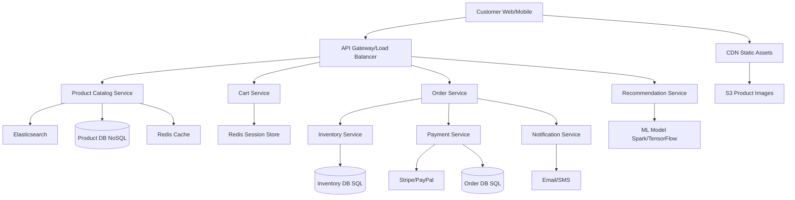

# Design Amazon (E-commerce Platform)

## ⏱️ 1. The 2-Minute Version

**Goal**: Design a large-scale e-commerce platform like Amazon that supports product catalog browsing, shopping cart, checkout, order management, inventory tracking, and payment processing with millions of concurrent users.

**Key Components**:
1. **Product Catalog Service**: Search and browse products (read-heavy).
2. **Cart Service**: Temporary shopping cart storage.
3. **Order Service**: Manages order lifecycle.
4. **Inventory Service**: Tracks stock levels with strong consistency.
5. **Payment Service**: Processes transactions securely.
6. **Recommendation Service**: Personalized product suggestions.

**Key Challenges**:
- **Inventory Consistency**: Prevent overselling (two users buying last item).
- **Flash Sales**: Handle traffic spikes (100x normal load).
- **Search Performance**: Sub-second search across millions of products.
- **Cart Persistence**: Handle abandoned carts, preserve across sessions.

**Trade-offs**:
- **Inventory Reservation**: Reserve on add-to-cart (better UX, ties up inventory) vs. Reserve on checkout (less stock tied up, more cart abandonments).
- **Catalog Consistency**: Eventual (faster, scalable) vs. Strong (slower, accurate pricing).
- **Search**: Elasticsearch (powerful, complex) vs. Database (simpler, limited features).

---

## 🏗️ 2. The 10-Minute Structured Version

### Requirements

#### Functional

**Customer**:
- Browse products by category, search by keywords.
- View product details (images, description, reviews, ratings).
- Add/remove items to cart.
- Checkout with shipping address and payment.
- Track order status.
- Write reviews and ratings.

**Seller** (if marketplace like Amazon):
- Add/update product listings.
- Manage inventory.
- View sales analytics.

**Admin**:
- Manage categories.
- Handle disputes, refunds.
- Monitor system health.

#### Non-Functional
- **Availability**: 99.99% uptime (5 nines desired for checkout).
- **Latency**:
  - Product search: < 200ms.
  - Add to cart: < 100ms.
  - Checkout: < 3 seconds.
- **Scale**:
  - 100M products in catalog.
  - 10M concurrent users.
  - Black Friday: 1M orders/hour.
- **Consistency**:
  - **Catalog**: Eventual consistency (OK if price updates lag by seconds).
  - **Inventory/Orders**: Strong consistency (no double selling).
- **Security**: PCI-DSS compliance for payments.

### Capacity Estimation

**Assumptions**:
- 100M products.
- 10M DAU, each views 50 products = 500M product views/day = 5.8k/sec.
- Conversion rate: 2% = 200k orders/day = 2.3 orders/sec (normal), 300 orders/sec (Black Friday).

**Storage**:
- Products: 100M * 10 KB (metadata) = 1 TB.
- Product images: 100M * 5 images * 500 KB = 250 TB (S3 + CDN).
- Orders: 200k/day * 365 * 5 years * 5 KB = 1.8 TB.

### High-Level Architecture



### Data Flow: Purchase Flow

1. **Browse/Search**:
   - User searches "laptop".
   - Search query goes to **Catalog Service** -> **Elasticsearch**.
   - Results returned with product IDs.
   - Fetch metadata from **Redis cache** (hot products) or **Product DB**.

2. **Add to Cart**:
   - User clicks "Add to Cart".
   - **Cart Service** creates/updates cart in **Redis**.
   - Key: `cart:{user_id}`, Value: `{ product_id: quantity }`.
   - Optional: Check inventory availability (soft check, not reserved yet).

3. **Checkout**:
   - User clicks "Checkout".
   - **Order Service** is invoked.
   - Validate cart items (still available, prices unchanged).
   - Create order with status `PENDING`.
   
4. **Inventory Reservation**:
   - **Inventory Service** attempts to reserve items.
   - Use **pessimistic locking** or **optimistic locking**.
   - If successful, set reservation with TTL (10 minutes).

5. **Payment**:
   - **Payment Service** calls external gateway (Stripe).
   - Use `order_id` as idempotency key.
   - On success: Update order status to `CONFIRMED`.
   
6. **Finalize**:
   - Update **Inventory** (deduct reserved stock).
   - Send confirmation email via **Notification Service**.
   - Clear cart from Redis.

7. **Fulfillment**:
   - Warehouse system picks/packs order.
   - Update order status to `SHIPPED`.
   - Send tracking info to customer.

---

## 🧠 3. Deep Dive & Technical Details

### 1. Product Catalog Design

**Database Choice**:
- **NoSQL (MongoDB/DynamoDB)**: 
  - Flexible schema (laptops have "RAM", shoes have "size").
  - Fast reads.
  - Horizontal scaling.

**Schema**:
```json
{
  "product_id": "123",
  "name": "Dell XPS 13",
  "category_id": "laptops",
  "price": 1299.99,
  "currency": "USD",
  "attributes": {
    "brand": "Dell",
    "ram": "16GB",
    "storage": "512GB SSD"
  },
  "images": ["s3://bucket/prod123_1.jpg", "s3://bucket/prod123_2.jpg"],
  "rating": 4.5,
  "review_count": 2340,
  "created_at": "2024-01-15",
  "updated_at": "2024-11-20"
}
```

**Sharding**:
- Shard by `category_id` or `product_id` (consistent hashing).

---

### 2. Search (Elasticsearch)

**Why Elasticsearch?**
- Full-text search with relevance scoring.
- Faceted search (filter by brand, price range, rating).
- Autocomplete suggestions (n-gram tokenizers).

**Index Structure**:
```json
{
  "mappings": {
    "properties": {
      "name": {"type": "text", "analyzer": "standard"},
      "description": {"type": "text"},
      "category": {"type": "keyword"},
      "price": {"type": "float"},
      "rating": {"type": "float"},
      "brand": {"type": "keyword"}
    }
  }
}
```

**Search Query**:
```json
{
  "query": {
    "bool": {
      "must": [
        {"match": {"name": "laptop"}}
      ],
      "filter": [
        {"range": {"price": {"gte": 500, "lte": 2000}}},
        {"term": {"brand": "Dell"}}
      ]
    }
  },
  "sort": [{"rating": "desc"}]
}
```

**Indexing Pipeline**:
- When product is created/updated in **Product DB**, publish event to Kafka.
- **Indexer service** consumes events and updates Elasticsearch.

---

### 3. Shopping Cart

**Why Redis?**
- Fast read/write (in-memory).
- TTL support (delete abandoned carts after 30 days).
- Session store.

**Data Model**:
```python
# Redis Hash
HSET cart:{user_id} product_123 2  # 2 units of product 123
HSET cart:{user_id} product_456 1
EXPIRE cart:{user_id} 2592000  # 30 days
```

**Guest Users**:
- Generate temporary `session_id` (UUID).
- Store cart against session.
- Merge with user cart on login.

**Persistence**:
- Background job periodically dumps active carts to SQL for recovery.

---

### 4. Inventory Management

**The Hard Part**: Prevent overselling.

**Challenge**:
- User A and User B both try to buy the last laptop.
- Both read `stock = 1`.
- Both proceed to checkout.
- Result: Sold 2, have 0. Angry customer!

**Solution 1: Optimistic Locking**
```sql
UPDATE inventory 
SET stock = stock - 1, version = version + 1
WHERE product_id = 123 AND stock >= 1 AND version = 5;

-- Check affected rows. If 0, someone else bought it.
```
**Pros**: High concurrency.
**Cons**: User gets "Out of stock" error at checkout (poor UX).

**Solution 2: Pessimistic Locking**
```sql
BEGIN TRANSACTION;
SELECT stock FROM inventory WHERE product_id = 123 FOR UPDATE;
-- Lock acquired. Other transactions wait.

IF stock >= 1:
    UPDATE inventory SET stock = stock - 1 WHERE product_id = 123;
    COMMIT;
ELSE:
    ROLLBACK;
```
**Pros**: Guaranteed consistency.
**Cons**: Contention under high load (Black Friday).

**Solution 3: Reservation System** ✅ (Best for UX)
```python
# When user initiates checkout
def reserve_inventory(product_id, quantity):
    # Atomic decrement in Redis
    new_stock = redis.decrby(f"stock:{product_id}", quantity)
    if new_stock >= 0:
        # Create reservation
        reservation_id = generate_id()
        redis.setex(f"reservation:{reservation_id}", 600, {
            "product_id": product_id,
            "quantity": quantity
        })
        return reservation_id
    else:
        # Not enough stock, rollback
        redis.incrby(f"stock:{product_id}", quantity)
        return None

# On payment success
def finalize_order(reservation_id):
    # Deduct from DB
    db.execute("UPDATE inventory SET stock = stock - ? WHERE product_id = ?")
    redis.delete(f"reservation:{reservation_id}")

# On payment failure or timeout
def release_reservation(reservation_id):
    reservation = redis.get(f"reservation:{reservation_id}")
    redis.incrby(f"stock:{reservation.product_id}", reservation.quantity)
    redis.delete(f"reservation:{reservation_id}")
```

**Background Job**: Scan for expired reservations every minute, release them.

---

### 5. Order Management

**Database**: PostgreSQL (ACID required).

**Schema**:
```sql
CREATE TABLE orders (
  order_id BIGSERIAL PRIMARY KEY,
  user_id BIGINT,
  status VARCHAR(20), -- PENDING, CONFIRMED, SHIPPED, DELIVERED, CANCELLED
  total_amount DECIMAL(10,2),
  shipping_address TEXT,
  created_at TIMESTAMP,
  updated_at TIMESTAMP
);

CREATE TABLE order_items (
  order_item_id BIGSERIAL PRIMARY KEY,
  order_id BIGINT REFERENCES orders(order_id),
  product_id BIGINT,
  quantity INT,
  price_at_purchase DECIMAL(10,2) -- Snapshot of price when ordered
);
```

**Why Snapshot Price?**
- Product price may change after order.
- User should be charged the price they saw at checkout.

**State Machine**:
```
PENDING -> PAYMENT_FAILED (refund)
PENDING -> CONFIRMED -> SHIPPED -> DELIVERED
CONFIRMED -> CANCELLED (before shipment)
```

---

### 6. Payment Processing

**Flow**:
1. **Tokenization**: 
   - User enters card details.
   - Frontend sends to Stripe, gets token (never touch raw card data).
2. **Charge**:
   - Backend calls Stripe API with token + amount.
   - Idempotency key = `order_id`.
3. **Webhook**:
   - Stripe sends webhook on success/failure.
   - Update order status.
4. **Retry Logic**:
   - If Stripe API is down, retry with exponential backoff.

**PCI-DSS Compliance**:
- Never store raw credit card numbers.
- Use Stripe/PayPal's tokenization.

---

### 7. Recommendation Engine

**Approaches**:

**Collaborative Filtering**:
- "Users who bought X also bought Y".
- Matrix factorization (ALS in Spark MLlib).

**Content-Based**:
- Recommend similar products based on attributes.
- Example: User bought "Dell XPS", recommend other laptops.

**Hybrid**:
- Combine both approaches.

**Implementation**:
- **Offline**: Daily batch job (Spark) computes recommendations, stores in Redis.
  ```python
  redis.set(f"recommendations:{user_id}", [101, 203, 405, ...])
  ```
- **Online**: Fetch from Redis when user lands on homepage.

---

### 8. Flash Sales & Black Friday Traffic

**Problem**: Normal traffic = 1k orders/sec. Black Friday = 100k orders/sec.

**Solutions**:

**1. Virtual Waiting Room**:
- Similar to Ticketmaster.
- Queue incoming traffic, process in batches.

**2. Pre-allocation**:
- Pre-allocate "flash sale bundles" in advance.
- Example: 10,000 units available. Create 10k unique tokens.
- First 10k users get tokens. Checkout with token guarantees purchase.

**3. Auto-scaling**:
- Scale out **Order Service**, **Payment Service** horizontally.
- Use Kubernetes HPA (Horizontal Pod Autoscaler).

**4. CDN**:
- Serve product pages, images from CDN (90%+ cache hit ratio).

**5. Database Read Replicas**:
- Route read queries to replicas.
- Writes still go to master.

---

### 9. Database Sharding

**Products**: Shard by `product_id` (consistent hashing).

**Orders**: Shard by `user_id`.
- Benefit: User's order history on one shard (fast query).
- Challenge: Analytics (total revenue) requires scatter-gather or data warehouse (replicate to BigQuery/Redshift).

**Inventory**: No sharding (use single PostgreSQL with read replicas).
- Inventory size is relatively small (100M products * 200 bytes = 20 GB).
- Need strong consistency (can't shard easily).

---

### 10. Caching Strategy

**What to Cache**:
1. **Product Metadata**: Redis. TTL = 1 hour.
2. **Search Results**: Key = `search:laptop:page1`. TTL = 10 mins.
3. **User Profile**: TTL = 30 mins.
4. **Recommendations**: TTL = 24 hours.

**Cache Invalidation**:
- **Write-Through**: Update cache when product is updated.
- **TTL-based**: Let cache expire and lazily refresh.

---

### 11. Monitoring & Alerts

**Metrics**:
- **Order success rate**: % of orders successfully placed.
- **Payment failure rate**: < 1%.
- **Inventory accuracy**: Difference between Redis and DB stock.
- **Search latency**: p95 < 200ms.

**Alerts**:
- Payment gateway timeout > 5%.
- Inventory service down.
- Order queue length > 10k.

---

### 12. Edge Cases & Failure Handling

**Problem**: User clicks "Buy" twice (double click).
- **Solution**: Idempotency key in Order Service. Ignore duplicate requests.

**Problem**: Payment succeeds but Order Service crashes before updating DB.
- **Solution**: Stripe webhook retries. Idempotent order confirmation.

**Problem**: Product price changes between add-to-cart and checkout.
- **Solution**: Show price at checkout. Ask user to confirm if price increased.

**Problem**: Inventory goes negative (oversold due to race condition).
- **Solution**: Background job detects negative stock, alerts admin, refunds recent orders.

---

## 📊 Diagram References

Related architecture diagrams:
- [E-commerce System Architecture Diagram](file:///Users/dj/Documents/Programming/techLead/tech-lead-repo/docs/system_design/diagrams/design_ecommerce_1.mmd)
