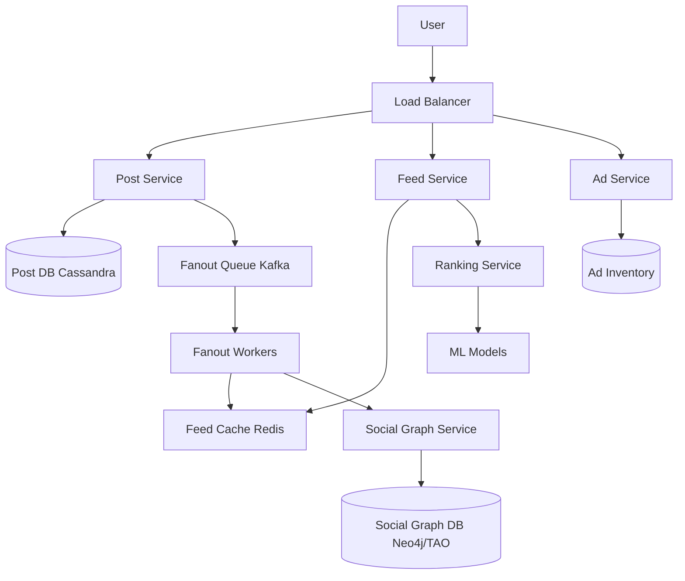

# Design Facebook News Feed

## ⏱️ 1. The 2-Minute Version

**Goal**: Design a personalized social media feed system like Facebook that aggregates and ranks content (posts, photos, videos) from friends, pages, and ads for billions of users.

**Key Components**:
1. **Feed Publishing Service**: Handles post creation and fanout.
2. **Feed Retrieval Service**: Generates personalized timeline.
3. **Ranking Service**: Scores content based on relevance.
4. **Notification Service**: Alerts users about new content.
5. **Ad Service**: Injects sponsored content.

**Key Challenges**:
- **Personalization**: Each user sees different content based on relationships, interests.
- **Ranking**: Determine "most relevant" from thousands of candidates in < 200ms.
- **Freshness**: New posts should appear quickly.
- **Scale**: 3B users, billions of posts/day.

**Trade-offs**:
- **Fan-out on Write vs. Read**: Pre-compute feeds (fast reads) vs. On-demand generation (fresher content).
- **Real-time vs. Batch Ranking**: ML models (updated hourly) vs. Real-time scoring (expensive).
- **Global vs. Personalized**: Show popular content vs. Individually tailored (better engagement).

---

## 🏗️ 2. The 10-Minute Structured Version

### Requirements

#### Functional
- **Post**: Text, images, videos, links.
- **Feed**: Aggregated content from friends + pages + groups + ads.
- **Interaction**: Like, comment, share.
- **Ranking**: Show most relevant content first.
- **Filtering**: Hide seen posts, blocked users, NSFW content.

#### Non-Functional
- **Latency**: Feed load < 200ms.
- **Freshness**: New posts visible within 30 seconds.
- **Availability**: 99.99% uptime.
- **Scale**: 3B users, 1B DAU, 100M concurrent active users.

### High-Level Architecture



### Data Flow: Post Creation

1. User creates post.
2. Post Service:
   - Generate `post_id`.
   - Store in Post DB.
   - Publish to Fanout Queue.
3. Fanout Workers:
   - Fetch user's friends from Social Graph.
   - Push `post_id` to each friend's feed cache (hybrid fanout).
4. Return success.

### Data Flow: Feed Retrieval

1. User requests feed.
2. Feed Service:
   - Fetch candidate post IDs from Feed Cache (Redis).
   - Fetch posts from celebrities/pages user follows (pull model).
   - Combine into ~1000 candidates.
3. Ranking Service:
   - Score each post using ML model.
   - Factors: affinity, edge weight, time decay, content type.
4. Filter Service:
   - Remove seen posts, blocked users, spam.
5. Ad Service:
   - Inject ads (every 5th post).
6. Return top 20 posts.

---

## 🧠 3. Deep Dive & Technical Details

### 1. Hybrid Fanout Model

**Push** (Fan-out on Write):
- When user posts, push to friends' feed caches.
- Works for regular users (< 5k friends).

**Pull** (Fan-out on Read):
- For celebrities (> 5k friends), skip fanout.
- When users load feed, pull recent posts from celebrities they follow.

**Hybrid**:
```python
def get_feed(user_id):
    # Push: pre-computed from friends
    cached_posts = redis.lrange(f"feed:{user_id}", 0, 500)
    
    # Pull: recent from pages/celebrities
    celebrity_posts = fetch_celebrity_posts(user_id)
    
    # Merge
    candidates = cached_posts + celebrity_posts  # ~1000 posts
    
    # Rank
    ranked = ranking_service.rank(user_id, candidates)
    
    # Filter
    filtered = filter_seen_and_blocked(ranked)
    
    # Mix in ads
    final = inject_ads(filtered)
    
    return final[:20]
```

---

### 2. Ranking Algorithm (EdgeRank / ML-based)

**Classic EdgeRank** (Simplified):
```
Score = Affinity × Edge Weight × Time Decay
```

**Affinity Score**:
- How close is user to content creator?
- Based on: interactions (likes, comments, messages), relationship (family, close friend), profile similarity.

**Edge Weight**:
- Value of action type:
  - Comment: 10
  - Like: 5
  - Share: 15
  - View: 1

**Time Decay**:
```python
time_decay = 1 / (hours_since_posted + 1)
```

**Modern ML-based Ranking**:
- **Features** (100s):
  - User: Age, location, interests, past behavior.
  - Content: Type (video > photo > text), length, source.
  - Interaction: Historical engagement rate with similar content.
  - Context: Time of day, device type.
- **Model**: Gradient Boosted Trees or Deep Neural Network.
- **Training**: Offline on historical data, online learning from real-time feedback.
- **Prediction**: Probability user will engage (like, comment, share).

---

### 3. Feed Cache Structure (Redis)

**Key**: `feed:{user_id}`
**Value**: Sorted set of post IDs with scores (timestamps).

```python
# Add post to followers' feeds
redis.zadd(f"feed:{follower_id}", {post_id: timestamp})

# Retrieve latest posts
post_ids = redis.zrevrange(f"feed:{user_id}", 0, 500)
```

**TTL**: 30 days (expire inactive users).

---

### 4. Social Graph Service

**Graph Database** (Neo4j or Facebook's TAO):
- Nodes: Users, Pages, Groups.
- Edges: Friend, Follow, Like, Member.

**Queries**:
- "Get all friends of user X"
- "Get mutual friends of users X and Y"
- "Is user X following page Y?"

**Caching**:
- Cache friend lists (hot data) in Redis.
- TTL: 1 hour.

---

### 5. Content Filtering

**Seen Posts**:
- Track in Redis set: `seen_posts:{user_id}`.
- Filter out before displaying.

**Blocked Users**:
- Query Social Graph for block list.
- Filter out posts from blocked users.

**NSFW/Spam Detection**:
- ML models scan images/text.
- Flag and hide inappropriate content.

---

### 6. Ad Injection

**Ad Targeting**:
- User demographics, interests, behavior.
- Auction-based (highest bidder wins slot).

**Insertion**:
- Inject ad every N organic posts (e.g., N=5).
- Track: impressions, clicks, conversions.

---

### 7. Scalability

**Post Service**: Stateless, horizontally scalable.
**Fanout Workers**: Kafka consumer groups, auto-scale based on queue lag.
**Feed Cache**: Redis Cluster, sharded by user_id.
**Ranking Service**: Batch prediction, cache scores for 10 minutes.

---

### 8. Monitoring

**Metrics**:
- Feed load latency (p50, p95, p99).
- Fanout latency (time from post creation to cache update).
- Ranking model accuracy (CTR prediction).
- Cache hit rate.

**Alerts**:
- Feed latency p99 > 500ms.
- Fanout queue lag > 1 minute.
- Cache hit rate < 90%.

---

## 📊 Diagram References

Related architecture diagrams:
- [Facebook Feed System Architecture Diagram](file:///Users/dj/Documents/Programming/techLead/tech-lead-repo/docs/system_design/diagrams/design_facebook_feed_1.mmd)
