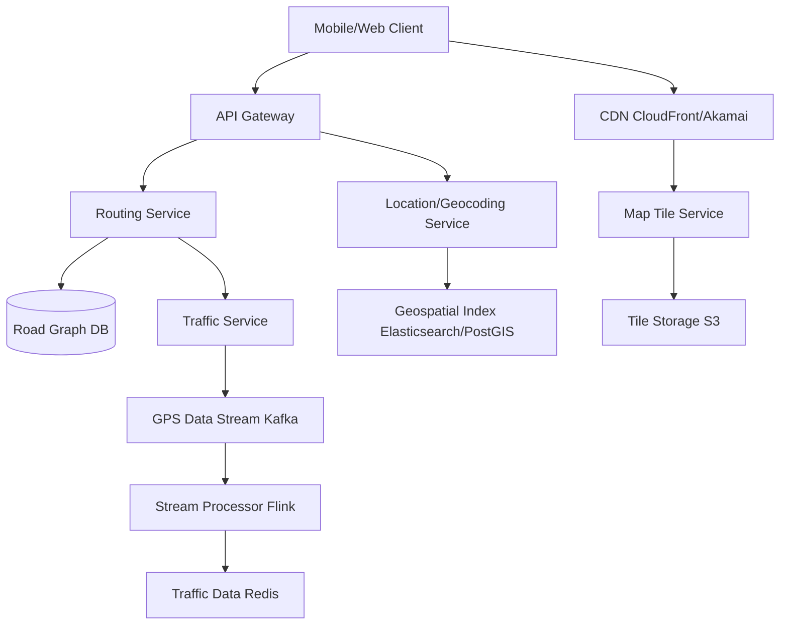

# Design Google Maps

## ⏱️ 1. The 2-Minute Version

**Goal**: Design a navigation and mapping application like Google Maps that provides real-time routing, traffic updates, location search, and turn-by-turn navigation for millions of concurrent users globally.

**Key Components**:
1. **Map Tile Service**: Serves map imagery/vectors at different zoom levels.
2. **Routing Service**: Calculates optimal paths using graph algorithms.
3. **Location Service**: Geocoding, reverse geocoding, place search.
4. **Traffic Service**: Real-time traffic data from user GPS traces.
5. **Navigation Service**: Turn-by-turn guidance.

**Key Challenges**:
- **Routing Performance**: Calculate routes on graph with billions of edges in < 1 second.
- **Real-time Traffic**: Aggregate GPS data from millions of devices.
- **Map Data Storage**: Petabytes of imagery + vector data.
- **Global Coverage**: Low latency worldwide.

**Trade-offs**:
- **Dijkstra vs. A* vs. Contraction Hierarchies**: Simple vs. Fast vs. Very fast (with preprocessing).
- **Vector vs. Raster Tiles**: Flexible rendering vs. Simplicity.
- **Real-time vs. Batch Traffic**: Accurate but expensive vs. Slightly stale but cheap.

---

## 🏗️ 2. The 10-Minute Structured Version

### Requirements

#### Functional
- **Search**: Find places, addresses, coordinates.
- **Routing**: Calculate shortest/fastest path A→B.
- **Navigation**: Turn-by-turn voice guidance.
- **Traffic**: Show real-time traffic conditions.
- **ETA**: Estimate arrival time.
- **Street View**: Panoramic street-level imagery.
- **Offline Maps**: Download regions for offline use.

#### Non-Functional
- **Latency**: Route calculation < 1s, map load < 500ms.
- **Accuracy**: Correct routes, up-to-date maps.
- **Availability**: 99.99% uptime.
- **Scale**: 1B+ users, 100M concurrent active navigations.

### High-Level Architecture



### Data Flow: Route Calculation

1. User requests route: "San Francisco → Los Angeles".
2. **Geocoding**: Convert addresses to coordinates.
3. **Routing Service**:
   - Load road graph from cache/DB.
   - Apply traffic weights to edges.
   - Run A* algorithm.
   - Return polyline + step-by-step instructions.
4. **ETA Calculation**: Sum edge weights (time), add buffer.
5. Stream result to client.

---

## 🧠 3. Deep Dive & Technical Details

### 1. Routing Algorithms

**Dijkstra's Algorithm**:
- Explores all directions equally.
- Guarantees shortest path.
- **Time**: O(E log V), too slow for large graphs (billions of nodes).

**A\* (A-Star)**:
- Uses heuristic (straight-line distance to destination).
- Prioritizes paths moving toward goal.
- **Heuristic**: `h(n) = haversine_distance(n, destination)`.
- Much faster than Dijkstra in practice.

**Contraction Hierarchies (CH)**:
- **Preprocessing**: Add "shortcut" edges for highways (contract low-importance nodes).
  - Example: Highway exit → Highway exit shortcut skips local roads.
- **Query Time**: Bidirectional search on contracted graph.
- **Speed**: 1000x faster than Dijkstra.
- **Trade-off**: Expensive preprocessing (hours), but query in milliseconds.

**Implementation**:
```python
# A* pseudocode
def a_star(start, goal, graph):
    open_set = PriorityQueue()
    open_set.put((0 + heuristic(start, goal), start))
    came_from = {}
    g_score = {start: 0}
    
    while not open_set.empty():
        current = open_set.get()[1]
        
        if current == goal:
            return reconstruct_path(came_from, current)
        
        for neighbor in graph.neighbors(current):
            tentative_g = g_score[current] + edge_cost(current, neighbor)
            
            if neighbor not in g_score or tentative_g < g_score[neighbor]:
                came_from[neighbor] = current
                g_score[neighbor] = tentative_g
                f_score = tentative_g + heuristic(neighbor, goal)
                open_set.put((f_score, neighbor))
```

---

### 2. Road Graph Representation

**Nodes**: Intersections, road segments.
**Edges**: Roads with attributes:
```json
{
  "edge_id": "123",
  "from_node": "A",
  "to_node": "B",
  "length_meters": 500,
  "speed_limit": 55,
  "road_type": "highway",
  "current_traffic_speed": 45,
  "oneway": true
}
```

**Weight Calculation**:
```python
weight = length / current_traffic_speed  # Time to traverse
```

**Storage**:
- **Adjacency List**: `{node_id: [(neighbor_id, edge_weight), ...]}`
- **Database**: PostGIS (geospatial queries).
- **In-Memory**: Load frequently accessed regions into RAM for fast routing.

---

### 3. Map Tiles

**Tiling System**:
- Divide world into grid at zoom levels 0-20.
- **Zoom 0**: Entire world = 1 tile.
- **Zoom 20**: Street-level detail.
- **Tile Naming**: `{z}/{x}/{y}.png` where z=zoom, x/y=coordinates.

**Vector Tiles**:
- Send geometric data (lines, polygons, points) + attributes.
- Client renders using styles.
- **Format**: Protocol Buffers (Mapbox Vector Tiles).
- **Advantage**: Smaller size, smooth zooming, customizable styling.

**Raster Tiles**:
- Pre-rendered images (PNG/JPEG).
- Simple to serve, but larger and less flexible.

**CDN**:
- Tiles cached globally on CDN.
- Cache hit rate > 95%.

---

### 4. Real-time Traffic

**Data Sources**:
- **User GPS Traces**: Android phones (Google Mobile Services) send location updates.
- **Anonymization**: Aggregate data, remove PII.

**Processing**:
1. Stream GPS data to Kafka.
2. Flink processes stream:
   - Map match GPS points to road segments.
   - Calculate average speed on each segment in sliding window (5 mins).
3. Update Traffic Cache (Redis):
   - `road_segment_id → {current_speed, timestamp}`.

**Traffic Visualization**:
- **Green**: Speed > 80% of speed limit.
- **Yellow**: 40-80%.
- **Red**: < 40%.

**Prediction**:
- Use historical traffic patterns + current conditions.
- ML models (LSTM) predict traffic 30-60 mins ahead.

---

### 5. Geocoding & Place Search

**Geocoding** (Address → Coordinates):
- Parse address: "1600 Amphitheatre Parkway, Mountain View, CA".
- Query geospatial database (Elasticsearch with geo_point).
- Return `{lat, lon}`.

**Reverse Geocoding** (Coordinates → Address):
- Given `{lat, lon}`, find nearest address.
- Use geospatial index (R-tree, QuadTree).

**Place Search**:
- Index POIs (restaurants, gas stations) in Elasticsearch.
- Query: "pizza near me".
- Ranking: Distance, rating, popularity.

---

### 6. Turn-by-Turn Navigation

**Process**:
1. Calculate route polyline.
2. Generate instructions:
   - "Turn left onto Main St in 500m".
   - "In 200m, merge onto Highway 101 South".
3. Client tracks GPS location.
4. When user deviates:
   - Recalculate route in real-time.
5. Voice synthesis (TTS) announces instructions.

**Rerouting**:
- Monitor GPS location every 2-5 seconds.
- If distance to route > threshold (50m):
   - Trigger recalculation.
   - Should complete in < 500ms for good UX.

---

### 7. Scalability

**Routing Service**:
- Cache popular routes (SF → LA).
- Partition graph by geographic region.
- Horizontal scaling (stateless service).

**Traffic Service**:
- Kafka partitions by road_segment_id.
- Flink workers scale based on throughput.

**Tile Service**:
- CDN handles 99% of requests.
- Origin service auto-scales for cache misses.

---

### 8. Monitoring

**Metrics**:
- Route calculation latency (p50, p95, p99).
- Traffic data freshness (lag from GPS event to cache update).
- Tile CDN hit rate.
- Geocoding accuracy.

**Alerts**:
- Routing latency p99 > 2s.
- Traffic data lag > 10 mins.
- CDN hit rate < 90%.

---

## 📊 Diagram References

Related architecture diagrams:
- [Google Maps System Architecture Diagram](file:///Users/dj/Documents/Programming/techLead/tech-lead-repo/docs/system_design/diagrams/design_google_maps_1.mmd)
