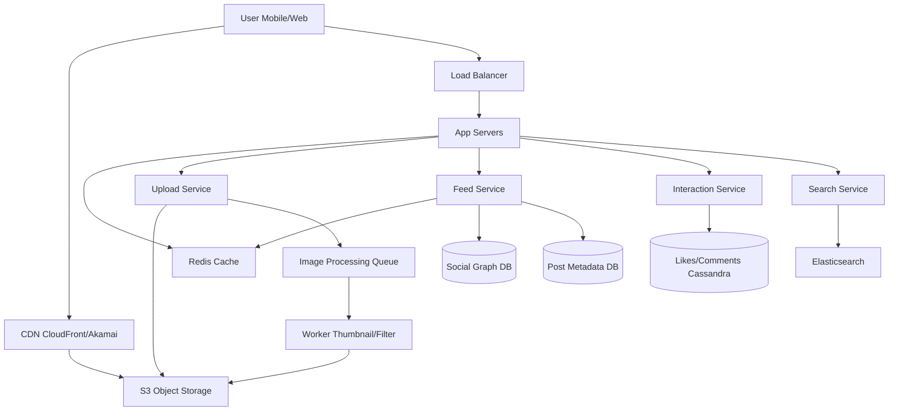

# Design Instagram

## ⏱️ 1. The 2-Minute Version

**Goal**: Design a photo-sharing social media platform that supports image uploads, news feed, social graph (follow/unfollow), likes, comments, and direct messaging at Instagram's scale (2B+ users).

**Key Components**:
1. **Image Storage**: Object storage (S3) for photos/videos.
2. **CDN**: Global content delivery for fast image loading.
3. **Feed Service**: Generates personalized news feeds using hybrid fan-out.
4. **Social Graph**: Stores follow relationships in graph database or key-value store.
5. **Metadata Store**: SQL or NoSQL for post metadata, comments, likes.

**Key Challenges**:
- **Storage Scale**: Petabytes of images/videos.
- **Feed Generation**: Balance between freshness and personalization for billions of users.
- **Hot Spotting**: Celebrity posts (100M+ followers) cause load spikes.
- **Latency**: Sub-second image load times globally.

**Trade-offs**:
- **Fan-out on Write vs. Fan-out on Read**: Write (pre-compute feeds) is fast to read but expensive for celebrities. Read (compute on-demand) saves storage but slower.
- **Consistency vs. Availability**: Eventual consistency for likes/comments (AP) vs. Strong for payments (CP).
- **Storage**: S3 (cheap, durable) vs. Dedicated CDN cache (expensive, fast).

---

## 🏗️ 2. The 10-Minute Structured Version

### Requirements

#### Functional
- **Upload Photos/Videos**: With filters, captions, tags, location.
- **News Feed**: Chronological + algorithmic ranking.
- **Social Graph**: Follow/unfollow users.
- **Interactions**: Like, comment, share.
- **Stories**: 24-hour ephemeral content.
- **Direct Messages**: 1-on-1 and group chats.
- **Search**: Users, hashtags, locations.
- **Explore Page**: Discover new content.

#### Non-Functional
- **Availability**: 99.99% uptime.
- **Latency**: 
  - Image load: < 300ms globally.
  - Feed load: < 1 second.
- **Scale**:
  - 2B users, 500M daily active users (DAU).
  - 100M photos uploaded per day.
  - 4.2B likes per day.
- **Storage**: Petabytes (photos + videos).
- **Bandwidth**: 10 PB/month egress (CDN).

### Capacity Estimation

**Assumptions**:
- 500M DAU.
- Each user uploads 1 photo every 2 days on average = 250M photos/day.
- Average photo size: 2 MB (original) + 500 KB (compressed) + 50 KB (thumbnail) = 2.5 MB total.
- Storage per day: 250M * 2.5 MB = 625 TB/day.
- Storage for 5 years: 625 TB * 365 * 5 = 1.14 PB.

**Read Traffic**:
- Each user views 50 photos/day.
- Total reads: 500M * 50 = 25B photo views/day = 290k/sec.

**Bandwidth**:
- 290k requests/sec * 500 KB = 145 GB/sec egress.

### High-Level Architecture



### Data Flow: Photo Upload

1. **User uploads photo** via mobile app.
2. **App Server** generates unique `photo_id` (Snowflake ID).
3. **Upload Service** uploads original image to **S3** at path: `s3://instagram-photos/{user_id}/{photo_id}_original.jpg`.
4. **Metadata saved** to **Post Metadata DB**: `{ photo_id, user_id, caption, timestamp, location }`.
5. **Queue message** sent to Kafka/SQS: `{ photo_id, s3_path }`.
6. **Worker** consumes message:
   - Generates **thumbnails** (150x150, 640x640).
   - Applies **filters** (if requested).
   - Uploads variants to S3.
   - Optional: Runs **ML model** for NSFW detection, face recognition.
7. **Update metadata** with S3 URLs for all sizes.
8. **Feed Service** triggers: Add photo to followers' feeds (fan-out on write for non-celebrities).

---

## 🧠 3. Deep Dive & Technical Details

### 1. Image Storage & CDN

**Why S3?**
- **Durability**: 11 nines (99.999999999%).
- **Scalability**: Unlimited storage.
- **Cost**: Cheap ($0.023/GB/month).

**Folder Structure**:
```
s3://instagram-photos/
  ├── sharded-by-user-id/
      ├── user_123/
          ├── photo_456_original.jpg
          ├── photo_456_640x640.jpg
          ├── photo_456_150x150.jpg
```

**CDN (CloudFront)**:
- **Cache Hit Ratio**: Aim for > 90%.
- **TTL**: 30 days for images (they rarely change).
- **Invalidation**: Rarely needed (images are immutable; use versioned URLs).

**Optimization**:
- **WebP/AVIF format**: 30% smaller than JPEG.
- **Lazy loading**: Load images as user scrolls.
- **Responsive images**: Serve different sizes based on device.

---

### 2. Database Schema & Sharding

**Post Metadata (Cassandra or PostgreSQL)**:

```sql
CREATE TABLE posts (
  photo_id BIGINT PRIMARY KEY, -- Snowflake ID
  user_id BIGINT,
  caption TEXT,
  location VARCHAR(255),
  created_at TIMESTAMP,
  s3_url_original VARCHAR(500),
  s3_url_medium VARCHAR(500),
  s3_url_thumbnail VARCHAR(500),
  likes_count INT DEFAULT 0,
  comments_count INT DEFAULT 0,
  INDEX idx_user_created (user_id, created_at DESC)
);
```

**Sharding Strategy**:
- **Shard by `photo_id`**: Distribute photos evenly.
  - Use **consistent hashing** or **hash(photo_id) % num_shards**.
- **Problem**: Query "get all photos by user_123" requires scatter-gather across shards.
- **Solution**: Maintain **secondary index** or use **Cassandra** with composite partition key `(user_id, photo_id)`.

**Cassandra Schema** (better for Instagram's use case):
```cql
CREATE TABLE posts_by_user (
  user_id BIGINT,
  photo_id BIGINT,
  caption TEXT,
  created_at TIMESTAMP,
  s3_url TEXT,
  PRIMARY KEY (user_id, created_at, photo_id)
) WITH CLUSTERING ORDER BY (created_at DESC);
```
- **Partition Key**: `user_id` (all photos by user on same node).
- **Clustering Key**: `created_at DESC` (sorted by time).

**Likes & Comments** (Cassandra for write-heavy workload):
```cql
CREATE TABLE likes (
  photo_id BIGINT,
  user_id BIGINT,
  created_at TIMESTAMP,
  PRIMARY KEY (photo_id, user_id)
);

CREATE TABLE comments (
  photo_id BIGINT,
  comment_id BIGINT,
  user_id BIGINT,
  text TEXT,
  created_at TIMESTAMP,
  PRIMARY KEY (photo_id, created_at, comment_id)
) WITH CLUSTERING ORDER BY (created_at DESC);
```

**Counters** (separate table for performance):
```cql
CREATE TABLE post_counters (
  photo_id BIGINT PRIMARY KEY,
  likes_count COUNTER,
  comments_count COUNTER
);
```
- Use Cassandra's COUNTER type for atomic increments.
- Avoid read-modify-write race conditions.

---

### 3. News Feed Generation

**Challenge**: Generate feed for 500M users, each with avg 200 followings.

**Approach 1: Fan-out on Write** (Push model)
- When user A posts photo, immediately write to all followers' feeds.
- **Pros**: Fast read (feed is pre-computed).
- **Cons**: Slow write for celebrities (Kim Kardashian has 300M followers = 300M writes).

**Approach 2: Fan-out on Read** (Pull model)
- When user opens app, query all followed users' recent posts, merge, sort.
- **Pros**: Fast write.
- **Cons**: Slow read (query 200 users, sort, paginate).

**✅ Hybrid Approach** (Instagram's actual approach):
- **Regular users (< 1M followers)**: Fan-out on write.
  - Maintain a **feed timeline** for each user in Redis or Cassandra.
  - When someone posts, write to all followers' timelines asynchronously.
- **Celebrities (> 1M followers)**: Fan-out on read.
  - Don't write to 300M feeds.
  - When user opens app, fetch celebrity posts on-demand and merge with regular feed.

**Implementation**:

**Feed Timeline Table** (Redis Sorted Set):
```python
# When user A posts photo (fan-out on write for non-celebrities)
followers = get_followers(user_A_id)
for follower in followers:
    redis.zadd(f"feed:{follower_id}", {photo_id: timestamp})

# When user opens app (read)
feed_items = redis.zrevrange(f"feed:{user_id}", 0, 19)  # Top 20 posts
```

**Ranking Algorithm** (for Explore page or algorithmic feed):
```
Score = W1 * Affinity(user, author) 
      + W2 * Engagement(photo)  # likes + comments
      + W3 * Recency(photo)
      + W4 * ContentType(photo)  # prefer videos
```

---

### 4. Social Graph Storage

**Requirements**:
- Store "User A follows User B".
- Query "Who does User A follow?" (Following).
- Query "Who follows User A?" (Followers).
- Scale: Billions of edges.

**Option 1: SQL (PostgreSQL)**
```sql
CREATE TABLE follows (
  follower_id BIGINT,
  followee_id BIGINT,
  created_at TIMESTAMP,
  PRIMARY KEY (follower_id, followee_id)
);

-- Indexes for both queries
CREATE INDEX idx_follower ON follows(follower_id);
CREATE INDEX idx_followee ON follows(followee_id);
```

**Sharding**: Shard by `follower_id`.
- **Problem**: Query "get followers of User B" scattered across shards.
- **Solution**: Duplicate data in reverse index.

**Option 2: Graph Database (Neo4j, JanusGraph)**
- Natural fit for social graphs.
- Efficient traversal (friends-of-friends).
- **Cons**: Complex to scale. Overkill for simple follow relationship.

**Option 3: Redis (What Instagram uses for hot data)**
```python
# Store following
redis.sadd(f"following:{user_A_id}", user_B_id)

# Store followers
redis.sadd(f"followers:{user_B_id}", user_A_id)

# Get followers
followers = redis.smembers(f"followers:{user_id}")
```

---

### 5. Likes & Comments

**Write-Heavy Workload**:
- 4.2B likes/day = 48k likes/sec.
- Need high write throughput.

**Solution: Cassandra**
- Designed for write-heavy workloads.
- Use **COUNTER** type for likes count (atomic increments, no race conditions).

**Eventual Consistency**:
- It's okay if like count shows "1000" instead of "1001" for a few milliseconds.
- User won't notice. No strong consistency needed.

**Like/Unlike Flow**:
```python
# Like
cassandra.execute("UPDATE post_counters SET likes_count = likes_count + 1 WHERE photo_id = ?")
cassandra.execute("INSERT INTO likes (photo_id, user_id) VALUES (?, ?)")

# Unlike
cassandra.execute("UPDATE post_counters SET likes_count = likes_count - 1 WHERE photo_id = ?")
cassandra.execute("DELETE FROM likes WHERE photo_id = ? AND user_id = ?")
```

**Optimization - Write Behind**:
- Don't write every like immediately to DB.
- Buffer in Redis: `redis.incr(f"likes_count:{photo_id}")`.
- Background job flushes to Cassandra every 10 seconds.
- **Trade-off**: Risk losing data if Redis crashes, but gain 10x lower DB load.

---

### 6. Search (Elasticsearch)

**Indexed Data**:
- **Users**: username, full name, bio.
- **Hashtags**: extracted from captions.
- **Locations**: GPS coordinates + place names.

**Index Update**:
- When user posts photo with caption "#sunset #beach", extract hashtags and index.
- Use Kafka to stream updates to Elasticsearch asynchronously.

**Query Example**:
```json
{
  "query": {
    "multi_match": {
      "query": "beach sunset",
      "fields": ["caption", "hashtags"]
    }
  }
}
```

---

### 7. Image Processing Pipeline

**Asynchronous Processing**:
- Uploading original image should be fast (< 2 seconds).
- Thumbnail generation, filters, ML can happen async.

**Pipeline**:
1. **Upload** -> S3 (original).
2. **Enqueue** -> Kafka topic `image_processing`.
3. **Workers** (auto-scaling based on queue length):
   - Download from S3.
   - Generate thumbnails (ImageMagick, Pillow).
   - Apply filters.
   - Upload variants to S3.
   - Update DB with new URLs.

**ML Models** (Optional):
- **NSFW Detection**: Flag inappropriate content.
- **Face Detection**: Tag people.
- **Object Recognition**: Auto-suggest hashtags.

---

### 8. Stories (24-hour ephemeral content)

**Storage**:
- Don't store in S3 permanently (wasteful for 24-hour content).
- Use S3 with **lifecycle policy**: Delete after 25 hours.

**Data Model**:
```sql
CREATE TABLE stories (
  story_id BIGINT PRIMARY KEY,
  user_id BIGINT,
  s3_url VARCHAR(500),
  created_at TIMESTAMP,
  expires_at TIMESTAMP -- created_at + 24 hours
);
```

**Cleanup**:
- **Cron job** runs hourly: `DELETE FROM stories WHERE expires_at < NOW()`.
- S3 lifecycle policy deletes files automatically.

**Feed**:
- Similar to news feed, but sorted by time.
- Cache in Redis: `redis.zadd(f"stories_feed:{user_id}", {story_id: timestamp})`.

---

### 9. Direct Messaging

**Requirements**:
- Real-time delivery.
- 1-on-1 and group chats.

**Architecture** (similar to WhatsApp):
- **WebSocket** for persistent connections.
- **Message Store**: Cassandra.
- **Delivery**: Push notifications (FCM/APNS) if user offline.

---

### 10. Scalability & Performance

**Caching**:
- **Redis** for:
  - Feed timelines.
  - Post metadata (hot posts).
  - User profiles.
  - Social graph (following/followers for active users).

**Database Read Replicas**:
- Master for writes.
- 10+ read replicas for read queries (feed, profile, search).

**Load Balancing**:
- **Geographic LB**: Route US users to US region, EU to EU region.
- **Service-based LB**: Separate LB for upload, feed, search.

**Rate Limiting**:
- **Per User**: Max 100 likes/minute (prevent bots).
- **Per IP**: Max 1000 requests/minute.

---

### 11. Monitoring & Observability

**Metrics**:
- **Upload success rate**: % of successful uploads.
- **Feed load time**: p50, p95, p99.
- **CDN cache hit ratio**: Should be > 90%.
- **Image processing queue length**: Alert if > 10k.

**Alerts**:
- Upload service down.
- Database replica lag > 10 seconds.
- S3 error rate > 1%.

---

### 12. Edge Cases & Failure Handling

**Problem**: S3 outage.
- **Impact**: Can't upload new photos, CDN cache misses fail.
- **Mitigation**: Multi-region S3 replication, fallback to backup region.

**Problem**: Celebrity posts overwhelm system.
- **Mitigation**: 
  - Hybrid fan-out (fan-out on read for celebrities).
  - Rate limit fan-out workers.

**Problem**: User deletes photo.
- **Solution**: 
  - Soft delete (mark as deleted, don't show in feed).
  - Async cleanup from S3 after 30 days (in case of recovery).

**Problem**: Image processing worker crashes.
- **Solution**: 
  - Kafka retains messages for 7 days (can replay).
  - Dead letter queue for failed jobs (manual review).

---

## 📊 Diagram References

Related architecture diagrams:
- [Instagram System Architecture Diagram](file:///Users/dj/Documents/Programming/techLead/tech-lead-repo/docs/system_design/diagrams/design_instagram_1.mmd)
