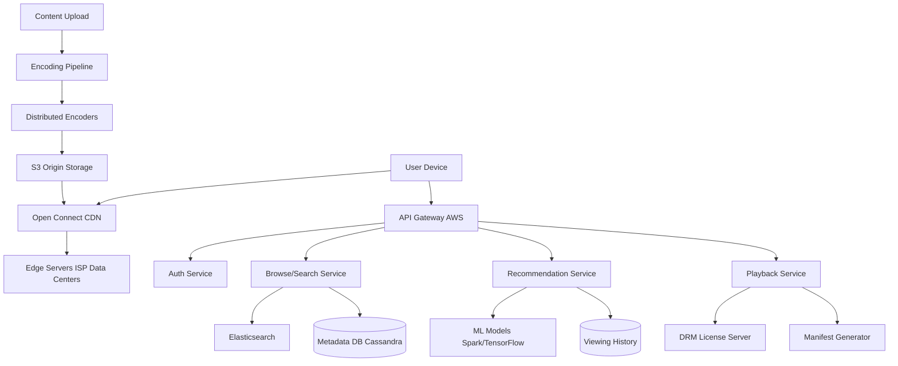

# Design Netflix

## ⏱️ 1. The 2-Minute Version

**Goal**: Design a global video streaming platform like Netflix that supports millions of concurrent streams with minimal buffering, adaptive bitrate streaming, and personalized recommendations.

**Key Components**:
1. **Control Plane** (AWS): Handles user management, billing, search, recommendations, metadata.
2. **Data Plane** (Open Connect CDN): Handles video streaming from edge locations.
3. **Encoding Pipeline**: Converts source videos into multiple formats and bitrates.
4. **Recommendation Engine**: ML-based personalized content suggestions.

**Key Challenges**:
- **Global Distribution**: Stream 4K video to millions simultaneously worldwide.
- **Adaptive Bitrate (ABR)**: Adjust quality based on network conditions.
- **Storage**: Petabytes of video content.
- **Personalization**: Unique homepage for each of 200M+ subscribers.

**Trade-offs**:
- **Pre-encoding vs. On-the-fly encoding**: Pre-encode all variants (expensive storage) vs. Encode on-demand (high CPU, latency).
- **Push vs. Pull CDN**: Push popular content to edges vs. Pull on-demand (Netflix uses push during off-peak hours).
- **Global vs. Regional Recommendations**: Global trends vs. Localized preferences.

---

## 🏗️ 2. The 10-Minute Structured Version

### Requirements

#### Functional
- **Upload**: Content creators upload movies/shows.
- **Encode**: Transcode into multiple formats/bitrates.
- **Stream**: Users watch with adaptive bitrate.
- **Search**: Find content by title, genre, actor.
- **Recommend**: Personalized homepage.
- **Profiles**: Multiple user profiles per account.
- **Subtitle/Audio**: Multi-language support.

#### Non-Functional
- **Availability**: 99.99% uptime.
- **Latency**: Video start time < 2 seconds, minimal buffering.
- **Scale**:
  - 200M+ subscribers.
  - 1B hours watched/week.
  - Peak: 100M concurrent streams.
- **Bandwidth**: Petabytes/day egress.
- **Storage**: 100K+ titles, each with 10+ variants = Exabytes.

### High-Level Architecture



### Data Flow

**Video Upload & Encoding**:
1. Studio uploads source  movie (Raw, TB size).
2. Encoding Pipeline:
   - Split into 4-second chunks.
   - Encode each chunk to multiple bitrates: 4K, 1080p, 720p, 480p, 240p.
   - Use codecs: H.264, H.265 (HEVC), VP9, AV1.
   - Generate thumbnails for scrub bar.
3. Upload encoded chunks to S3.
4. Push to Open Connect CDN (overnight during low-traffic hours).

**Video Streaming**:
1. User clicks "Play".
2. Client requests manifest file (MPD for DASH or M3U8 for HLS).
3. **Manifest** lists available bitrates and chunk URLs.
4. Client starts with low bitrate (fast startup).
5. Client monitors bandwidth, requests higher/lower bitrate chunks adaptively.
6. Chunks served from nearest Edge server (< 50ms latency).

---

## 🧠 3. Deep Dive & Technical Details

### 1. Video Encoding Pipeline

**Source**: Raw 4K video, 20 Mbps bitrate, 2-hour movie = 18 GB.

**Process**:
1. **Chunking**: Split into 4-second segments.
2. **Parallel Encoding**: Use DAG workflow (Netflix Conductor).
   - Each chunk encoded independently by distributed workers (AWS EC2 instances).
3. **Bitrate Ladder**:
   - 4K: 25 Mbps (H.265).
   - 1080p: 8 Mbps.
   - 720p: 5 Mbps.
   - 480p: 2.5 Mbps.
   - 240p: 0.5 Mbps (mobile).
4. **Audio**: Encoded separately (AAC, Dolby Atmos).
5. **Subtitles**: Stored as text (SRT, WebVTT).

**Storage After Encoding**:
- 1 movie * 5 bitrates * 2 hours * 60 secs * 15 chunks/sec = ~54K chunks.
- Total storage per movie: ~50 GB.

**Optimization**:
- **Per-title encoding**: Analyze each title, determine optimal bitrate ladder (some titles don't need 4K).
- **AV1 codec**: 30% better compression than H.265.

---

### 2. Adaptive Bitrate Streaming (ABR)

**Protocols**:
- **MPEG-DASH**: Industry standard, used by Netflix on most platforms.
- **HLS (Apple)**: For iOS/Safari.

**ABR Algorithm** (Client-side):
```python
while streaming:
    measure_bandwidth()
    measure_buffer_size()
    
    if buffer_low and bandwidth_poor:
        switch_to_lower_bitrate()
    elif buffer_healthy and bandwidth_good:
        switch_to_higher_bitrate()
    
    fetch_next_chunk(selected_bitrate)
```

**Benefits**:
- Smooth playback (no buffering).
- Optimal quality for user's network.

---

### 3. Open Connect CDN

**What is it?**
- Netflix's custom CDN.
- **Appliances** (servers) installed in ISP data centers worldwide.
- Stores ~100 TB of popular content per appliance.

**Why not use Akamai/CloudFlare?**
- Cost: Netflix's traffic is ~15% of global internet traffic. Third-party CDN too expensive.
- Control: Optimize caching, pre-positioning.

**Content Distribution**:
- **Overnight Push**: During low-traffic (2-6 AM), push popular titles from origin (S3) to edge servers.
- **Popularity Prediction**: ML model predicts what users in each region will watch.
- **Example**: New season of "Stranger Things" pre-loaded to all edges before release.

**Cache Eviction**:
- LRU eviction when storage full.
- Prioritize popular + new releases.

---

### 4. Metadata & Search

**Metadata DB** (Cassandra):
```json
{
  "title_id": "123",
  "title": "The Matrix",
  "genre": ["Action", "Sci-Fi"],
  "cast": ["Keanu Reeves", "Carrie-Anne Moss"],
  "release_year": 1999,
  "rating": 8.7,
  "thumbnail_url": "s3://...",
  "available_regions": ["US", "CA", "UK"]
}
```

**Search** (Elasticsearch):
- Index titles, actors, directors, genres.
- Typo-tolerant fuzzy matching.
- Personalized ranking (boost genres user watches).

---

### 5. Recommendation System

**Data**:
- **Viewing history**: What you watched, when you paused, rewound.
- **Ratings**: Thumbs up/down.
- **Browse behavior**: What you hovered over, scrolled past.

**Models**:
- **Collaborative Filtering**: "Users similar to you liked X".
- **Matrix Factorization**: Decompose User-Item matrix (Spark ALS).
- **Deep Learning**: Neural networks for complex patterns.

**Personalization**:
- **Homepage rows**: Each row personalized. "Because you watched X", "Trending Now", "New Releases".
- **Thumbnail A/B Testing**: Show different thumbnails to different users, measure click-through.

---

### 6. DRM (Digital Rights Management)

**Purpose**: Prevent piracy.

**Implementation**:
- Encrypt video chunks (AES-128).
- Client requests decryption key from DRM License Server.
- License server checks if user has active subscription.
- Key delivered securely (Widevine, PlayReady, FairPlay).

---

### 7. Scalability

**Control Plane** (AWS):
- Microservices architecture.
- Auto-scaling based on load.
- Multi-region deployment (US-East, US-West, EU, Asia).

**Data Plane** (Open Connect):
- 10,000+ servers globally.
- Horizontally scalable (add more appliances to ISPs).

**Database**:
- **Cassandra**: Shard by `user_id` or `title_id`.
- **Elasticsearch**: Distributed across multiple nodes.

---

### 8. Monitoring

**Metrics**:
- **Buffering Rate**: % of playback time spent buffering.
- **Start Time**: Time from click to first frame.
- **Bitrate Distribution**: % of users watching in HD, 4K.
- **CDN Hit Rate**: % of requests served from edge vs. origin.

**Alerts**:
- Buffering rate > 2%.
- CDN cache miss rate > 10%.
- Encoding pipeline backlog > 100 titles.

---

### 9. Edge Cases

**Problem**: Major outage (entire AWS region down).
- **Solution**: Multi-region failover. Control plane redirects to backup region.

**Problem**: ISP peering issues (slow connection to Open Connect).
- **Solution**: Fall back to third-party CDN (Akamai) temporarily.

**Problem**: Popular release overwhelms CDN (e.g., new season of hit show).
- **Solution**: Pre-load content, rate limit concurrent streams per account, use third-party CDN for overflow.

---

## 📊 Diagram References

Related architecture diagrams:
- [Netflix System Architecture Diagram](file:///Users/dj/Documents/Programming/techLead/tech-lead-repo/docs/system_design/diagrams/design_netflix_1.mmd)
