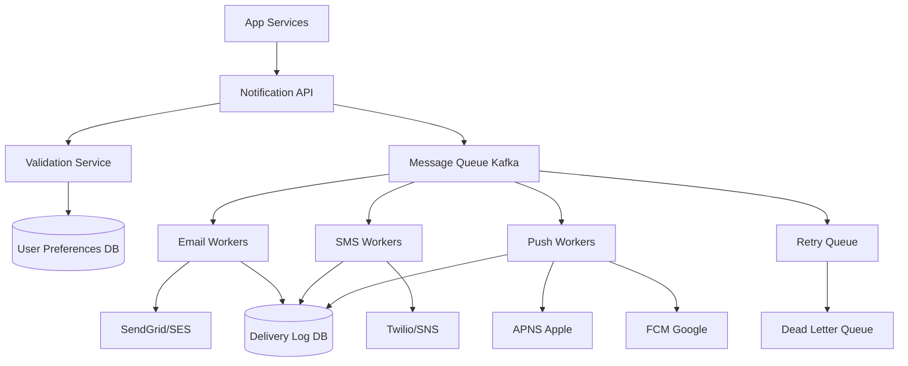

# Design a Notification System

## ⏱️ 1. The 2-Minute Version

**Goal**: Design a scalable multi-channel notification system that sends email, SMS, and push notifications to millions of users reliably, respecting user preferences and rate limits.

**Key Components**:
1. **Notification API**: Entry point for notification requests.
2. **Message Queue**: Decouples producers from senders (Kafka).
3. **Workers**: Consume queue and send via 3rd-party providers.
4. **User Preferences Service**:Manages opt-ins/outs.
5. **Template Service**: Dynamic content rendering.

**Key Challenges**:
- **Reliability**: Don't lose notifications (delivery guarantee).
- **Scale**: Millions of notifications/day.
- **Rate Limiting**: Don't spam users or hit provider limits.
- **Multi-channel**: Email, SMS, Push with different SLAs.

**Trade-offs**:
- **Push vs. Pull**: Push to devices (fast, complex) vs. Pull on app open (simple, delayed).
- **Real-time vs. Batch**: Send immediately (expensive) vs. Batch and send (cheaper, delayed).
- **Reliability vs. Cost**: Retry indefinitely (expensive, reliable) vs. Limited retries (cheaper, some loss).

---

## 🏗️ 2. The 10-Minute Structured Version

### Requirements

#### Functional
- **Multi-channel**: Support Email, SMS, Push (iOS/Android), In-app.
- **Templates**: Dynamic content with placeholders.
- **Preferences**: Users can opt-in/out per channel.
- **Priority**: High-priority notifications bypass rate limits.
- **Scheduling**: Send at specific time or after delay.

#### Non-Functional
- **Reliability**: At-least-once delivery guarantee.
- **Scale**: 10M notifications/day.
- **Latency**: Send within 30 seconds (non-urgent), < 5 seconds (urgent).
- **Rate Limiting**: Max 5 notifications/user/day (configurable).

### High-Level Architecture



### Data Flow

1. Service calls Notification API:
   ```json
   {
     "user_id": "123",
     "channel": "email",
     "template_id": "welcome_email",
     "params": {"name": "Alice"},
     "priority": "normal"
   }
   ```
2. Validation Service:
   - Check user preferences (opted-in?).
   - Check rate limit (exceeded daily quota?).
3. Enqueue message to appropriate Kafka topic (`email_queue`, `sms_queue`, `push_queue`).
4. Workers consume queue:
   - Fetch template.
   - Render with params.
   - Call 3rd-party provider API.
   - Log delivery status.
5. If failure: Retry with exponential backoff → DLQ after max retries.

---

## 🧠 3. Deep Dive & Technical Details

### 1. Message Queue (Kafka)

**Topics**:
- `email_notifications`
- `sms_notifications`
- `push_notifications`
- `retry_notifications`
- `dlq_notifications`

**Partitioning**: By `user_id` to ensure ordering.
**Retention**: 7 days.

---

### 2. User Preferences

**Schema** (PostgreSQL):
```sql
CREATE TABLE user_preferences (
    user_id BIGINT PRIMARY KEY,
    email_enabled BOOLEAN DEFAULT true,
    sms_enabled BOOLEAN DEFAULT false,
    push_enabled BOOLEAN DEFAULT true,
    daily_limit INT DEFAULT 5,
    quiet_hours_start TIME,
    quiet_hours_end TIME
);
```

**Caching**: Cache in Redis for fast lookups.

---

### 3. Rate Limiting

**Per-User Daily Limit**:
- Redis key: `notif_count:{user_id}:{date}`
- Increment on each notification sent.
- Check before sending:
  ```python
  count = redis.incr(f"notif_count:{user_id}:{today}")
  redis.expire(f"notif_count:{user_id}:{today}", 86400)  # 24 hours
  
  if count > user.daily_limit and priority != "high":
      raise RateLimitExceeded()
  ```

**Provider Rate Limits**:
- Track API calls to providers (e.g., Twilio: 1000 SMS/sec).
- Use token bucket algorithm.

---

### 4. Template Service

**Storage**: Templates in DB/S3.

**Example Template** (Email):
```html
<html>
  <body>
    <h1>Hi {{name}},</h1>
    <p>Welcome to {{app_name}}!</p>
    <a href="{{verify_link}}">Verify Email</a>
  </body>
</html>
```

**Rendering**:
```python
template = fetch_template(template_id)
rendered = template.render(params={"name": "Alice", "app_name": "MyApp", "verify_link": "https://..."})
```

---

### 5. Reliability & Retry Mechanism

**At-Least-Once Delivery**:
- Kafka message not acknowledged until provider confirms delivery.
- On failure, retry with exponential backoff.

**Retry Logic**:
```python
def send_notification(message):
    max_retries = 5
    for attempt in range(max_retries):
        try:
            provider.send(message)
            kafka.ack(message)
            log_delivery("success", message)
            return
        except Exception as e:
            wait_time = 2 ** attempt  # Exponential backoff
            sleep(wait_time)
            log_delivery("retry", message, attempt)
    
    # Max retries exceeded
    send_to_dlq(message)
    log_delivery("failed", message)
```

**Dead Letter Queue (DLQ)**:
- Manual inspection and reprocessing.
- Alert on-call engineer if DLQ grows > threshold.

---

### 6. Deduplication

**Problem**: Prevent sending same notification twice (e.g., retry after network error).

**Solution**: Idempotency key
```python
notif_key = f"notif:{user_id}:{template_id}:{hash(params)}"
if redis.exists(notif_key):
    return  # Already sent
redis.setex(notif_key, 3600, "sent")  # TTL: 1 hour
```

---

### 7. Push Notifications

**iOS (APNS)**:
- Requires device token (obtained on app install).
- Send via APNS API.
- Handle token invalidation (user uninstalled app).

**Android (FCM)**:
- Similar to APNS.
- Supports data payloads (silent notifications).

**Implementation**:
```python
def send_push(user_id, title, body):
    device_tokens = fetch_device_tokens(user_id)
    
    for token in device_tokens:
        if token.platform == "ios":
            apns.send(token.value, title, body)
        elif token.platform == "android":
            fcm.send(token.value, title, body)
```

---

### 8. Monitoring

**Metrics**:
- **Delivery Rate**: % of notifications successfully delivered.
- **Latency**: Time from enqueue to send.
- **Queue Lag**: Backlog in Kafka topics.
- **Error Rate**: % of notifications failed.
- **DLQ Size**: Number of permanently failed notifications.

**Alerts**:
- Delivery rate < 95%.
- Queue lag > 1 minute.
- DLQ size > 1000.

---

### 9. Edge Cases

**Problem**: User has no email/phone on file.
- **Solution**: Skip that channel, mark as "undeliverable" in logs.

**Problem**: Provider outage (Twilio down).
- **Solution**: Retry, fallback to secondary provider (e.g., AWS SNS).

**Problem**: Notification storm (bug sends 1M notifications).
- **Solution**: Circuit breaker, rate limit at API level.

**Problem**: User in "Do Not Disturb" hours.
- **Solution**: Delay notification until quiet hours end or next day.

---

## 📊 Diagram References

Related architecture diagrams:
- [Notification System Architecture Diagram](file:///Users/dj/Documents/Programming/techLead/tech-lead-repo/docs/system_design/diagrams/design_notification_system_1.mmd)
