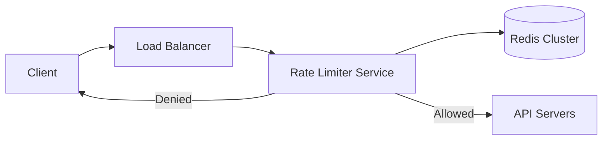

# Design a Rate Limiter

## ⏱️ 1. The 2-Minute Version

**Goal**: Design a system that limits the number of requests a user can send to an API within a specific time window (e.g., 10 requests per second).

**Key Components**:
1.  **Middleware/Sidecar**: Intercepts requests before they hit the business logic.
2.  **Store**: Fast, in-memory storage (Redis) to keep track of counters.
3.  **Algorithm**: Token Bucket or Sliding Window Log.

**Trade-offs**:
- **Local vs. Distributed**: Local memory is faster but doesn't work for a cluster of servers. Distributed (Redis) is consistent but adds latency.
- **Accuracy vs. Memory**: Sliding Window Log is accurate but memory-heavy. Fixed Window is light but allows bursts at edges.

---

## 🏗️ 2. The 10-Minute Structured Version

### Requirements
- **Functional**:
    - Accurately limit requests based on rules (IP, UserID, API Key).
    - Return `429 Too Many Requests` when limit is exceeded.
    - Headers: `X-Ratelimit-Remaining`, `X-Ratelimit-Limit`, `X-Ratelimit-Retry-After`.
- **Non-Functional**:
    - Low latency (< 20ms).
    - High availability (Rate limiter failure should not block traffic - "Fail Open").

### High-Level Design

### Algorithms

#### 1. Token Bucket
- **Concept**: A bucket holds `N` tokens. Refill `R` tokens every second. Each request takes 1 token.
- **Pros**: Allows bursts. Memory efficient.
- **Cons**: Slightly complex to implement correctly in distributed systems (race conditions).

#### 2. Leaky Bucket
- **Concept**: Requests enter a queue. Processed at constant rate.
- **Pros**: Smooths out traffic.
- **Cons**: Bursts fill the queue and drop requests.

#### 3. Fixed Window Counter
- **Concept**: Count requests in `10:00-10:01`.
- **Pros**: Simple.
- **Cons**: Edge case - 100 reqs at `10:00:59` and 100 at `10:01:01` = 200 reqs in 2 seconds.

#### 4. Sliding Window Log
- **Concept**: Store timestamp of every request. Count how many in last `X` seconds.
- **Pros**: Very accurate.
- **Cons**: High memory (storing all timestamps).

#### 5. Sliding Window Counter (Hybrid)
- **Concept**: Weighted average of previous window and current window.
- **Pros**: Accurate and memory efficient.

---

## 🧠 3. Deep Dive & Technical Details

### Distributed Rate Limiting (The Hard Part)
- **Race Conditions**: Two requests read `Count = 9` at the same time, both increment to `10`. Actual count is `11`, but system thinks `10`.
- **Solution**:
    - **Lua Scripts (Redis)**: Atomically check and increment.
    - **Sticky Sessions**: Route same user to same rate limiter node (bad for failover).

### Optimization
- **Synchronization**: Don't sync with Redis on *every* request. Sync every N requests or every M seconds (Eventual Consistency).
- **Fail Open**: If Redis is down, let the request through. Better to overload the system slightly than to block everyone.

### Multi-Location
- If you have data centers in US and EU, do you sync limits?
- Usually **No**. Rate limits are per-region for performance. Global sync is too slow.

### Client-Side
- Clients should respect `Retry-After` header.
- Implement **Exponential Backoff** to avoid thundering herd.
