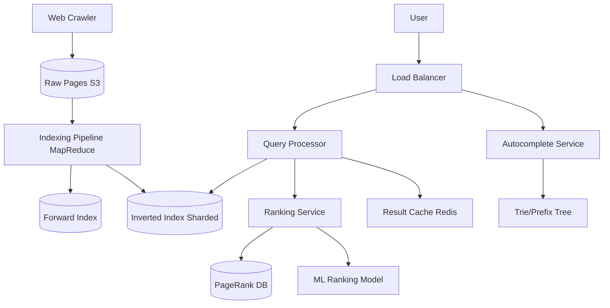

# Design a Search Engine (Google)

## ⏱️ 1. The 2-Minute Version

**Goal**: Design a web search engine like Google that crawls billions of web pages, indexes them for fast retrieval, and returns relevant results for user queries in < 200ms.

**Key Components**:
1. **Web Crawler**: Discovers and downloads web pages.
2. **Indexer**: Processes documents and builds inverted index.
3. **Query Processor**: Parses queries and retrieves matching documents.
4. **Ranker**: Scores and sorts results by relevance.
5. **Serving Infrastructure**: CDN, caching, load balancing.

**Key Challenges**:
- **Scale**: Index 100B+ web pages (petabytes of data).
- **Freshness**: Reindex frequently updated pages.
- **Relevance**: Return most useful results from billions of candidates.
- **Latency**: Return results in < 200ms.

**Trade-offs**:
- **Document vs. Term Partitioning**: Easier load balancing vs. Better query performance.
- **Batch vs. Real-time Indexing**: Simpler but stale vs. Complex but fresh.
- **TF-IDF vs. ML Ranking**: Simple and fast vs. Better quality but expensive.

---

## 🏗️ 2. The 10-Minute Structured Version

### Requirements

#### Functional
- **Crawl**: Discover and fetch web pages.
- **Index**: Extract keywords, build searchable index.
- **Search**: Return relevant results for queries.
- **Autocomplete**: Suggest queries as user types.
- **Snippets**: Show preview of matching content.

#### Non-Functional
- **Latency**: Search results < 200ms.
- **Scale**: 100B+ pages indexed, 100k QPS.
- **Freshness**: Reindex news sites hourly, general sites weekly.
- **Relevance**: High precision and recall.

### High-Level Architecture



### Data Flow: Indexing

1. **Crawl**: Crawler fetches web pages → S3.
2. **Processing**:
   - Extract text from HTML (remove tags, scripts).
   - Tokenize, remove stop words, stem.
   - Extract links for future crawling.
3. **Build Forward Index**: `DocID → [term1, term2, ...]`
4. **Build Inverted Index** (MapReduce):
   - Map: `(term, docID)` pairs.
   - Reduce: `term → [(docID1, freq1, positions1), (docID2, freq2, positions2), ...]`
5. Shard and store in distributed database.

### Data Flow: Querying

1. User types query: "machine learning".
2. Query Processor:
   - Spell check, expand (synonyms: "ML", "artificial intelligence").
   - Tokenize: `["machine", "learning"]`.
3. Lookup in Inverted Index:
   - `"machine" → [doc5, doc17, doc200, ...]`
   - `"learning" → [doc5, doc42, doc200, ...]`
   - Intersection: `[doc5, doc200]`.
4. Ranker:
   - Score each document (TF-IDF, PageRank, user signals).
   - Sort by relevance.
5. Generate snippets (highlight matching terms).
6. Return top 10 results.

---

## 🧠 3. Deep Dive & Technical Details

### 1. Inverted Index

**Structure**:
```
term → [
  (docID, frequency, [positions]),
  ...
]
```

**Example**:
```
"machine" → [
  (doc5, freq=3, positions=[10, 45, 102]),
  (doc17, freq=1, positions=[5])
]
```

**Construction (MapReduce)**:
```python
# Map phase
for doc in documents:
    for term in extract_terms(doc):
        emit(term, (doc.id, position))

# Reduce phase
for term, values in grouped_by_term:
    postings_list = aggregate(values)  # [(docID, freq, positions), ...]
    store_in_index(term, postings_list)
```

---

### 2. Index Sharding

**Document Partitioning**:
- Each shard holds subset of documents.
- Query sent to ALL shards, results merged.
- **Pros**: Easy to add shards, balanced load.
- **Cons**: Query hits all shards (higher latency).

**Term Partitioning**:
- Each shard holds subset of terms (e.g., shard1: a-m, shard2: n-z).
- Query sent only to relevant shards.
- **Pros**: Lower query latency.
- **Cons**: Load imbalance (common terms like "the" get hot shard).

**Google uses**: Hybrid with both.

---

### 3. Ranking Algorithms

**TF-IDF** (Term Frequency - Inverse Document Frequency):
```
TF-IDF(term, doc) = TF(term, doc) × IDF(term)

TF(term, doc) = count(term in doc) / total_terms(doc)
IDF(term) = log(total_docs / docs_containing_term)
```
- High TF-IDF if term appears often in doc but rarely across corpus.

**PageRank**:
- Link analysis algorithm.
- **Idea**: Important pages are linked by other important pages.
- **Formula**: 
  ```
  PR(A) = (1-d) + d × Σ(PR(T) / C(T))
  ```
  where d=damping factor (0.85), T=pages linking to A, C(T)=outlinks from T.
- Computed offline (iterative algorithm).

**BM25** (Best Matching 25):
- Improved TF-IDF with saturation (diminishing returns for high term frequency).
- Industry standard for text search.

**ML-based Ranking**:
- **Features**: TF-IDF, PageRank, click-through rate, dwell time, domain authority, freshness, user location.
- **Model**: Gradient Boosted Trees (LambdaMART), Neural Networks (RankNet).
- **Training**: Learning-to-rank on labeled query-document pairs.

---

### 4. Query Processing

**Spell Correction**:
- Detect typos: "machne learning" → "machine learning".
- Use edit distance, frequency dictionaries.

**Query Expansion**:
- Add synonyms: "ML" → "machine learning", "artificial intelligence".
- Use knowledge graph, word embeddings.

**Query Rewriting**:
- Detect intent: "weather SF" → "weather San Francisco".

---

### 5. Snippet Generation

**Process**:
1. Identify best matching passages in document.
2. Extract ~150 chars around matching terms.
3. **Bold** matching terms.

**Example**:
Query: "machine learning"
Document: "... **Machine learning** is a subset of AI that enables systems to learn from data ..."

---

### 6. Caching

**Query Result Cache** (Redis):
- Cache top 10 results for popular queries.
- Key: `search:{query_hash}`.
- TTL: 5 minutes.
- **Hit rate**: 30-40% (Zipf distribution - few queries very popular).

**Inverted Index Cache**:
- Cache postings lists for common terms in RAM.

---

### 7. Freshness

**Crawl Frequency**:
- News sites: Hourly.
- E-commerce: Daily.
- Static sites: Monthly.

**Incremental Indexing**:
- Don't rebuild entire index; update changed pages only.
- Use version control (hash page content, reindex if changed).

---

### 8. Scalability

**Crawler**: Distributed (1000s of machines).
**Indexer**: MapReduce/Spark cluster.
**Inverted Index**: Sharded across 1000s of servers, replicated 3x.
**Query Processor**: Stateless, auto-scales based on QPS.

---

### 9. Monitoring

**Metrics**:
- **Query Latency**: p50, p95, p99.
- **Index Size**: Number of documents, terms.
- **Crawl Rate**: Pages/sec.
- **Relevance**: Click-through rate, user satisfaction (surveys).

**Alerts**:
- Query latency p99 > 500ms.
- Index update lag > 24 hours.
- Crawler error rate > 5%.

---

### 10. Edge Cases

**Problem**: Query returns 0 results for misspelled term.
- **Solution**: Spell correction + "Did you mean?" suggestion.

**Problem**: Adversarial SEO (keyword stuffing).
- **Solution**: Penalize over-optimization, use ML to detect spam.

**Problem**: Query ambiguity ("apple" = fruit or company?).
- **Solution**: Personalization (user's past searches), query context.

**Problem**: Rapidly changing content (live sports scores).
- **Solution**: Real-time indexing, special fast lane for time-sensitive content.

---

## 📊 Diagram References

Related architecture diagrams:
- [Search Engine System Architecture Diagram](file:///Users/dj/Documents/Programming/techLead/tech-lead-repo/docs/system_design/diagrams/design_search_engine_1.mmd)
