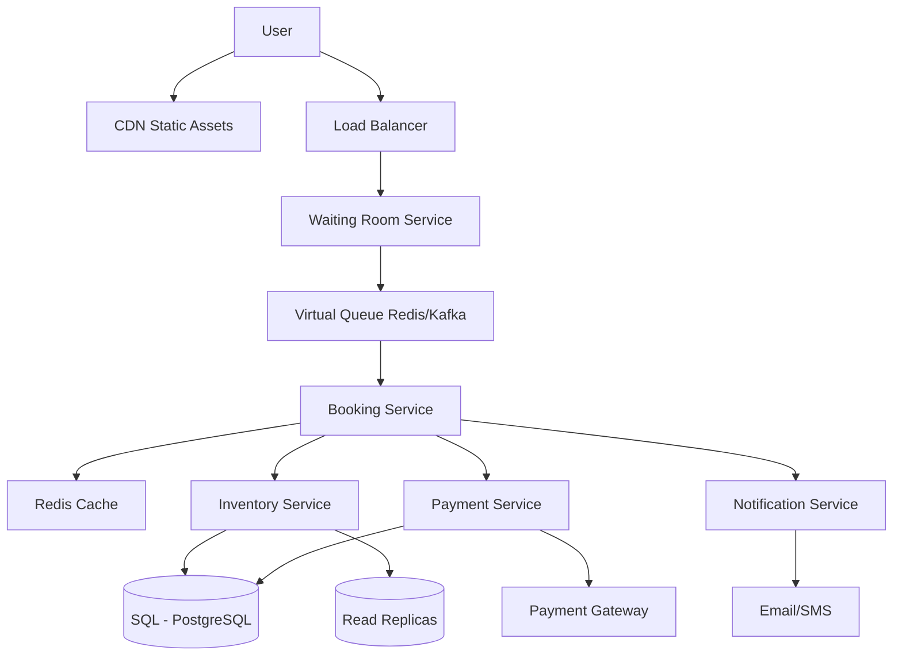

# Design Ticketmaster

## ⏱️ 1. The 2-Minute Version

**Goal**: Design a high-throughput ticketing platform that handles millions of concurrent users trying to book limited seats for popular events (concerts, sports) without double bookings.

**Key Components**:
1. **Waiting Room/Virtual Queue**: Controls traffic surge during high-demand ticket releases.
2. **Seat Inventory Service**: Manages seat availability with strong consistency.
3. **Reservation Service**: Temporary holds (locks) with TTL.
4. **Payment Service**: Processes transactions and finalizes bookings.

**Key Challenges**:
- **Burst Traffic**: 1M+ users hitting the system in seconds.
- **Fairness**: FIFO ordering while preventing bots.
- **No Double Booking**: Strong consistency on seat inventory.
- **Bot Prevention**: CAPTCHA, rate limiting, behavioral analysis.

**Trade-offs**:
- **Optimistic vs. Pessimistic Locking**: Optimistic is faster but causes more failures. Pessimistic (reservations with TTL) provides better UX.
- **Queue vs. No Queue**: Queue adds latency but protects backend from overload.

---

## 🏗️ 2. The 10-Minute Structured Version

### Requirements

#### Functional
- **Browse Events**: Search, filter by location/date/genre.
- **View Seating**: Interactive seat map with availability.
- **Reserve Seats**: Hold seats for checkout (5-10 min TTL).
- **Payment**: Process credit card, complete booking.
- **Ticket Delivery**: Email confirmation + QR code.
- **Transfer/Resale**: Allow ticket transfers (optional).

#### Non-Functional
- **Availability**: 99.99% uptime (4 nines).
- **Fairness**: True FIFO, no queue jumping.
- **Consistency**: ACID guarantees for bookings (no double sells).
- **Scale**: 
  - 100k concurrent users normally.
  - 10M+ concurrent during Taylor Swift drops.
  - 50k events globally at any time.
- **Latency**: Seat reservation < 200ms, payment < 3s.
- **Security**: Bot prevention, fraud detection.

### Capacity Estimation

**Assumptions**:
- 50k events, average 10k seats each = 500M seats in system.
- Popular event: 100k seats, 5M users trying to book.
- Conversion rate: ~5% (95% users fail to get tickets).

**Storage**:
- Event metadata: 50k events * 10 KB = 500 MB.
- Seat inventory: 500M seats * 200 bytes = 100 GB.
- Orders: 100M orders/year * 5 KB = 500 GB/year.

**Traffic** (Peak for popular event):
- 5M users enter waiting room in first 60 seconds.
- System processes 1000 bookings/sec from queue.
- Reservation attempts: 10k/sec.

### High-Level Architecture



### Data Flow: Booking Flow

1. **Entry**: User hits `/event/123`.
2. **Waiting Room Check**: 
   - If event is "high demand", redirect to waiting room.
   - User gets JWT token with position in queue.
3. **Queue Processing**:
   - Virtual queue (Redis Sorted Set or Kafka) processes users FIFO.
   - When user's turn arrives, redirect to `/book/123`.
4. **Seat Selection**:
   - User sees seat map (cached).
   - User clicks seat -> POST to Inventory Service.
5. **Reservation**:
   - Inventory Service checks availability in DB.
   - If available, create reservation (Redis + DB) with 5-min TTL.
   - Return success + reservation ID.
6. **Payment**:
   - User fills payment form.
   - Payment Service charges card via Stripe/PayPal.
7. **Confirmation**:
   - Update reservation to `CONFIRMED` in DB.
   - Release Redis lock.
   - Send confirmation email/SMS with QR code.
8. **Timeout Handling**:
   - If 5 mins expire, Redis key evicts.
   - Background job marks seat as `AVAILABLE` again.

---

## 🧠 3. Deep Dive & Technical Details

### 1. Waiting Room (Virtual Queue)

**Why?**
- Popular events cause thundering herd. Backend can't handle 5M requests/sec.
- Queue acts as a shock absorber.

**Implementation Options**:

#### Option A: Redis Sorted Set
```redis
ZADD waiting_room:event_123 <timestamp> <user_token>
```
- Score = timestamp of entry.
- Background worker processes top N users every second.
- Pros: Simple, fast.
- Cons: Single point of failure (need Redis Cluster).

#### Option B: Kafka Topic
- Each user entering = 1 message to Kafka topic.
- Consumer group processes messages FIFO.
- Pros: Durability, replayability.
- Cons: Slightly higher latency (~50ms).

**Queue Position Display**:
```
Your position: 45,234
Estimated wait: 7 minutes
```
- Calculate: `ZRANK waiting_room:event_123 <user_token>`.
- Estimated time = `(position / throughput)`.

**Fairness & Bot Prevention**:
- **CAPTCHA**: Before entering queue.
- **Rate Limiting**: Max 1 entry per user per event.
- **Device Fingerprinting**: Detect bots using same IP/headers.
- **Token Expiry**: JWT tokens expire after queue time + 10 mins.

---

### 2. Seat Inventory Management

**Database Schema** (PostgreSQL):

```sql
-- Events Table
CREATE TABLE events (
  event_id BIGSERIAL PRIMARY KEY,
  name VARCHAR(255),
  venue_id BIGINT,
  event_date TIMESTAMP,
  status VARCHAR(20) -- 'UPCOMING', 'OPEN', 'SOLD_OUT', 'ENDED'
);

-- Seats Table (Sharded by event_id)
CREATE TABLE seats (
  seat_id BIGSERIAL PRIMARY KEY,
  event_id BIGINT,
  section VARCHAR(50),
  row VARCHAR(10),
  seat_number INT,
  price DECIMAL(10,2),
  status VARCHAR(20), -- 'AVAILABLE', 'RESERVED', 'SOLD'
  reserved_until TIMESTAMP,
  user_id BIGINT,
  INDEX idx_event_status (event_id, status)
);

-- Orders Table
CREATE TABLE orders (
  order_id BIGSERIAL PRIMARY KEY,
  user_id BIGINT,
  seat_id BIGINT,
  payment_id VARCHAR(255),
  status VARCHAR(20), -- 'PENDING', 'CONFIRMED', 'CANCELLED'
  created_at TIMESTAMP,
  confirmed_at TIMESTAMP
);
```

**Concurrency Control**:

❌ **Naive Approach (Race Condition)**:
```python
# Thread 1 and Thread 2 both read at the same time
seat = db.query("SELECT * FROM seats WHERE seat_id = 123")
if seat.status == 'AVAILABLE':
    db.execute("UPDATE seats SET status = 'RESERVED' WHERE seat_id = 123")
```
**Problem**: Both threads see `AVAILABLE`, both update. Double booking!

✅ **Solution 1: Database Row-Level Locking**:
```sql
BEGIN TRANSACTION;
SELECT * FROM seats 
WHERE seat_id = 123 AND status = 'AVAILABLE'
FOR UPDATE; -- Locks the row

-- Check if row was returned
UPDATE seats 
SET status = 'RESERVED', reserved_until = NOW() + INTERVAL '5 minutes', user_id = 456
WHERE seat_id = 123 AND status = 'AVAILABLE';
COMMIT;
```
- **Pros**: ACID guarantees.
- **Cons**: Locks can cause contention under high load.

✅ **Solution 2: Optimistic Locking (Compare-and-Swap)**:
```sql
UPDATE seats 
SET status = 'RESERVED', version = version + 1
WHERE seat_id = 123 AND status = 'AVAILABLE' AND version = 5;

-- Check affected rows. If 0, someone else got it first.
```
- **Pros**: No locks, better concurrency.
- **Cons**: Retry logic needed. Higher failure rate.

✅ **Solution 3: Redis as Coordination Layer** (Hybrid):
```python
# Step 1: Try to acquire lock in Redis (fast)
if redis.set("lock:seat:123", user_id, NX=True, EX=300):  # NX = only if not exists
    # Step 2: Double-check DB
    seat = db.query("SELECT * FROM seats WHERE seat_id = 123 FOR UPDATE")
    if seat.status == 'AVAILABLE':
        db.execute("UPDATE seats SET status = 'RESERVED', user_id = ?, reserved_until = ?")
        return SUCCESS
    else:
        redis.delete("lock:seat:123")
        return SEAT_TAKEN
else:
    return SEAT_TAKEN
```
- **Pros**: Fast fail for concurrent requests (Redis is faster than DB). DB is still source of truth.
- **Cons**: Two-phase operation.

---

### 3. Reservation TTL & Expiry

**Why TTL?**
- User selects seat but abandons checkout.
- Without TTL, seat stays locked forever.

**Implementation**:

**Redis TTL**:
```python
redis.setex(f"reservation:seat:{seat_id}", 300, user_id)  # 5 minutes
```

**Background Job** (Cron every 30 seconds):
```python
expired_reservations = db.query("""
    SELECT seat_id FROM seats 
    WHERE status = 'RESERVED' AND reserved_until < NOW()
""")
for seat in expired_reservations:
    db.execute("UPDATE seats SET status = 'AVAILABLE', user_id = NULL WHERE seat_id = ?", seat.seat_id)
    redis.delete(f"reservation:seat:{seat.seat_id}")
```

**Edge Case**: What if payment happens at 4:59 but TTL expires?
- **Solution**: Payment service checks `reserved_until` before charging. Extend TTL by 1 minute during payment processing.

---

### 4. Payment Integration

**Flow**:
1. User submits payment form.
2. Backend calls **Payment Gateway** (Stripe/Braintree).
3. **Idempotency**: Use `order_id` as idempotency key to prevent duplicate charges.
4. On success:
   - Update `orders.status = 'CONFIRMED'`.
   - Update `seats.status = 'SOLD'`.
   - Delete Redis reservation.
5. On failure:
   - Release reservation (mark seat as `AVAILABLE`).
   - Show error to user.

**Atomicity**:
```python
# Distributed Transaction Pattern
try:
    payment_result = stripe.charge(amount, idempotency_key=order_id)
    db.begin_transaction()
    db.execute("UPDATE seats SET status = 'SOLD' WHERE seat_id = ?")
    db.execute("UPDATE orders SET status = 'CONFIRMED', payment_id = ? WHERE order_id = ?")
    db.commit()
except Exception as e:
    db.rollback()
    stripe.refund(payment_result.id)  # Compensating transaction
    raise
```

---

### 5. Database Sharding & Scaling

**Sharding Strategy**:
- **Shard by `event_id`**: All seats for an event on one shard.
  - Pros: Queries for seat availability don't cross shards.
  - Cons: Hot shard problem (Taylor Swift event on Shard 3, all traffic there).

**Solution to Hot Shards**:
- **Read Replicas**: Direct read traffic (seat map viewing) to replicas.
- **Caching**: Heavily cache seat map (Redis). Invalidate only on reservation.
- **Write Sharding**: For extremely hot events, shard by `section` instead of `event_id`.

**Example**:
- Event 123, Section A -> Shard 1.
- Event 123, Section B -> Shard 2.

---

### 6. Caching Strategy

**What to Cache**:
1. **Event Metadata**: Redis, TTL = 1 hour.
2. **Seat Map (Static)**: CDN + Redis, TTL = 10 mins, invalidate on updates.
3. **Seat Availability (Dynamic)**: Short TTL (5 seconds) or use Redis Pub/Sub to push updates.

**Cache Invalidation**:
- When seat is reserved/sold, publish event:
```python
redis.publish("seat_updates:event_123", json.dumps({"seat_id": 123, "status": "RESERVED"}))
```
- Frontend WebSocket clients subscribe and update UI in real-time.

---

### 7. Scalability & Performance

**Horizontal Scaling**:
- **Stateless Services**: All business logic services (Booking, Inventory, Payment) are stateless.
- **Database**: Read replicas + sharding.
- **Redis**: Redis Cluster (partitioned by key).

**Rate Limiting**:
- **Per User**: Max 10 reservation attempts per minute.
- **Per IP**: Max 100 requests per minute.
- **Global**: Max 50k reservations/sec across the system.

**CDN for Static Assets**:
- Serve seat maps, images from CDN (CloudFront, Fastly).

---

### 8. Monitoring & Observability

**Key Metrics**:
- **Queue Length**: How many users waiting.
- **Reservation Rate**: Reservations/sec.
- **Failure Rate**: % of failed reservation attempts.
- **Payment Success Rate**: % of successful payments.
- **Latency**: p50, p95, p99 for critical APIs.

**Alerts**:
- Queue length > 100k.
- Payment failure rate > 5%.
- Database connection pool exhaustion.

---

### 9. Edge Cases & Failure Modes

**Problem**: Redis goes down.
- **Impact**: Can't create reservations.
- **Mitigation**: 
  - Redis Cluster with replication.
  - Fallback to DB-only mode (slower but functional).

**Problem**: Payment gateway timeout.
- **Impact**: User charged but seat not confirmed.
- **Mitigation**: 
  - Retry payment status check (poll Stripe API).
  - Webhook from Stripe for async confirmation.

**Problem**: User refreshes page during checkout.
- **Impact**: Creates duplicate reservation requests.
- **Mitigation**: Idempotency - check if user already has active reservation for this event.

**Problem**: Event sells out while user is in queue.
- **Solution**: 
  - Check seat availability before allowing user to proceed from queue.
  - Show "Sold Out" message gracefully.

---

## 📊 Diagram References

Related architecture diagrams:
- [Ticketmaster System Architecture Diagram](file:///Users/dj/Documents/Programming/techLead/tech-lead-repo/docs/system_design/diagrams/design_ticketmaster_1.mmd)
