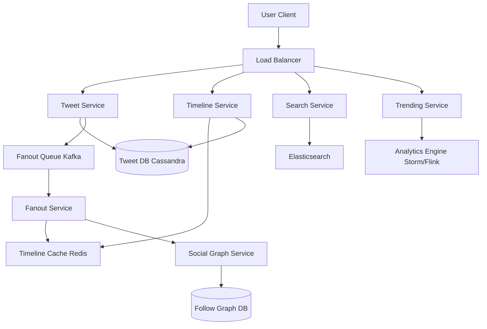

# Design Twitter / X

## ⏱️ 1. The 2-Minute Version

**Goal**: Design a microblogging platform like Twitter that allows users to post tweets (280 chars), follow others, and view a personalized timeline with billions of tweets/day at massive scale.

**Key Components**:
1. **Tweet Service**: Handles posting tweets.
2. **Timeline Service**: Generates home timeline (tweets from followees).
3. **Fanout Service**: Distributes tweets to followers' timelines.
4. **Social Graph Service**: Manages follow relationships.
5. **Trending Service**: Calculates trending topics.

**Key Challenges**:
- **Celebrity Problem**: User with 100M followers posts → fanout to 100M timelines.
- **Timeline Latency**: Must load timeline in < 200ms.
- **Real-time**: Tweets should appear in followers' feeds within seconds.
- **Scale**: 500M tweets/day, 400M DAU.

**Trade-offs**:
- **Pull (Fan-out on Read)**: Slow reads (query all followees) vs. Simple writes.
- **Push (Fan-out on Write)**: Fast reads (pre-computed) vs. Slow writes for celebrities.
- **Hybrid**: Best of both, but complex implementation.

---

## 🏗️ 2. The 10-Minute Structured Version

### Requirements

#### Functional
- **Post Tweet**: Text, images, video.
- **Timeline**: Home (from followees), User (own tweets).
- **Follow/Unfollow**: Manage connections.
- **Like/Retweet**: Engagement.
- **Search**: By keywords, hashtags, users.
- **Trending**: Show trending topics.
- **Notifications**: Mentions, likes, follows.

#### Non-Functional
- **Availability**: 99.99% uptime.
- **Latency**: Timeline < 200ms, Post tweet < 100ms.
- **Scale**:
  - 400M DAU.
  - 500M tweets/day = 5.8k tweets/sec.
  - Peak: 20k tweets/sec (breaking news).
  - 200M timeline loads/day.
- **Consistency**: Eventual consistency OK for timelines.

### Capacity Estimation

**Storage**:
- Tweet: 280 chars + metadata = 500 bytes.
- 500M tweets/day * 500 bytes = 250 GB/day.
- 5 years: 250 GB * 365 * 5 ≈ 450 TB.
- Media (images/videos): 20% of tweets have media, avg 2 MB.
  - 500M * 0.2 * 2 MB = 200 TB/day.

**QPS**:
- Write: 5.8k QPS (tweets).
- Read: 200M timelines/day / 86400 ≈ 2.3k QPS (timeline loads).
- Read >> Write after accounting for refreshes: ~50k QPS.

### High-Level Architecture



### Data Flow

**Posting a Tweet**:
1. User posts tweet.
2. Tweet Service:
   - Generate `tweet_id` (Snowflake ID).
   - Store in Tweet DB (Cassandra).
   - Publish to Fanout Queue (Kafka).
3. Fanout Service:
   - Fetch user's followers from Social Graph.
   - **If regular user** (< 10k followers): Push `tweet_id` to each follower's timeline cache (Redis list).
   - **If celebrity** (> 10k followers): Skip fanout (use pull model).
4. Return success to user.

**Loading Timeline**:
1. User requests home timeline.
2. Timeline Service:
   - Check Timeline Cache (Redis): `timeline:{user_id}`.
   - If cache hit: Return cached tweet IDs.
   - If cache miss or partial:
     - Fetch recent tweets from celebrities user follows (pull from Tweet DB).
     - Merge with cached tweets.
     - Rank by recency.
   - Hydrate tweet IDs (fetch full tweet data from Tweet DB).
3. Return top N tweets.

---

## 🧠 3. Deep Dive & Technical Details

### 1. Fanout Strategies

**Pull Model (Fan-out on Read)**:
```python
def get_timeline(user_id):
    followees = graph_db.get_followees(user_id)  # [100, 200, 300, ...]
    tweets = []
    for followee in followees:
        tweets.extend(tweet_db.fetch_recent(followee, limit=10))
    tweets.sort(key=lambda t: t.timestamp, reverse=True)
    return tweets[:20]
```
- **Pros**: Simple write path (just store tweet).
- **Cons**: Slow read (user follows 1000 people → query 1000 times).

**Push Model (Fan-out on Write)**:
```python
def post_tweet(user_id, content):
    tweet_id = generate_id()
    tweet_db.store(tweet_id, user_id, content)
    
    followers = graph_db.get_followers(user_id)  # Could be 100M!
    for follower in followers:
        redis.lpush(f"timeline:{follower}", tweet_id)
        redis.ltrim(f"timeline:{follower}", 0, 799)  # Keep latest 800
```
- **Pros**: Fast read (O(1) from cache).
- **Cons**: Slow write for celebrities (Bieber posts → fanout to 100M).

**Hybrid Approach (Twitter's Solution)**:
- **Regular users**: Push model.
- **Celebrities** (> threshold followers): No fanout.
- **Timeline construction**:
  ```python
  def get_timeline(user_id):
      # Get pre-computed timeline from cache (regular followees)
      cached_tweets = redis.lrange(f"timeline:{user_id}", 0, 100)
      
      # Get recent tweets from celebrities user follows (pull)
      celebrity_followees = get_celebrity_followees(user_id)
      celebrity_tweets = fetch_recent_celebrity_tweets(celebrity_followees)
      
      # Merge
      all_tweets = merge_sort(cached_tweets, celebrity_tweets)
      return all_tweets[:20]
  ```

---

### 2. Database Schema

**Tweet Table** (Cassandra):
```sql
CREATE TABLE tweets (
    tweet_id BIGINT PRIMARY KEY,
    user_id BIGINT,
    content TEXT,
    timestamp TIMESTAMP,
    media_url TEXT,
    retweet_count INT,
    like_count INT
);

-- Index for user timeline (pull model)
CREATE TABLE user_tweets (
    user_id BIGINT,
    tweet_id BIGINT,
    timestamp TIMESTAMP,
    PRIMARY KEY (user_id, timestamp, tweet_id)
) WITH CLUSTERING ORDER BY (timestamp DESC);
```

**Follow Graph** (MySQL or Graph DB):
```sql
CREATE TABLE follows (
    follower_id BIGINT,
    followee_id BIGINT,
    created_at TIMESTAMP,
    PRIMARY KEY (follower_id, followee_id)
);

CREATE INDEX idx_followee ON follows(followee_id);  -- For fetching followers
```

---

###3. Timeline Cache (Redis)

**Structure**:
- **Key**: `timeline:{user_id}`
- **Value**: List of tweet IDs `[tweet_123, tweet_122, tweet_121, ...]`
- **Size**: Store latest 800 tweets (enough for most users).
- **TTL**: 7 days (evict inactive users).

**Hydration**:
- Timeline cache stores only tweet IDs (lightweight).
- Fetch full tweet data from Tweet DB or Tweet Cache.

---

### 4. Sharding Strategy

**Tweet DB**: Shard by `tweet_id`:
- Use Snowflake ID (includes timestamp, datacenter, machine ID).
- Evenly distributes tweets across shards.

**Social Graph**: Shard by `user_id`:
- All follower/followee data for a user on same shard.
- Query: "Get followers of user X" → Single shard read.

---

### 5. Trending Topics

**Goal**: Show globally trending hashtags/topics.

**Architecture**:
1. Stream tweets to analytics engine (Apache Storm, Flink).
2. Count hashtag frequency in sliding window (1 hour).
3. Detect anomalies (sudden spike = trending).
4. Store top 10 trending topics in Redis.
5. Timeline Service fetches and displays.

**Calculation**:
```python
# Pseudo-code
for each hashtag in last_hour:
    current_count = count(hashtag, last_hour)
    historical_avg = avg_count(hashtag, last_24_hours)
    
    if current_count > 3 * historical_avg:
        mark_as_trending(hashtag)
```

---

### 6. Search (Elasticsearch)

**Index**:
- Index all tweets in Elasticsearch.
- Fields: `content`, `user_id`, `hashtags`, `mentions`, `timestamp`.

**Query**:
- Full-text search: `"machine learning"`.
- Hashtag search: `#AI`.
- Mention search: `@elonmusk`.

**Ranking**:
- Recency (newer tweets ranked higher).
- Engagement (likes, retweets).
- Relevance (TF-IDF).

---

### 7. Retweets & Likes

**Retweets**:
- Store as new tweet with `original_tweet_id` pointer.
- Increment `retweet_count` on original tweet (Cassandra COUNTER).

**Likes**:
- High write volume (billions/day).
- Use Cassandra COUNTER type for `like_count`.
- Eventual consistency acceptable.

---

### 8. Scalability

**Tweet Service**:
- Stateless, horizontally scalable.
- Auto-scale based on QPS.

**Fanout Service**:
- Worker pool consuming Kafka queue.
- Scale workers independently.

**Cassandra**:
- Replication factor: 3.
- Quorum writes/reads (consistency level).

---

### 9. Monitoring

**Metrics**:
- **Tweet Latency**: p50, p95, p99 for posting.
- **Timeline Latency**: p50, p95, p99 for loading.
- **Fanout Queue Lag**: Backlog in Kafka.
- **Cache Hit Rate**: % of timeline loads served from cache.

**Alerts**:
- Timeline latency p99 > 500ms.
- Fanout queue lag > 10k messages.
- Cache hit rate < 85%.

---

### 10. Edge Cases

**Problem**: User follows 10k people (power user).
- **Solution**: Cap timeline to recent 800 tweets, use pagination for older.

**Problem**: Tweet goes viral (1M retweets in minutes).
- **Solution**: Cache hot tweets, rate limit retweet API.

**Problem**: Spam/bot accounts.
- **Solution**: Rate limiting, ML-based spam detection, CAPTCHA.

**Problem**: Deleted tweet still appears in timeline cache.
- **Solution**: Lazy deletion (remove when user refreshes), or proactive cache invalidation (expensive).

---

## 📊 Diagram References

Related architecture diagrams:
- [Twitter System Architecture Diagram](file:///Users/dj/Documents/Programming/techLead/tech-lead-repo/docs/system_design/diagrams/design_twitter_1.mmd)
