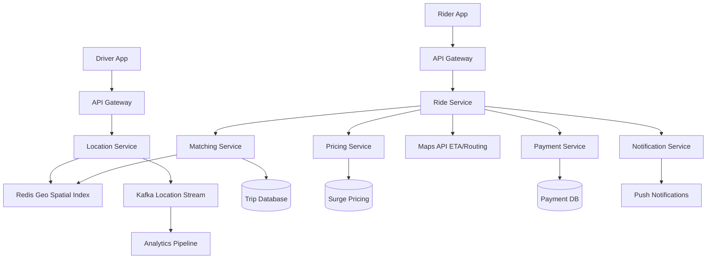

# Design Uber/Lyft

## ⏱️ 1. The 2-Minute Version

**Goal**: Design a real-time ride-sharing platform that connects riders with nearby drivers, handles dynamic pricing, GPS tracking, and payment processing at massive scale.

**Key Components**:
1. **Location Service**: Tracks driver GPS positions in real-time.
2. **Matching Service**: Finds optimal driver-rider pairing using geospatial algorithms.
3. **Trip Service**: Manages trip lifecycle and state transitions.
4. **Pricing Service**: Calculates fares with surge pricing.
5. **Routing Service**: Provides ETA and navigation.

**Key Challenges**:
- **Real-time Processing**: Sub-second matching latency.
- **Geospatial Queries**: Efficiently find "who's nearby" from millions of drivers.
- **Consistency**: Prevent double dispatch (one driver, one rider at a time).
- **Scale**: Millions of active drivers, billions of trips/year.

**Trade-offs**:
- **Accuracy vs. Latency**: Precise location updates (every 1s) vs. battery drain and network cost.
- **Matching Algorithm**: Greedy (nearest driver) vs. Global optimization (minimize total wait time).
- **Consistency**: Prevent double-booking (pessimistic locks) vs. Allow retries (optimistic).

---

## 🏗️ 2. The 10-Minute Structured Version

### Requirements

#### Functional

**Rider Side**:
- Request ride with pickup/dropoff locations.
- See available drivers on map + estimated wait time.
- Track driver in real-time.
- View trip summary and fare estimate.
- Pay via credit card/digital wallet.
- Rate driver.

**Driver Side**:
- Toggle online/offline status.
- Receive ride requests.
- Accept/decline requests.
- Navigate to pickup and dropoff.
- Complete trip and receive payment.
- View earnings.

**Admin**:
- Monitor system health (active trips, drivers online).
- Handle disputes, refunds.
- Apply surge pricing dynamically.

#### Non-Functional
- **Availability**: 99.99% uptime (critical for safety).
- **Latency**: 
  - Matching: < 1 second.
  - Location updates: < 500ms.
  - Map rendering: < 2 seconds.
- **Scale**:
  - 100M+ active users.
  - 10M+ active drivers.
  - 20M trips/day globally.
- **Accuracy**: GPS accuracy within 10 meters.
- **Consistency**: No double dispatch.

### Capacity Estimation

**Assumptions**:
- 10M drivers online globally at peak.
- Each driver sends GPS update every 4 seconds.
- GPS updates: 10M / 4 = 2.5M writes/sec.
- Rider opens app: 50M concurrent sessions.
- Trip requests: 20M/day = 230 requests/sec.

**Storage**:
- Driver profiles: 10M * 5 KB = 50 GB.
- Trip history: 20M trips/day * 365 days * 5 years * 2 KB = 73 TB.
- Location data (recent): 10M drivers * 1 KB = 10 GB (in-memory).

**Bandwidth**:
- GPS updates: 2.5M/sec * 200 bytes = 500 MB/sec inbound.

### High-Level Architecture



### Data Flow: Ride Request Flow

1. **Rider Requests Ride**:
   - Rider opens app, enters pickup/dropoff.
   - App sends request to **Ride Service**.
   
2. **ETA & Fare Calculation**:
   - **Ride Service** calls **Maps API** to get route distance and ETA.
   - Calls **Pricing Service** to calculate fare (base + per mile/minute + surge).
   - Shows estimate to rider.

3. **Matching**:
   - **Ride Service** calls **Matching Service**.
   - **Matching Service** queries **Redis Geospatial Index**: "Find drivers within 5km of pickup location, status = AVAILABLE".
   - Filters drivers by vehicle type (UberX, UberXL, etc.).
   - Calculates ETA for each candidate driver to pickup point.
   - Sorts by ETA, selects best match.

4. **Dispatch**:
   - **Matching Service** sends ride request to **Driver 1** via **Notification Service** (WebSocket/FCM push).
   - Set driver status to `PENDING` with TTL (10 seconds).
   - Driver has 10 seconds to accept.

5. **Driver Response**:
   - **Accept**: Update trip state to `ACCEPTED`, driver status to `EN_ROUTE_TO_PICKUP`.
   - **Decline/Timeout**: Release lock, try **Driver 2**.

6. **Trip Lifecycle**:
   - **EN_ROUTE_TO_PICKUP**: Driver navigates to rider.
   - **ARRIVED**: Driver marks arrival.
   - **IN_PROGRESS**: Rider boards, driver starts trip.
   - **COMPLETED**: Driver ends trip, app calculates final fare.

7. **Payment**:
   - **Payment Service** charges rider's card.
   - Driver receives payout (minus commission).

8. **Ratings**:
   - Both rider and driver rate each other.

---

## 🧠 3. Deep Dive & Technical Details

### 1. Geospatial Indexing

**The Problem**:
- "Find all available drivers within 5km of (lat, lon)".
- Naive approach: Scan all 10M drivers, calculate Haversine distance. **O(N)** = too slow.

**Solution 1: Geohash**

**How It Works**:
- Divide earth into a grid. Each cell has a string ID.
- Interleave latitude and longitude bits.
- Example: `9q8yy` represents area in San Francisco.
- Longer prefix = neighbors.

**Pros**:
- Simple.
- Works well for rectangular regions.

**Cons**:
- **Edge Cases**: Two points near grid boundary have different prefixes.
- **Non-uniform shapes**: Geohash cells are rectangular, but you want circular radius.

**Redis Implementation**:
```python
# Add driver location
redis.geoadd("drivers", longitude, latitude, driver_id)

# Find drivers within 5km
results = redis.georadius("drivers", pickup_lon, pickup_lat, 5, "km", withdist=True)
```

**Solution 2: QuadTree**

**How It Works**:
- Recursively divide 2D space into 4 quadrants until each node has <= N items.
- To find neighbors, traverse tree.

**Pros**:
- Better for non-uniform distribution (many drivers in cities, few in rural areas).
- Dynamic: Adapts to density.

**Cons**:
- More complex to implement.
- Rebalancing overhead.

**Solution 3: Google S2 (What Uber Uses)**

**How It Works**:
- Maps sphere to a cube, projects onto 2D using Hilbert Curve.
- **Hilbert Curve** preserves locality (nearby points on curve = nearby in 2D).
- Cells are hierarchical.

**Pros**:
- Better locality than Geohash.
- No grid boundary issues.
- Works globally (handles poles, date line).

**Cons**:
- Complex library (Google's S2 Geometry).

---

### 2. Driver Location Updates

**Challenge**: 10M drivers sending GPS every 4 seconds = 2.5M writes/sec.

**Approach**:

1. **Ingestion**:
   - Driver app sends GPS to **Location Service** via WebSocket or HTTP POST.
   - Format: `{ driver_id, lat, lon, timestamp, heading, speed }`.

2. **Stream Processing (Kafka)**:
   - Location Service publishes to Kafka topic `driver_locations`.
   - **Why Kafka?**
     - Decouples ingestion from processing.
     - Enables real-time analytics (heatmaps, surge detection).
     - Buffer for downstream failures.

3. **Update Index (Redis)**:
   - Consumer reads from Kafka, updates Redis Geospatial Index.
   - `redis.geoadd("drivers", lon, lat, driver_id)`.

4. **Database (Optional)**:
   - Don't write every GPS ping to DB (too expensive).
   - Write only significant events:
     - Driver goes online/offline.
     - Trip starts/ends.
   - Use Cassandra or PostgreSQL for trip history.

**Optimization - Throttling**:
- If driver is stationary (speed = 0), reduce update frequency to every 30 seconds.
- If driver is moving fast (highway), increase to every 2 seconds.

---

### 3. Matching Algorithm

**Goal**: Given a ride request, find the "best" driver.

**Criteria** (in priority order):
1. **Availability**: Driver status = `AVAILABLE`.
2. **Proximity**: Distance to pickup point.
3. **ETA**: Time to reach pickup (uses routing API, considers traffic).
4. **Vehicle Type**: Match rider's requested type (UberX, UberXL).
5. **Driver Rating**: Prefer higher-rated drivers (secondary).

**Algorithm**:

```python
def find_best_driver(pickup_lat, pickup_lon, vehicle_type):
    # Step 1: GeospatialQuery
    candidates = redis.georadius("drivers", pickup_lon, pickup_lat, 5, "km")
    
    # Step 2: Filter by availability and vehicle type
    available = [d for d in candidates if d.status == 'AVAILABLE' and d.vehicle_type == vehicle_type]
    
    if not available:
        # Expand radius
        available = redis.georadius("drivers", pickup_lon, pickup_lat, 10, "km")
    
    # Step 3: Calculate ETA for each
    for driver in available:
        driver.eta = maps_api.get_eta(driver.lat, driver.lon, pickup_lat, pickup_lon)
    
    # Step 4: Sort by ETA
    available.sort(key=lambda d: d.eta)
    
    # Step 5: Return top 3 (for retries)
    return available[:3]
```

**Dispatch with Retries**:
- Send request to Driver 1.
- If no response in 10 seconds, send to Driver 2.
- If 3 drivers decline, show "No drivers available" to rider.

**Concurrency Control**:
- **Problem**: Two riders request simultaneously, both matched to same driver.
- **Solution**: Use **Optimistic Locking** with version number.

```python
def dispatch_driver(driver_id, trip_id):
    # Atomic check-and-set in Redis
    result = redis.set(f"driver:{driver_id}:status", "PENDING", nx=True, ex=10)
    if result:
        # Success, send notification
        send_push_notification(driver_id, trip_id)
        return True
    else:
        # Already dispatched to someone else
        return False
```

---

### 4. Trip State Management

**State Machine**:
```
REQUESTED --> MATCHED --> ACCEPTED --> EN_ROUTE_TO_PICKUP 
--> ARRIVED --> IN_PROGRESS --> COMPLETED --> PAID
```

**Storage**:
- Use PostgreSQL or DynamoDB for trip records.
- Schema:

```sql
CREATE TABLE trips (
  trip_id BIGSERIAL PRIMARY KEY,
  rider_id BIGINT,
  driver_id BIGINT,
  status VARCHAR(20),
  pickup_lat DECIMAL(10,8),
  pickup_lon DECIMAL(11,8),
  dropoff_lat DECIMAL(10,8),
  dropoff_lon DECIMAL(11,8),
  estimated_fare DECIMAL(10,2),
  final_fare DECIMAL(10,2),
  created_at TIMESTAMP,
  started_at TIMESTAMP,
  completed_at TIMESTAMP
);
```

**Real-Time Updates**:
- Use **WebSockets** to push trip state changes to rider and driver apps.
- Example: When driver accepts, both apps get real-time update.

---

### 5. Pricing & Surge Pricing

**Base Fare Calculation**:
```
Fare = BasePrice + (PricePerMile * Distance) + (PricePerMinute * Duration) + SurgeFactor
```

**Surge Pricing**:
- **Goal**: Balance supply and demand.
- **Trigger**: Demand (ride requests) >> Supply (available drivers) in a region.

**Implementation**:
1. **Grid Division**: Divide city into hexagons (H3 Uber's library).
2. **Metrics** (per hexagon, every 1 minute):
   - `demand = number of unfulfilled requests`
   - `supply = number of available drivers`
   - `surge_multiplier = min(demand / supply, 3.0)` (cap at 3x).
3. **Storage**: Redis.
   ```python
   redis.set(f"surge:{hex_id}", surge_multiplier, ex=60)
   ```
4. **Application**: When calculating fare, multiply by surge.

**Notification**:
- If surge > 1.5x, show warning to rider: "Fares are higher due to increased demand".

---

### 6. ETA Calculation & Routing

**Data Sources**:
- **Google Maps Directions API** or in-house routing engine (OSRM).
- Input: Origin (driver location), Destination (pickup point).
- Output: Distance, Duration (considers real-time traffic).

**Caching**:
- Cache common routes in Redis with 5-min TTL.
- Key: `route:{lat1}:{lon1}:{lat2}:{lon2}`.

**Optimization**:
- Batch ETA requests for multiple drivers to reduce API calls.

---

### 7. Payment Processing

**Flow**:
1. **Card Storage**: Rider adds card during signup (Stripe/Braintree).
2. **Pre-authorization**: When trip starts, pre-auth estimated fare + 20% buffer.
3. **Final Charge**: When trip ends, charge actual fare.
4. **Driver Payout**: Weekly payout (ACH/Direct Deposit).

**Idempotency**:
- Use `trip_id` as idempotency key to prevent double charges.

**Failed Payments**:
- Retry with exponential backoff.
- If fail after 3 attempts, mark rider as "payment required" (can't request new rides until resolved).

---

### 8. Notifications

**Push Notifications**:
- **Driver**: "New ride request from [Name]".
- **Rider**: "Driver is 2 minutes away".

**Channels**:
- **FCM** (Firebase Cloud Messaging) for mobile push.
- **WebSocket** for in-app real-time updates.
- **SMS** as fallback.

**Optimization**:
- Don't spam. Group notifications (e.g., "Driver arrived" + "Start trip" within 10 secs = 1 notification).

---

### 9. Database Sharding

**Shard by `trip_id`**:
- Trips are immutable once created.
- Use **Consistent Hashing** to distribute across shards.

**Shard by `user_id`** (User data):
- All user data (profile, payment methods, history) on one shard.

**Geo-Sharding** (for location data):
- Drivers in US West -> Shard 1.
- Drivers in US East -> Shard 2.
- Reduces latency for regional queries.

---

### 10. Scalability & Performance

**Caching**:
- **Redis** for:
  - Driver locations (Geospatial index).
  - Surge pricing.
  - Active trip states.

**Load Balancing**:
- **Layer 7 LB** (NGINX, ALB) for HTTP traffic.
- **WebSocket**: Sticky sessions or use Redis Pub/Sub for fan-out.

**CDN**:
- Serve static map tiles from CDN.

**Rate Limiting**:
- Prevent abuse: Max 10 ride requests per user per hour.

---

### 11. Monitoring & Observability

**Metrics**:
- **Matching success rate**: % of requests successfully matched.
- **Average wait time**: Time from request to driver arrival.
- **Driver utilization**: % of time drivers have active trips.
- **Surge frequency**: % of requests with surge pricing.

**Alerts**:
- Matching latency > 2 seconds.
- GPS update lag > 10 seconds.
- Payment failure rate > 2%.

**Distributed Tracing**:
- Use **Jaeger** or **Zipkin** to trace request flow across services.

---

### 12. Edge Cases & Failure Handling

**Problem**: GPS signal lost (tunnel, underground parking).
- **Solution**: Extrapolate driver position using last known location + heading + speed.

**Problem**: Driver app crashes mid-trip.
- **Solution**: Persist trip state in DB. When driver restarts app, resume trip.

**Problem**: Network partition (rider can't reach backend).
- **Solution**: 
  - Rider app shows cached driver location.
  - Use exponential backoff for retries.

**Problem**: Driver cancels after accepting.
- **Solution**: 
  - Penalize driver (reduce rating, temporary suspension).
  - Immediately re-match rider.

---

## 📊 Diagram References

Related architecture diagrams:
- [Uber/Lyft System Architecture Diagram](file:///Users/dj/Documents/Programming/techLead/tech-lead-repo/docs/system_design/diagrams/design_uber_1.mmd)
