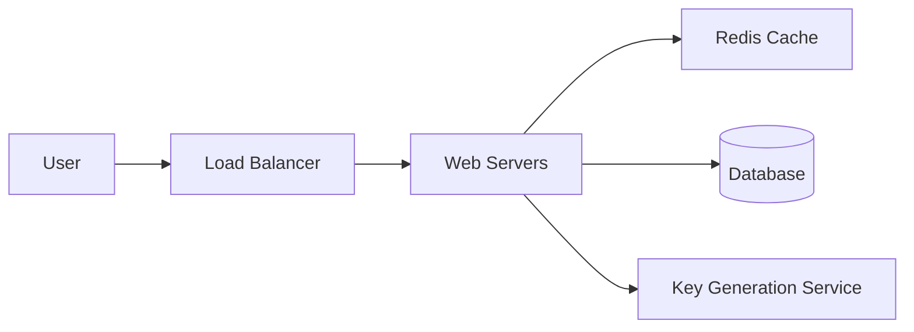

# Design a URL Shortener (e.g., TinyURL, bit.ly)

## ⏱️ 1. The 2-Minute Version

**Goal**: Design a service that takes a long URL and returns a short, unique alias, and redirects users from the short alias to the original URL.

**Key Components**:
1.  **API**: `createShortUrl(longUrl)`, `getOriginalUrl(shortUrl)`.
2.  **Database**: Store mappings `{ shortUrl: "abc", longUrl: "http://..." }`.
3.  **Hashing**: Use Base62 encoding on a unique ID to generate short strings.
4.  **Scale**: Read-heavy system (100:1 read/write ratio). Use caching (Redis) for hot URLs.

**Trade-offs**:
- **Collision Handling**: Pre-generate unique IDs (KGS) vs. checking DB on write.
- **Availability vs. Consistency**: Prioritize Availability (AP). It's okay if a newly created link takes a split second to propagate, but redirects must always work.

---

## 🏗️ 2. The 10-Minute Structured Version

### Requirements
- **Functional**:
    - Given a long URL, generate a unique short URL.
    - Clicking the short URL redirects to the long URL.
    - Links expire after a default time (optional).
- **Non-Functional**:
    - Highly available (redirects must not fail).
    - Low latency (redirects must be fast).
    - Short URLs should be unpredictable (security).

### Capacity Estimation (Back-of-Envelope)
- **Traffic**: 100M new URLs/month. 100:1 read ratio = 10B reads/month.
- **QPS**:
    - Writes: 100M / (30 * 24 * 3600) ≈ 40 writes/sec.
    - Reads: 40 * 100 = 4,000 reads/sec.
- **Storage**: 500 bytes per entry. 100M * 12 months * 5 years * 500 bytes ≈ 3 TB.

### High-Level Design

### Data Flow
1.  **Write**: User sends `longUrl`. Server gets a unique ID from KGS, converts to Base62, saves to DB, returns `shortUrl`.
2.  **Read**: User visits `shortUrl`. Server checks Cache. If miss, checks DB. Returns `301` or `302` redirect.

---

## 🧠 3. Deep Dive & Technical Details

### Database Choice
- **Relational (PostgreSQL/MySQL)**: Good for structure, but we have massive data. Sharding is needed.
- **NoSQL (Cassandra/DynamoDB)**: Better for scale. Key-Value store is perfect here.
    - **PK**: `shortUrl`
    - **Value**: `longUrl`, `expirationDate`, `userId`

### Shortening Algorithm
- **Hash Function (MD5/SHA256)**:
    - Problem: Output is too long. Truncating leads to collisions.
- **Base62 Conversion**:
    - Characters: `[a-z, A-Z, 0-9]` = 62 chars.
    - Length 7: $62^7 \approx 3.5$ trillion combinations. Enough for years.
    - **How to get unique number?**
        - **Auto-increment ID**: Hard in distributed DB.
        - **Snowflake ID**: Twitter's distributed ID generator.
        - **Key Generation Service (KGS)**: A dedicated service that pre-generates keys and stores them in a DB. Web servers fetch a block of keys to use.

### Caching Strategy
- **Eviction**: LRU (Least Recently Used). 20% of URLs generate 80% of traffic.
- **TTL**: Set expiration for cache entries to handle updates (though URLs rarely change).

### Redirects: 301 vs 302
- **301 (Permanent)**: Browser caches the redirect. Reduces server load but you lose analytics (you don't know when they visit again).
- **302 (Temporary)**: Browser always hits your server. Higher load, but better analytics.

### Failure Modes
- **KGS Failure**: Keep a standby replica.
- **Cache Failure**: Hit the DB (latency spike).
- **DB Failure**: Replication (Master-Slave or Multi-Master).

---

## 📊 Diagram References

Related architecture diagrams:
- [URL Shortener System Architecture Diagram](file:///Users/dj/Documents/Programming/techLead/tech-lead-repo/docs/system_design/diagrams/design_url_shortener_1.mmd)
