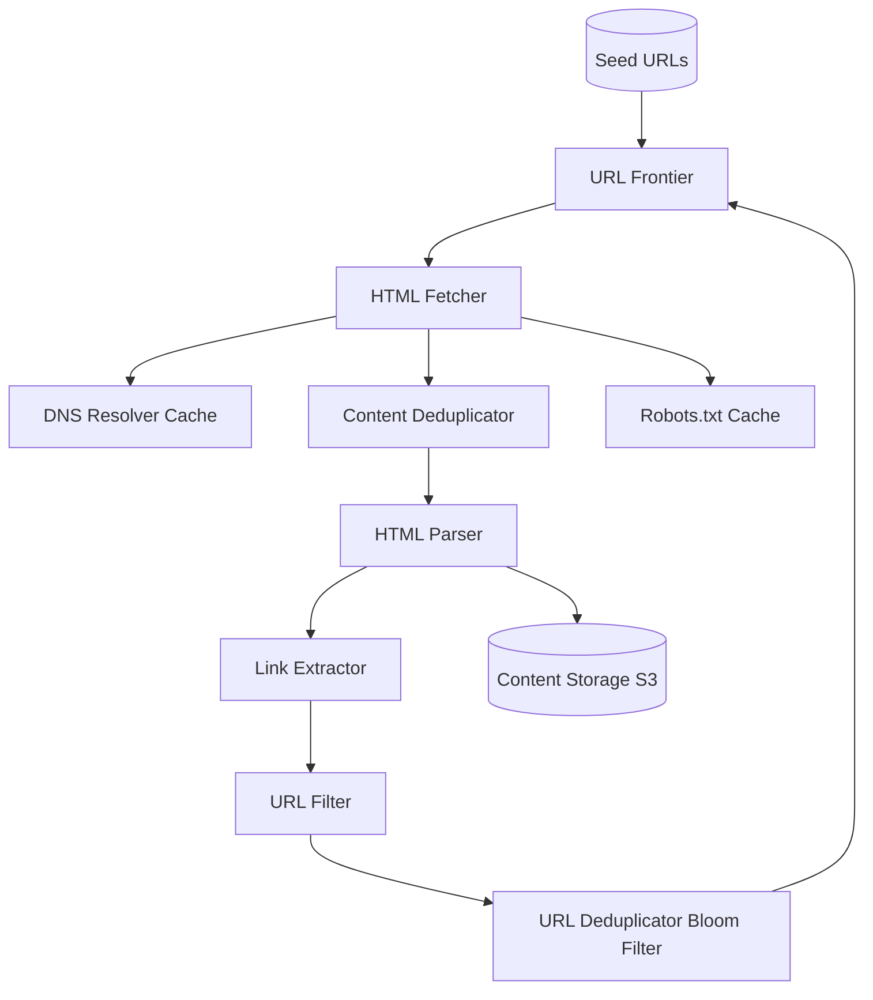

# Design a Web Crawler

## ⏱️ 1. The 2-Minute Version

**Goal**: Design a distributed web crawler that discovers and downloads billions of web pages efficiently, politely, and robustly for a search engine.

**Key Components**:
1. **URL Frontier**: Priority queue of URLs to crawl.
2. **Fetcher**: Downloads web pages (HTTP GET).
3. **Parser**: Extracts links and content.
4. **Deduplicator**: Avoids crawling same page twice.
5. **Storage**: Saves pages for indexing.

**Key Challenges**:
- **Scale**: Billions of URLs, petabytes of data.
- **Politeness**: Respect robots.txt, avoid overloading servers.
- **Robustness**: Handle malformed HTML, infinite loops, traps.
- **Freshness**: Recrawl frequently updated pages.

**Trade-offs**:
- **BFS vs. DFS**: Breadth-first (discover more sites) vs. Depth-first (explore single site deeply).
- **Centralized vs. Distributed Frontier**: Simple vs. Scalable.
- **Exact vs. Approximate Deduplication**: Accurate but slow vs. Fast with false positives.

---

## 🏗️ 2. The 10-Minute Structured Version

### Requirements

#### Functional
- **Discover**: Start from seed URLs, follow links.
- **Download**: Fetch HTML content.
- **Extract**: Parse HTML, find new links.
- **Store**: Save content for indexing.
- **Respect**: Honor robots.txt, rate limits.

#### Non-Functional
- **Scale**: Crawl billions of pages.
- **Throughput**: 1000s of pages/sec.
- **Politeness**: Max 1 request/sec per host.
- **Robustness**: Handle errors, duplicates, traps.
- **Extensibility**: Support new protocols, content types.

### High-Level Architecture



### Data Flow

1. **Initialize**: Load seed URLs into Frontier.
2. **Fetch**:
   - Pop URL from Frontier (priority queue).
   - Check Robots.txt cache (allowed?).
   - Resolve DNS (with caching).
   - Download page.
3. **Process**:
   - Check content deduplication (SimHash).
   - Parse HTML.
   - Extract links.
4. **Filter Links**:
   - URL normalization (remove fragments, lowercase).
   - Blacklist filtering (spam, known traps).
   - Deduplication (Bloom filter - URL seen before?).
5. **Enqueue**: Add new URLs to Frontier.
6. **Store**: Save page content to S3.
7. **Repeat**.

---

## 🧠 3. Deep Dive & Technical Details

### 1. URL Frontier (Priority Queue)

**Goals**:
- **Politeness**: Don't overwhelm single host.
- **Priority**: Crawl important pages first.
- **Freshness**: Recrawl updated pages.

**Implementation - Two-tier queue**:

**Tier 1: Prioritizer**
- Assign priority to URLs (PageRank, site importance, freshness).
- Front queues (F1, F2, ..., FN) for different priority levels.

**Tier 2: Politeness enforcer**
- Back queues (B1, B2, ..., BM) each mapped to a host.
- Ensure URLs from same host go to same back queue.
- Each back queue has rate limiter (1 request/sec).
- **Queue selector**: Routes URLs from front queues to appropriate back queues.

**Pseudocode**:
```python
class URLFrontier:
    def __init__(self):
        self.front_queues = [PriorityQueue() for _ in range(N)]  # Priority
        self.back_queues = [Queue() for _ in range(M)]  # Per-host
        self.host_to_queue = {}  # hostname -> back_queue_id
    
    def enqueue(self, url, priority):
        self.front_queues[priority].put(url)
    
    def dequeue(self):
        # Move from front to back queues
        for fq in self.front_queues:
            if not fq.empty():
                url = fq.get()
                host = extract_host(url)
                
                if host not in self.host_to_queue:
                    self.host_to_queue[host] = assign_back_queue()
                
                back_queue_id = self.host_to_queue[host]
                self.back_queues[back_queue_id].put(url)
        
        # Return from back queue (with rate limit check)
        for bq in self.back_queues:
            if bq.can_fetch():  # Rate limit OK?
                return bq.get()
```

---

### 2. Robots.txt Handling

**What is it?**
- File at `http://example.com/robots.txt`.
- Specifies which paths crawler can access.

**Example**:
```
User-agent: *
Disallow: /admin/
Crawl-delay: 10
```

**Implementation**:
- Fetch `robots.txt` once per domain.
- Cache in Redis (TTL: 24 hours).
- Before fetching URL, check if allowed.

---

### 3. DNS Resolution

**Problem**: DNS lookup is slow (100-200ms).

**Solution**: DNS cache
- Cache IP addresses for hostnames.
- TTL: 1 hour.
- Prefetch DNS for hostnames in frontier.

---

### 4. Deduplication

**URL Deduplication (Bloom Filter)**:
- Check if URL already crawled.
- **Bloom Filter**: Probabilistic data structure.
  - Fast O(1) lookup.
  - False positives possible (say URL seen when it wasn't), but no false negatives.
  - Memory efficient (1B URLs ~ 1-2 GB).

**Content Deduplication (SimHash)**:
- Detect near-duplicate pages (identical content, different URLs).
- **SimHash**: Fingerprint document to 64-bit hash.
- Similar docs have similar hashes (Hamming distance).
- Compare new page hash with existing hashes (< 3 bits different = duplicate).

**Example**:
```python
def simhash(text):
    tokens = tokenize(text)
    vector = [0] * 64
    for token in tokens:
        hash_val = hash(token)  # 64-bit hash
        for i in range(64):
            if hash_val & (1 << i):
                vector[i] += 1
            else:
                vector[i] -= 1
    
    fingerprint = 0
    for i in range(64):
        if vector[i] > 0:
            fingerprint |= (1 << i)
    
    return fingerprint

def is_duplicate(new_hash, existing_hashes, threshold=3):
    for existing in existing_hashes:
        hamming_dist = bin(new_hash ^ existing).count('1')
        if hamming_dist <= threshold:
            return True
    return False
```

---

### 5. Crawl Frontier Prioritization

**Factors**:
- **PageRank**: Importance of page.
- **Update Frequency**: News sites crawled hourly, static sites monthly.
- **User Interest**: If users search for content from site often, prioritize.

**Recrawl Scheduling**:
- Track last crawl time and change frequency.
- Assign next crawl time: `next_crawl = last_crawl + (1 / update_frequency)`.

---

### 6. Distributed Crawling

**Partitioning**:
- Hash URL to assign to crawler worker.
- `worker_id = hash(url) % num_workers`.
- Each worker has own Frontier, Fetcher, Storage.

**Coordination**:
- Use distributed queue (Kafka) for Frontier.
- Use distributed Bloom filter (Redis) for deduplication.

---

### 7. Handling Edge Cases

**Infinite Loops (Spider Traps)**:
- **Problem**: `/page1?id=1` → `/page1?id=2` → ... (infinite).
- **Solution**: Limit max depth per site (e.g., 10 levels), URL length (< 256 chars).

**Dynamic Content (JavaScript-rendered)**:
- **Problem**: Links loaded by JS not in raw HTML.
- **Solution**: Use headless browser (Puppeteer, Selenium) for select sites (expensive).

**Malformed HTML**:
- **Solution**: Use robust parser (BeautifulSoup, lxml).

**Hostile Servers (Captchas, IP bans)**:
- **Solution**: Rotate IP addresses, slow down, avoid.

---

### 8. Politeness

**Rate Limiting**:
- Max 1 request/sec per host.
- Token bucket algorithm.

**Respect Robots.txt**:
- Honor `Disallow` and `Crawl-delay`.

**User-Agent Header**:
- Identify crawler: `User-Agent: MyBot/1.0 (+http://example.com/bot-info)`.

---

### 9. Scalability

**Fetchers**: 1000s of distributed workers.
**Frontier**: Kafka partitioned by host.
**Storage**: S3 for raw HTML.
**Deduplication**: Redis cluster for Bloom filter.

---

### 10. Monitoring

**Metrics**:
- **Crawl Rate**: Pages/sec.
- **Frontier Size**: URLs in queue.
- **Errors**: HTTP errors, parse failures, DNS failures.
- **Politeness**: Requests/sec per host.

**Alerts**:
- Crawl rate drops below threshold.
- Frontier size growing unbounded.
- Error rate > 10%.

---

## 📊 Diagram References

Related architecture diagrams:
- [Web Crawler System Architecture Diagram](file:///Users/dj/Documents/Programming/techLead/tech-lead-repo/docs/system_design/diagrams/design_web_crawler_1.mmd)
