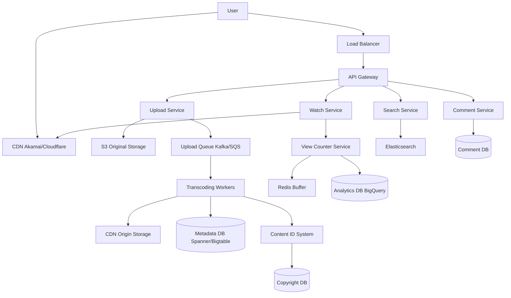

# Design YouTube

## ⏱️ 1. The 2-Minute Version

**Goal**: Design a video sharing platform like YouTube that allows users to upload, watch, search, comment on, and share videos at massive scale (1B+ users, 500 hours uploaded/minute).

**Key Components**:
1. **Upload Service**: Handles video uploads, stores in blob storage.
2. **Transcoding Pipeline**: Converts videos to multiple formats/resolutions.
3. **CDN**: Delivers video content globally with low latency.
4. **Metadata DB**: Stores video info, user data, comments.
5. **Search/Recommendation**: Elasticsearch + ML models.

**Key Challenges**:
- **Upload Scale**: 500 hours/min = 30k hours/hour uploaded globally.
- **Storage**: Petabytes of video (multiple formats per video).
- **View Counting**: Billions of views/day, eventual consistency acceptable.
- **Content Moderation**: Detect copyright violations, inappropriate content.

**Trade-offs**:
- **Upload Speed vs. Processing Quality**: Fast upload (process async) vs. Wait for processing (poor UX).
- **Eventual vs. Strong Consistency**: View counts (eventual OK) vs. Monetization (strong consistency).
- **Storage Cost vs. Quality**: Store many variants (expensive) vs. Fewer variants (lower quality options).

---

## 🏗️ 2. The 10-Minute Structured Version

### Requirements

#### Functional
- **Upload**: Users upload videos (any format).
- **Watch**: Stream videos with ABR (Adaptive Bitrate).
- **Search**: By title, tags, channel.
- **Interact**: Like, comment, subscribe.
- **Monetization**: Ads, creator revenue sharing.
- **Live Streaming**: Real-time broadcasts.

#### Non-Functional
- **Availability**: 99.99% uptime.
- **Latency**: Video start < 2s, search < 200ms.
- **Scale**:
  - 2B+ users.
  - 500 hours uploaded/minute.
  - 1B hours watched/day.
- **Storage**: Exabytes.
- **Bandwidth**: Petabytes/day egress.

### High-Level Architecture



### Data Flow: Upload

1. User uploads 1 GB video.
2. Upload Service:
   - Generates `video_id`.
   - Uploads to S3 (original).
   - Saves metadata: `{video_id, user_id, title, description, upload_time, status: PROCESSING}`.
3. Enqueue message: `{video_id, s3_path}`.
4. Transcoding Workers:
   - Download from S3.
   - Transcode to MPEG-DASH/HLS: 4K, 1080p, 720p, 480p, 360p, 240p.
   - Generate thumbnails (timeline scrub bar).
   - Run Content ID (copyright detection).
   - Run NSFW detection (ML model).
5. Upload processed videos to CDN Origin.
6. Update metadata: `status: READY`.
7. Notify user via email/push notification.

### Data Flow: Watch

1. User clicks video.
2. Watch Service:
   - Fetch metadata from DB.
   - Generate manifest file (MPD/M3U8) with available bitrates.
   - Return manifest URL.
3. Client requests video chunks from CDN based on ABR logic.
4. View Counter Service:
   - Increment view count in Redis.
   - Batch flush to Analytics DB every 10 seconds.

---

## 🧠 3. Deep Dive & Technical Details

### 1. Upload & Transcoding

**Upload Optimization**:
- **Resumable Uploads**: If upload fails midway, resume from last successful chunk.
- **Parallel Upload**: Split large file, upload chunks in parallel.

**Transcoding**:
- Distributed worker pool (Kubernetes autoscaling).
- DAG-based workflow (Airflow, Conductor).
- **Codec**: H.264 (legacy), VP9 (YouTube's preference), AV1 (future).

**Content ID (Copyright Detection)**:
- Fingerprint audio and video frames.
- Compare against database of copyrighted material.
- Actions:
  - **Block**: Remove video.
  - **Monetize**: Show ads, revenue goes to copyright owner.
  - **Track**: Log for analytics.

---

### 2. View Counting

**Challenge**: Popular videos get millions of views/hour. Can't write to DB on every view (DB overload).

**Solution - Write-Behind Cache**:
```python
# Increment in Redis
redis.incr(f"views:{video_id}")

# Background job (every 10 seconds)
for video_id in redis.keys("views:*"):
    count = redis.get(f"views:{video_id}")
    db.execute("UPDATE videos SET view_count = view_count + ? WHERE video_id = ?", count, video_id)
    redis.delete(f"views:{video_id}")
```

**Eventual Consistency**:
- View count may lag by ~10 seconds.
- Acceptable for this use case ("301+ views" was YouTube's old behavior during processing).

---

### 3. Recommendation Algorithm

**Signals**:
- Watch history.
- Search queries.
- Likes, comments.
- Watch time (% of video watched).
- Click-through rate on thumbnails.

**Models**:
- **Candidate Generation**: Wide net, fetch 100s of candidates.
  - Collaborative filtering.
  - Based on subscriptions.
- **Ranking**: Score and rank top 20 for homepage.
  - Deep neural network (TensorFlow).
  - Factors: relevance, freshness, diversity.

---

### 4. Monetization & Ads

**Ad Serving**:
- Pre-roll, mid-roll, post-roll ads.
- Auction-based (Google Ads).
- Personalized ads based on user interests.

**Creator Payouts**:
- Revenue sharing: ~55% to creator, 45% to YouTube.
- Calculate based on views, ad clicks, Premium subscribers watching.

---

### 5. Comments & Social Features

**Comment Storage** (Cassandra):
```sql
CREATE TABLE comments (
  video_id BIGINT,
  comment_id BIGINT,
  user_id BIGINT,
  text TEXT,
  created_at TIMESTAMP,
  likes_count INT,
  PRIMARY KEY (video_id, created_at, comment_id)
) WITH CLUSTERING ORDER BY (created_at DESC);
```

**Nested Replies**:
- Store `parent_comment_id`.
- Limit nesting depth (e.g., 3 levels).

**Spam Detection**:
- ML model detects spam.
- User reports.

---

### 6. Live Streaming

**Challenges**:
- Ultra-low latency (< 5 seconds).
- Handle sudden traffic spikes.

**Protocol**:
- **RTMP** (upload from creator) -> **HLS/DASH** (delivery to viewers).
- Use **WebRTC** for sub-second latency (gaming streams).

**Architecture**:
- Ingest servers receive RTMP stream.
- Transcode in real-time.
- Distribute via CDN.

---

### 7. Database Sharding

**Videos**: Shard by `video_id`.
**Users**: Shard by `user_id`.
**Comments**: Shard by `video_id` (all comments for video on same shard).

---

### 8. Monitoring

**Metrics**:
- Upload success rate.
- Transcoding queue length.
- Video start time (latency).
- Buffering rate.
- CDN cache hit ratio.

**Alerts**:
- Transcoding backlog > 1000.
- Upload failure rate > 5%.
- Buffering rate > 3%.

---

## 📊 Diagram References

Related architecture diagrams:
- [YouTube System Architecture Diagram](file:///Users/dj/Documents/Programming/techLead/tech-lead-repo/docs/system_design/diagrams/design_youtube_1.mmd)
