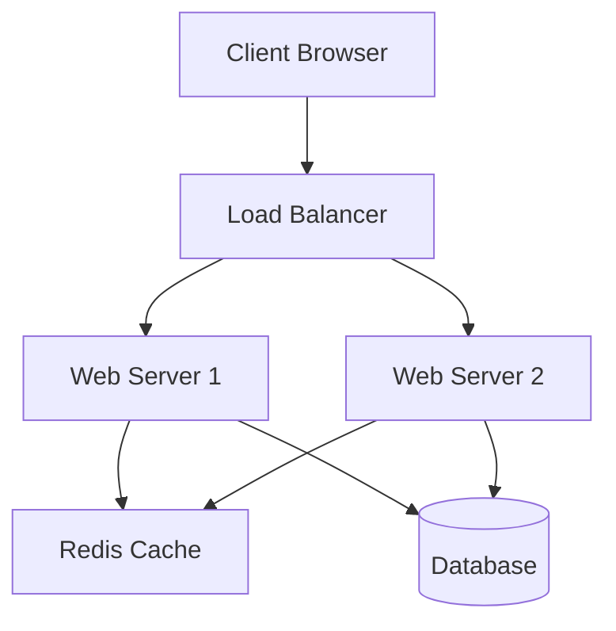

# System Design

This section covers the fundamentals of system design and provides detailed, conversational solutions to common interview problems.

## 📚 Core Concepts

### 1. Scalability
- **Vertical Scaling (Scale Up)**: Adding more power (CPU, RAM) to an existing machine.
    - *Limit*: Hardware capacity.
- **Horizontal Scaling (Scale Out)**: Adding more machines to the pool.
    - *Challenge*: Data consistency and management.

### 2. Load Balancing
Distributes incoming network traffic across multiple servers.
- **Algorithms**: Round Robin, Least Connections, IP Hash.
- **Types**: L4 (Transport Layer), L7 (Application Layer).

### 3. Caching
Storing copies of data in a temporary storage location for faster access.
- **Locations**: Client, CDN, Load Balancer, Application (local), Distributed Cache (Redis).
- **Eviction Policies**: LRU (Least Recently Used), LFU (Least Frequently Used).

### 4. Database Replication & Sharding
- **Replication**: Copying data to multiple nodes for redundancy and read scaling.
- **Sharding**: Partitioning data across multiple nodes to scale writes and storage.

### 5. CAP Theorem
In a distributed system, you can only have two of the three:
- **Consistency**: Every read receives the most recent write or an error.
- **Availability**: Every request receives a (non-error) response, without the guarantee that it contains the most recent write.
- **Partition Tolerance**: The system continues to operate despite an arbitrary number of messages being dropped or delayed by the network.

*Note: In distributed systems, Partition Tolerance is a must. So you choose between CP (Consistency) and AP (Availability).*

---

## 🗣️ Conversational Design Solutions

These guides follow a 3-layer approach:
1.  **2-Minute Version**: High-level summary.
2.  **10-Minute Structured Version**: Components and flow.
3.  **Deep Dive**: Technical details, trade-offs, and edge cases.

### Available Designs
- [Design a URL Shortener](./conversational_solutions/design_url_shortener.md)
- [Design a Rate Limiter](./conversational_solutions/design_rate_limiter.md)
- [Design a Chat App (WhatsApp)](./conversational_solutions/design_chat_app.md)
- [Design a Distributed Cache](./conversational_solutions/design_distributed_cache.md)

---

## 🎨 Diagramming

We use **Mermaid** for diagrams. It allows us to treat diagrams as code.

### Example: Simple Web Architecture

