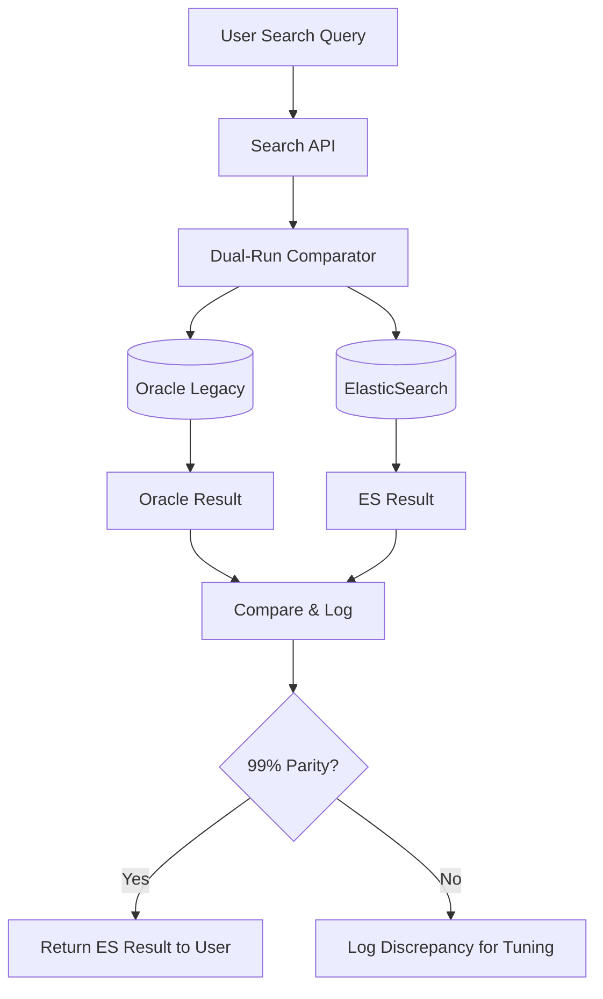
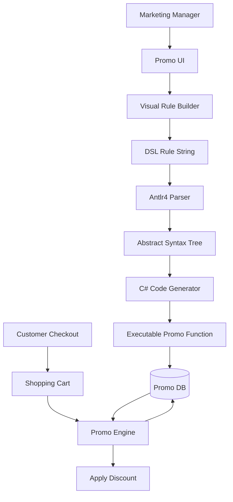

# System Design: E-commerce Search & Promo Engine

## 1. Requirements

### OneSearch - Functional Requirements
*   **Search:** Full-text search with fuzzy matching, synonyms, filters
*   **Facets:** Dynamic filtering by category, brand, price, nutritional values, ingredients
*   **Sorting:** Relevance, Price (high-low, low-high), Rating, Newest
*   **Pagination:** Handle 10,000+ product catalogs
*   **Multi-Tenant:** Support UK and EU sites with region-specific products

### OneSearch - Non-Functional Requirements
*   **Latency:** Search results < 200ms (p95)
*   **Throughput:** Handle 5,000 requests/second (Black Friday peak)
*   **Availability:** 99.9%+ uptime
*   **Parity:** 99%+ match with legacy Oracle search during migration

### Promo Engine - Functional Requirements
*   **Rule Definition:** Support complex promo logic (BOGO, Multi-buy, Tiered discounts, Cart thresholds)
*   **Non-Technical UI:** Marketing teams can create promos without writing code
*   **Validation:** Prevent invalid/circular promo logic
*   **Preview:** Test promos on sample baskets before live deployment
*   **Scheduling:** Auto-activate and expire promos based on date/time

### Promo Engine - Non-Functional Requirements
*   **Latency:** Promo calculation < 50ms per basket (checkout performance)
*   **Accuracy:** Zero incorrect discount applications
*   **Self-Service:** Zero engineering dependency for promo creation

---

## 2. API Design (OneSearch)

### Search API
```http
GET /api/v1/products/search
```

**Request:**
```json
{
  "q": "vitamin c 1000mg",
  "filters": { 
    "category": ["Vitamins"],
    "brand": ["H&B"],
    "price": { "min": 0, "max": 20 },
    "nutritionalValues": { "vegan": true }
  },
  "sort": "relevance",
  "page": 1,
  "pageSize": 24,
  "tenant": "uk"
}
```

**Response:**
```json
{
  "total": 150,
  "page": 1,
  "facets": {
    "category": { "Vitamins": 120, "Minerals": 30 },
    "brand": { "H&B": 80, "Solgar": 40, "Nature's Way": 30 },
    "price_ranges": [
      { "range": "0-10", "count": 50 },
      { "range": "10-20", "count": 70 },
      { "range": "20+", "count": 30 }
    ]
  },
  "items": [
    {
      "id": "123",
      "name": "Vitamin C 1000mg",
      "price": 9.99,
      "brand": "H&B",
      "rating": 4.5,
      "inStock": true,
      "score": 1.45
    },
    ...
  ]
}
```

---

## 3. Data Model (ElasticSearch)

### Product Index Schema
```json
{
  "mappings": {
    "properties": {
      "productId": { "type": "keyword" },
      "name": { 
        "type": "text", 
        "analyzer": "standard",
        "fields": {
          "keyword": { "type": "keyword" },
          "exact": { "type": "text", "analyzer": "exact_match" }
        }
      },
      "description": { "type": "text" },
      "category": { "type": "keyword" },
      "brand": { "type": "keyword" },
      "price": { "type": "float" },
      "rating": { "type": "float" },
      "inStock": { "type": "boolean" },
      "tenants": { "type": "keyword" },
      
      "nutritionalInfo": {
        "type": "object",
        "properties": {
          "calories": { "type": "integer" },
          "protein": { "type": "float" },
          "fiber": { "type": "float" }
        }
      },
      
      "tags": { 
        "type": "keyword",
        "fields": ["vegan", "gluten-free", "organic"]
      },
      
      "certificates": {
        "type": "nested",
        "properties": {
          "tenant": { "type": "keyword" },
          "certId": { "type": "keyword" },
          "type": { "type": "keyword" }
        }
      }
    }
  }
}
```

### Indexing Strategy
*   **Sharding:** 5 primary shards, 1 replica (HA)
*   **Multi-Tenant:** Separate indexes: `products_uk`, `products_eu`
*   **Refresh Interval:** 1 second (near real-time)
*   **Bulk Indexing:** Kafka consumers batch updates (100 docs at a time)

---

## 4. The Dual-Run Comparison System

**Challenge:** Ensure ElasticSearch returns the exact same results as Oracle during migration.

### Architecture


### Comparison Logic
```csharp
public class DualRunComparator {
  public SearchResult Compare(string query, Filters filters) {
    var oracleTask = OracleSearch.Execute(query, filters);
    var esTask = ElasticSearchService.Execute(query, filters);
    
    Task.WaitAll(oracleTask, esTask);
    
    var oracleResult = oracleTask.Result;
    var esResult = esTask.Result;
    
    // Calculate parity
    var parity = CalculateParity(oracleResult, esResult);
    
    if (parity < 0.99) {
      LogDiscrepancy(query, filters, oracleResult, esResult);
    }
    
    // Return ES result to user (Oracle is just for comparison)
    return esResult;
  }
  
  private double CalculateParity(Result oracle, Result es) {
    // Jaccard similarity on product IDs
    var intersection = oracle.ProductIds.Intersect(es.ProductIds).Count();
    var union = oracle.ProductIds.Union(es.ProductIds).Count();
    return (double)intersection / union;
  }
}
```

---

## 5. Promo Engine Architecture (Antlr4 DSL)

### High-Level Design


### DSL Example
**Rule:**
```
WHEN count(category='Vitamins') >= 3 THEN discount(cheapest, 100%)
```

**Compiled C# Code:**
```csharp
public class PromoRule_123 : IPromo {
  public Discount Apply(ShoppingCart cart) {
    var vitamins = cart.Items.Where(i => i.Category == "Vitamins");
    
    if (vitamins.Count() >= 3) {
      var cheapest = vitamins.OrderBy(i => i.Price).First();
      return new Discount {
        ProductId = cheapest.Id,
        Percentage = 100,
        Reason = "Buy 3 Vitamins, get cheapest free"
      };
    }
    
    return Discount.None;
  }
}
```

### Promo Evaluation Flow
1. **User adds items to cart**
2. **Cart service calls Promo Engine**
3. **Engine loads all active promos** (from cache)
4. **Evaluates each promo** against the cart
5. **Applies best discount** (highest value for customer)
6. **Returns updated cart** with promos applied

**Performance Optimization:**
- **Pre-Compilation:** Antlr4 compiles rules at creation time, not at runtime
- **Caching:** Active promos cached in Redis (1-min TTL)
- **Parallel Evaluation:** Run promo checks in parallel (if independent)

---

## 6. Scaling Strategies

### OneSearch - Scaling Reads
**Problem:** Black Friday traffic spikes 10x.

**Solutions:**
1. **ElasticSearch Read Replicas:** Scale from 1 to 5 replicas during peak
2. **CDN Caching:** Cache common queries (e.g., "protein powder") for 5 minutes
3. **Query Result Caching:** Redis cache for top 100 queries (24-hour TTL)
4. **Rate Limiting:** Prevent abuse (max 10 searches/second per user)

### Indexing Pipeline - Scaling Writes
**Problem:** Oracle emits 10,000 change events/second during inventory updates.

**Solutions:**
1. **Kafka Partitioning:** 10 partitions for `product-updates` topic
2. **Consumer Group:** 10 Kafka consumers (one per partition) → parallel processing
3. **Bulk Indexing:** Batch 100 updates before sending to ElasticSearch
4. **Backpressure:** If ES throttles, Kafka consumer slows down (no data loss)

---

## 7. Failure Scenarios & Resilience

### What if ElasticSearch goes down?
*   **Fallback:** Revert to Oracle search via feature flag
*   **Duration:** Manual switchover takes 1 minute
*   **Impact:** Users see slower search (2s) but site stays up

### What if Kafka goes down?
*   **Impact:** Product updates delayed (not real-time)
*   **Recovery:** Once Kafka recovers, consumers process backlog
*   **Mitigation:** Critical updates (price changes) use direct API calls as fallback

### What if a promo has a bug?
*   **Detection:** Real-time monitoring of cart value changes
*   **Alert:** If average basket value drops >10%, alert triggers
*   **Kill Switch:** Disable promo via UI (instant, no deployment)
*   **Rollback:** Previous cart state stored in session; rollback possible

---

## 8. Monitoring & Observability

### Key Metrics
- **Search Latency (p50, p95, p99):** Tracked per query type
- **ElasticSearch Health:** Cluster status, shard health, query queue depth
- **Indexing Lag:** Time between Oracle update and ES index update
- **Promo Error Rate:** Failed promo applications / total checkouts

### Dashboards
- **Search Performance:** Real-time query latency, throughput, error rates
- **Migration Parity:** Daily report of Oracle vs. ES discrepancies
- **Promo Impact:** Revenue attributed to promos, average discount per order

### Alerts
- **Critical:** Parity < 95%, ES cluster red, Indexing lag > 60s
- **Warning:** Latency p95 > 500ms, Promo error rate > 1%

---

## 9. Key Design Decisions & Trade-offs

### ElasticSearch vs. Solr
**Decision:** ElasticSearch  
**Why:** Better JSON support, simpler scaling, team familiarity, managed AWS service available  
**Trade-off:** Solr has more advanced NLP features, but we didn't need them

### Antlr4 vs. Custom Parser
**Decision:** Antlr4  
**Why:** Industry-standard, well-tested, excellent error messages  
**Trade-off:** Learning curve for the team, but long-term maintainability worth it

### Dual-Run Comparison vs. A/B Test
**Decision:** Dual-run with phased rollout  
**Why:** A/B testing alone wouldn't catch ordering discrepancies; needed explicit comparison  
**Trade-off:** Extra latency during dual-run phase (acceptable for migration period)

### Multi-Index (UK/EU) vs. Single Index with Filters
**Decision:** Multi-Index  
**Why:** Brexit data residency requirements, simpler tenant isolation  
**Trade-off:** More operational complexity (manage 2+ indexes), but compliance non-negotiable
