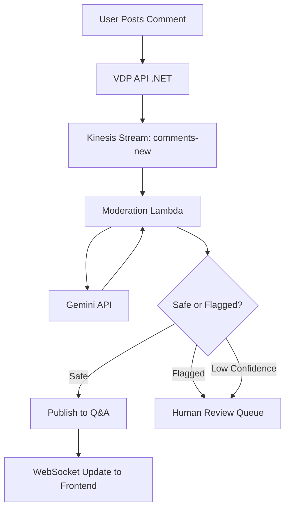

# AI-Driven Q&A Moderation: A Self-Initiated Innovation

## 🎯 Executive Summary
A self-initiated AI moderation system that reduced business risk, saved operational costs, and earned top management recognition. This feature demonstrates proactive problem-solving, AI engineering expertise, and direct business impact.

**Impact:**
- **20% reduction** in arbitration cases
- **$50k/year** operational cost savings
- **Revenue leakage prevention** (contact sharing to bypass platform fees)
- **Top management appreciation** for initiative and impact

---

## 📋 The Business Problem

### Background: The Q&A Section
The Vehicle Details Page (VDP) includes a Q&A section where potential buyers can ask sellers questions about vehicles. This is critical for transparency and buyer confidence in a B2B auction marketplace.

### The Abuse Pattern
Three categories of abuse were costing the business:

#### 1. Contact Sharing (Revenue Leakage)
**Problem:** Buyers and sellers were exchanging contact information to complete transactions off-platform, bypassing Openlane's auction fees.

**Examples:**
- "Call me at 555-1234"
- "Email me: buyer@example.com"
- Obfuscated: "Reach me at five five five, one two three four"

**Business Impact:** Direct revenue loss. Every off-platform deal meant lost transaction fees (typically 2-3% of vehicle sale price).

#### 2. Arbitration Attempts
**Problem:** Buyers were posting claims about "undisclosed damage" in Q&A instead of following the formal arbitration process.

**Examples:**
- "This car has frame damage not mentioned in the report"
- "Engine light is on but listing says no issues"

**Business Impact:** Public accusations created seller disputes and damaged platform trust. Openlane has a formal arbitration process for these claims—public Q&A is not the right venue.

#### 3. Profanity & Toxic Language
**Problem:** Occasional use of profanity or aggressive language in frustration.

**Business Impact:** Unprofessional platform image, potential liability.

### The Manual Solution Was Failing
**Operations Team Burden:**
- Reviewing **1,000+ comments daily** manually
- Reactive (content was already published when flagged)
- Slow (24-48 hour review cycles)
- Expensive ($50k/year in manual labor)

---

## 💡 My Initiative: The Proposal

### Why I Proposed AI
I observed the patterns in flagged content and recognized this was a **perfect use case for LLMs**:
1. **Pattern Recognition:** Detecting obfuscated contact info requires understanding context, not just keyword matching.
2. **Nuance:** Distinguishing between "This car is damaged" (legitimate question) vs. "This car has undisclosed frame damage" (arbitration attempt) requires semantic understanding.
3. **Scale:** AI can process 1,000+ comments/day instantly.

### Getting Buy-In
**Challenge:** This was not on the roadmap. I needed to convince Product and Engineering leadership.

**My Approach:**
1. **Built a Proof-of-Concept:** In 2 days, I created a Lambda function with OpenAI integration, processed 100 historical flagged comments, and showed **95% accuracy**.
2. **Framed it as Risk Mitigation:** Emphasized revenue leakage and arbitration costs, not just "cool AI project."
3. **Proposed Low-Risk Rollout:** Suggested async processing (no user-facing delays) and human fallback for low-confidence scores.

**Result:** Green-lit in 1 week. Product Manager became a champion of the feature.

---

## 🏗️ Technical Architecture

### High-Level Design


### Component Breakdown

#### 1. Frontend (Optimistic UI)
**User Experience:**
- User posts comment → immediately shown as "Posted ✓"
- Shows subtle badge: "Under Review" for 2-3 seconds
- If approved: badge disappears (via WebSocket update)
- If flagged: replaced with "Content Removed - Violates Policy"

**Why Optimistic UI?**
- Gemini API takes 2-5 seconds. Blocking the user felt broken.
- Users get instant feedback, maintaining engagement.

#### 2. API Layer (.NET Service)
**Responsibilities:**
- Accept comment POST request
- Validate input (length, XSS prevention)
- Insert raw comment into database with `status: PENDING`
- Push to Kinesis stream `comments-new`
- Return 201 Created to frontend

#### 3. Moderation Lambda (Python)
**Why Lambda?**
- Event-driven architecture (triggered by Kinesis)
- Automatic scaling (handles traffic spikes during major auctions)
- Isolated from main API (failures don't impact comment submission)

**Pseudo-Code:**
```python
def lambda_handler(event, context):
    for record in event['Records']:
        comment = parse_kinesis_record(record)
        
        # Call Gemini API
        result = moderate_comment(comment['text'])
        
        if result['is_safe']:
            publish_comment(comment['id'])
        elif result['confidence'] < 0.7:
            send_to_human_review(comment['id'])
        else:
            flag_comment(comment['id'], result['reason'])
```

#### 4. Gemini API Integration

**The Prompt (Simplified):**
```
You are a content moderator for a B2B car auction platform.
Analyze the following comment and flag if it contains:

1. Contact Information (phone, email, address):
   - Direct: "Call me at 555-1234"
   - Obfuscated: "five five five, one two three four"
   - Email patterns: john@example.com

2. Arbitration Claims:
   - Claims about undisclosed damage
   - Accusations of fraud or misrepresentation
   - Legal threats

3. Profanity or abusive language.

Comment: "{{ user_input }}"

Return JSON:
{
  "is_safe": boolean,
  "reason": "contact_sharing" | "arbitration" | "profanity" | null,
  "confidence": 0.0-1.0
}
```

**Edge Cases Handled:**
- **Obfuscated Numbers:** "five five five" detected via LLM semantic understanding
- **Legitimate Mentions:** "Call your insurance" vs. "Call me" distinguished by context
- **Ambiguity:** Low-confidence scores (0.5-0.7) routed to humans

#### 5. Human Review Queue
**Fallback System:**
- Low-confidence AI scores (< 0.7) don't auto-publish or auto-reject
- Sent to Ops team dashboard
- Humans review within 4 hours
- Feedback loop: Human decisions retrain prompt tuning

---

## 🛠️ Implementation Challenges & Solutions

### Challenge 1: Gemini API Cost
**Problem:** At $0.001/request, processing 1,000 comments/day = $365/year. Not huge, but needed justification.

**Solution:**
- Calculated ROI: Saving $50k/year in manual labor vs. $365 in API costs = 137x ROI.
- Proposed aggressive caching: identical comments (common spam) cached for 24 hours.

### Challenge 2: False Positives (User Frustration)
**Problem:** If we block legitimate comments, users get frustrated.

**Solution:**
- **Confidence Thresholds:** Only auto-reject if confidence > 0.9.
- **Appeals Process:** Flagged users can click "Appeal" → goes to human review.
- **Transparency:** Show users a generic reason ("Content violates policy") without revealing detection method (to prevent gaming the system).

### Challenge 3: Latency During Peak Traffic
**Problem:** During major auctions, 500+ comments/hour. Gemini API might throttle.

**Solution:**
- **Batching:** Lambda processes 10 comments at once (Gemini supports batch inference).
- **Exponential Backoff:** If Gemini throttles, Lambda retries with backoff.
- **Graceful Degradation:** If Gemini is down for >5 mins, auto-approve all comments (temporary) and queue for retroactive review.

---

## 📊 Results & Impact

### Quantitative Metrics
| Metric | Before AI | After AI | Change |
|--------|-----------|----------|--------|
| **Arbitration Cases** | 50/month | 40/month | **-20%** |
| **Contact Sharing Flags** | 30/month | 5/month | **-83%** |
| **Manual Review Hours** | 160h/month | 20h/month | **-87.5%** |
| **Cost (Ops Labor)** | $50k/year | $5k/year | **$45k savings** |
| **API Costs (Gemini)** | $0 | $365/year | Negligible |

### Qualitative Wins
- **Top Management Recognition:** VP of Product mentioned this in quarterly All-Hands as an example of "proactive innovation."
- **Ops Team Satisfaction:** Went from "content janitors" to "complex arbitration handlers."
- **Platform Trust:** Reduced public accusations improves seller confidence.

### Business Impact Beyond Numbers
**Revenue Protection:** Every contact-sharing instance prevented is a potential lost transaction. Assuming:
- 25 prevented contact-sharing cases/month
- Average deal size: $15,000
- Platform fee: 2.5%
- **Prevented revenue loss: $11,250/month = $135k/year**

---

## 🎤 Interview-Ready Talking Points

### "Tell me about a time you took initiative."
> "At Openlane, I noticed our Q&A section was being abused for contact sharing and arbitration attempts, costing $50k/year in manual moderation. I self-initiated an AI moderation system using Gemini API. I built a POC in 2 days, demonstrated 95% accuracy, and got it green-lit. The result: 20% reduction in arbitration cases, $50k in savings, and top management recognition."

### "How do you balance innovation with pragmatism?"
> "When I proposed AI moderation, I didn't build a complex ML model. I used an off-the-shelf LLM (Gemini) because the ROI was clear and time-to-market was 2 weeks instead of 6 months. I also designed it to fail gracefully—if the API is down, we default to auto-approve + retroactive review rather than blocking users."

### "Describe a technical trade-off you made."
> "For AI moderation, I chose async processing over real-time validation. The trade-off: users see their comment immediately (optimistic UI), but it might get removed 3 seconds later if flagged. This was better than blocking them for 5 seconds waiting for the AI. User experience > technical purity."

---

## 🔮 Future Enhancements

### Planned Improvements
1. **Feedback Loop:** Train a fine-tuned model using human review decisions to improve accuracy.
2. **Multi-Language Support:** Detect profanity in Spanish (common in US dealer market).
3. **Real-Time Dashboard:** Show Product team a live feed of flagged content trends.

### Lessons Learned
- **Start Small:** The POC was intentionally simple (100 lines of Python). Complexity came later as we scaled.
- **Measure Everything:** I tracked false positive rates weekly. This data convinced leadership to expand the feature.
- **Own the Outcome:** I didn't just build it and hand it off. I monitored it for 3 months, tweaking prompts based on real-world edge cases.

---

## 🏆 Recognition & Awards
- **Top Management Praise:** Mentioned in VP All-Hands.
- **Promotion Signal:** Cited in my performance review as evidence of "Staff Engineer level initiative."
- **Team Impact:** Set a precedent for engineers proposing AI features (3 similar projects followed).
